# Design an Airline Management System

> This mirrors the repository reference structure: *Clarify → Requirements → Core Entities → Class Diagram → Patterns → Concurrency → Testability → API walkthrough*.

---

## 1. How to attack this in an interview

Do **not** start with classes. First decide whether the system books a seat class ("any economy") or a **specific seat**. This implementation books a specific seat because that is where the double-selling race appears.

### Clarifying questions to ask
| Question | Why it matters | Assumption we lock in |
| --- | --- | --- |
| Search by route/date only or flexible dates? | Defines the search Strategy | Exact origin, destination, `LocalDate` |
| Book seat class or seat number? | Determines concurrency granularity | Passenger books one specific seat |
| Are aircraft seat maps shared across dates? | Avoids occupancy bleeding between instances | Each `FlightInstance` copies an unclaimed seat map |
| Fare model? | Strategy hook | Seat base cents × seat-class multiplier |
| Booking lifecycle? | State pattern scope | `CONFIRMED -> CHECKED_IN -> CANCELLED`; cancel also allowed before check-in |
| Notifications? | Observer hook | Synchronous in-process listeners |
| Concurrent booking? | The crux | Many threads may race for the same seat |

### What earns points
- Calling out that seat booking is a **check-then-act race**.
- Using a per-seat CAS, not a global airline lock.
- Injecting `Clock` and id generation for deterministic tests.

---

## 2. Requirements

**Functional**
1. Store `Flight`s with flight number, origin, and destination.
2. Store dated `FlightInstance`s with aircraft and seat map.
3. Search flight instances by origin, destination, and date.
4. Book a specific seat for a passenger and return a `Booking` / ticket.
5. Cancel a booking and free the seat for rebooking.
6. Check in a confirmed booking.
7. Notify observers for booking lifecycle events.

**Non-functional**
1. **Thread-safe**: the same seat must never be sold twice.
2. **Extensible**: pricing/search/storage/notifications can change independently.
3. **Testable**: deterministic time and ids; no sleeps.

---

## 3. Core entities

- **`Flight`** — route definition: flight number, origin, destination.
- **`FlightInstance`** — one dated operation of a flight with copied seat map.
- **`Aircraft` / `AircraftBuilder`** — cabin template and readable construction.
- **`Seat`** — seat number, `SeatClass`, base fare cents, atomic booking claim.
- **`Passenger`** — customer identity.
- **`Booking`** — ticket with fare, timestamps, and lifecycle state.
- **`BookingState`** — State pattern for legal transitions.
- **Repositories** — in-memory stores for flights, instances, and bookings.
- **`FarePricingStrategy`** — fare calculation Strategy.
- **`FlightSearchStrategy`** — search Strategy.
- **`AirlineService`** — Facade API.
- **`BookingEventListener`** — Observer for notifications.

---

## 4. Class diagram

```mermaid
classDiagram
    class SeatClass { <<enum>> ECONOMY BUSINESS FIRST }
    class BookingStatus { <<enum>> CONFIRMED CHECKED_IN CANCELLED }

    class Flight { -flightNumber -origin -destination }
    class Aircraft { -tailNumber -seatMapTemplate +newSeatMapForFlightInstance() Map }
    class Seat { -seatNumber -seatClass -baseFareCents -AtomicReference~String~ bookingId +tryClaim(id) bool +releaseBooking(id) bool }
    class FlightInstance { -id -flight -flightDate -aircraft -seatsByNumber +availableSeats() List }
    class Passenger { -id -name }
    class Booking { -id -passenger -flightInstanceId -seatNumber -fare -state +checkIn(now) +cancel(now) }

    class BookingState { <<interface>> +checkIn(booking, now) +cancel(booking, now) }
    class ConfirmedState
    class CheckedInState
    class CancelledState
    BookingState <|.. ConfirmedState
    BookingState <|.. CheckedInState
    BookingState <|.. CancelledState
    Booking o-- BookingState

    class FarePricingStrategy { <<interface>> +price(instance, seat) BigDecimal }
    class SeatClassFarePricingStrategy
    FarePricingStrategy <|.. SeatClassFarePricingStrategy

    class FlightSearchStrategy { <<interface>> +search(instances, origin, destination, date) List }
    class OriginDestinationDateSearchStrategy
    FlightSearchStrategy <|.. OriginDestinationDateSearchStrategy

    class FlightRepository
    class FlightInstanceRepository
    class BookingRepository
    class BookingEventListener { <<interface>> +onEvent(event) }
    class AirlineService { -repositories -pricing -search -clock -idGenerator +searchFlights(...) +bookSeat(...) +cancel(...) +checkIn(...) }

    AirlineService o-- FlightRepository
    AirlineService o-- FlightInstanceRepository
    AirlineService o-- BookingRepository
    AirlineService ..> FarePricingStrategy
    AirlineService ..> FlightSearchStrategy
    AirlineService ..> BookingEventListener
    FlightInstance o-- Flight
    FlightInstance o-- Aircraft
    FlightInstance o-- Seat
    Booking ..> Passenger
```



---

## 5. Design patterns used

| Pattern | Where | Why |
| --- | --- | --- |
| **Strategy** | `FarePricingStrategy`, `FlightSearchStrategy` | Swap dynamic pricing or flexible search without changing the facade. |
| **Repository** | `FlightRepository`, `FlightInstanceRepository`, `BookingRepository` | Hide storage details behind simple collections today, DB tomorrow. |
| **Facade** | `AirlineService` | One interview-friendly API over search, booking, lifecycle, notifications, and storage. |
| **State** | `BookingState` implementations | Legal transitions live with states, not service `if` statements. |
| **Observer** | `BookingEventListener` | Email/SMS/analytics subscribe without coupling to booking logic. |
| **Factory** | `Aircraft.singleAisle(...)` | Creates a common cabin shape from counts. |
| **Builder** | `AircraftBuilder`, `Booking.Builder`, `AirlineService.Builder` | Readable construction while preserving invariants. |

**Deliberately NOT a Singleton.** Multiple airline services are useful in tests and deployments; dependency injection keeps state isolated and resettable.

---

## 6. Concurrency — the part that separates seniors from juniors

The dangerous code is:

```
if (seat.isAvailable()) {
    seat.assign(booking);
}
```

Two threads can both observe "available" and both write a booking. That is the classic **check-then-act race**.

**Our fix — lock-free Compare-And-Swap per seat:**
- Each `Seat` holds `AtomicReference<String> bookingId`.
- `tryClaim(id)` does `bookingId.compareAndSet(null, id)`.
- If 100 threads race for seat `E1`, exactly one CAS wins; all losers receive `SeatUnavailableException`.
- Distinct seats do not block each other, so throughput scales with cabin size.
- Cancellation uses `compareAndSet(expectedBookingId, null)` so a stale cancel cannot free a newly rebooked seat.

> `// INTERVIEW INSIGHT:` checking availability and then occupying is a bug. CAS fuses check-and-act into one indivisible operation.

---

## 7. Testability

- **`Clock` is injected** into `AirlineService`; booking, check-in, cancellation, and notification times use `clock.instant()`.
- **Ids are injected** using `Supplier<String>`, so tests assert exact booking ids without UUID randomness.
- **Strategies are injected**, so search and pricing can be replaced independently.
- Concurrency tests use `CountDownLatch` to release threads together and assert exactly one winner or exactly cabin capacity winners; no `Thread.sleep`.

---

## 8. API walkthrough

```java
AirlineService service = AirlineService.builder()
        .clock(Clock.systemUTC())
        .idGenerator(() -> UUID.randomUUID().toString())
        .build();

Flight flight = new Flight("NP101", "BLR", "DEL");
Aircraft aircraft = Aircraft.singleAisle("VT-NP", 120, 12, 4);
FlightInstance instance = new FlightInstance("inst-1", flight, LocalDate.of(2026, 8, 1), aircraft);
service.addFlight(flight);
service.addFlightInstance(instance);

Booking booking = service.bookSeat(new Passenger("p1", "Ada"), "inst-1", "E1");
service.checkIn(booking.getId());
service.cancel(booking.getId());
```
