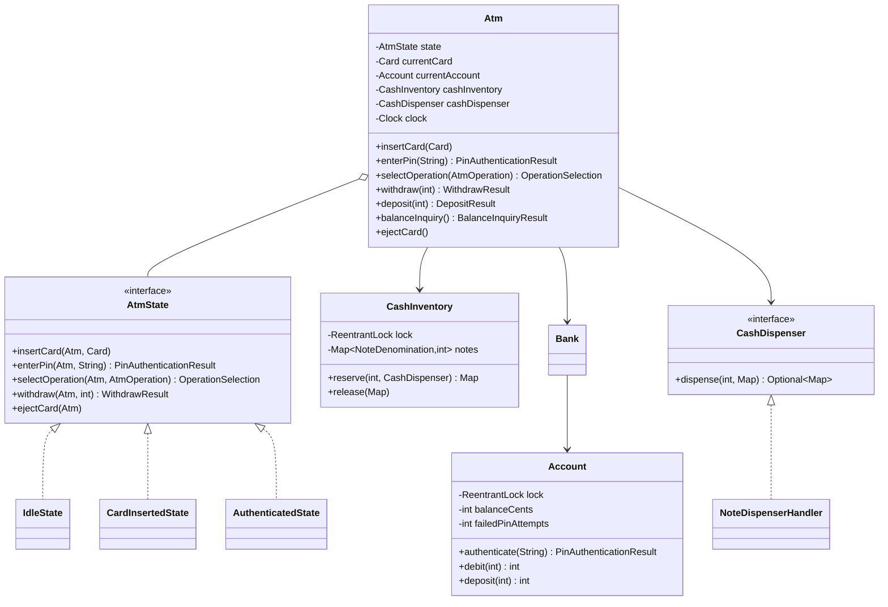

# Design an ATM

> This mirrors the repository's LLD structure: *Clarify → Requirements → Core Entities → Class Diagram → Patterns → Concurrency → Testability → API walkthrough*.

---

## 1. How to attack this in an interview

Start by separating the customer journey from the banking/cash safety problems. The headline is the **State pattern** for the ATM session, but the senior-level discussion is about atomic account debits and atomic cash reservation.

### Clarifying questions to ask
| Question | Why it matters | Assumption we lock in |
| --- | --- | --- |
| One customer at a time per physical ATM? | Drives session state and locking | Yes; one card/session per `Atm` instance |
| Where is account data stored? | ATM should not own bank truth | `Bank` repository maps card account id to `Account` |
| PIN retry policy? | Lockout behavior must be explicit | 3 failed attempts locks the account |
| Supported notes? | Drives cash dispenser chain | 2000, 500, 200, 100 rupee notes |
| Can the ATM partially dispense? | Affects transaction atomicity | No; exact notes or reject |
| Concurrent withdrawals on same account? | Main race condition | Yes; per-account lock prevents overdraft |
| Concurrent withdrawals from same cash cassette? | Main inventory race | Yes; inventory reservation is atomic |
| Time requirements? | Needed for transaction history/tests | Inject `Clock`; no real sleeping |

### What earns points
- Naming **State** for card/session flow before coding.
- Explaining why "check balance then debit" is a race unless both happen atomically.
- Explaining why cash must be reserved atomically; two withdrawals must not dispense the same physical notes.
- Returning rich result objects (`WithdrawResult`, `DepositResult`) instead of printing to console.

---

## 2. Requirements

**Functional**
1. Insert card → enter PIN → select operation → withdraw/deposit/balance inquiry → eject card.
2. Reject wrong PINs and lock the account after the configured attempt limit.
3. Withdrawals debit the account and dispense actual notes.
4. Reject withdrawals for insufficient account funds.
5. Reject withdrawals when the ATM has insufficient total cash.
6. Reject withdrawals when the ATM cannot make the exact amount with available notes.
7. Deposits increase account balance.
8. Balance inquiry returns the current balance.

**Non-functional**
1. **Thread-safe**: concurrent withdrawals on one account never overdraw.
2. **Thread-safe cash inventory**: notes are reserved and decremented atomically.
3. **Extensible**: new denominations/dispensing strategies can be added without changing `Atm`.
4. **Testable**: deterministic timestamps via injected `Clock`.

---

## 3. Core entities

- **`Atm`** — facade and session owner; delegates to `AtmState`.
- **`AtmState`** — State interface for legal actions in each session phase.
- **`IdleState`**, **`CardInsertedState`**, **`AuthenticatedState`** — concrete session states.
- **`Card`** — maps a physical card to an account id.
- **`Bank`** — account repository.
- **`Account`** — balance, PIN attempts and lockout; guarded by a per-account lock.
- **`CashInventory`** — physical note counts; guarded by an inventory lock.
- **`CashDispenser`** / **`NoteDispenserHandler`** — Chain of Responsibility for note breakdown.
- **Result records** — `WithdrawResult`, `DepositResult`, `BalanceInquiryResult`, `PinAuthenticationResult`.

---

## 4. Class diagram



---

## 5. Design patterns used

| Pattern | Where | Why |
| --- | --- | --- |
| **State** | `AtmState`, `IdleState`, `CardInsertedState`, `AuthenticatedState` | Models legal customer flow cleanly and avoids scattered conditionals. |
| **Chain of Responsibility** | `NoteDispenserHandler` chain 2000 → 500 → 200 → 100 | Classic ATM note-dispensing algorithm; each handler owns one denomination. |
| **Factory** | `CashDispenserFactory` | Wires the standard dispenser chain in one place. |
| **Facade** | `Atm` | Single simple API over state, bank account, cash inventory and dispenser. |
| **Builder** | `Atm.Builder` | Readable test setup with injected bank, inventory, dispenser and clock. |

---

## 6. Concurrency — the part that separates seniors from juniors

The account race:
```
T1 reads balance=1000
T2 reads balance=1000
T1 withdraws 800
T2 withdraws 800
```
If check and debit are separate unsynchronized steps, the account is overdrawn. `Account.debit` protects check-then-debit with a **per-account lock**, so operations on different accounts can still run in parallel.

The cash race is similar: two withdrawals could both see the last `500` note. `CashInventory.reserve` computes the exact note plan and decrements counts under one lock, so each physical note can be reserved once.

---

## 7. Testability

- `Atm` accepts a `Clock`; tests use `MutableClock` for deterministic timestamps.
- No method prints to console; result objects expose balances, timestamps and note breakdowns.
- `CashInventory` and `Account` are injectable/shared, so concurrency tests can run many ATM sessions against the same account/cassette.
- No `Thread.sleep`; concurrency tests use `CountDownLatch`.

---

## 8. API walkthrough

```java
Bank bank = new Bank().addAccount(new Account("A-1", "1234", 10_000_00));
CashInventory inventory = new CashInventory()
        .add(NoteDenomination.TWO_THOUSAND, 2)
        .add(NoteDenomination.FIVE_HUNDRED, 10)
        .add(NoteDenomination.ONE_HUNDRED, 10);

Atm atm = Atm.builder()
        .bank(bank)
        .cashInventory(inventory)
        .clock(Clock.systemUTC())
        .build();

atm.insertCard(new Card("CARD-1", "A-1"));
atm.enterPin("1234");
atm.selectOperation(AtmOperation.WITHDRAW);
WithdrawResult result = atm.withdraw(2_500_00);
atm.ejectCard();
```
