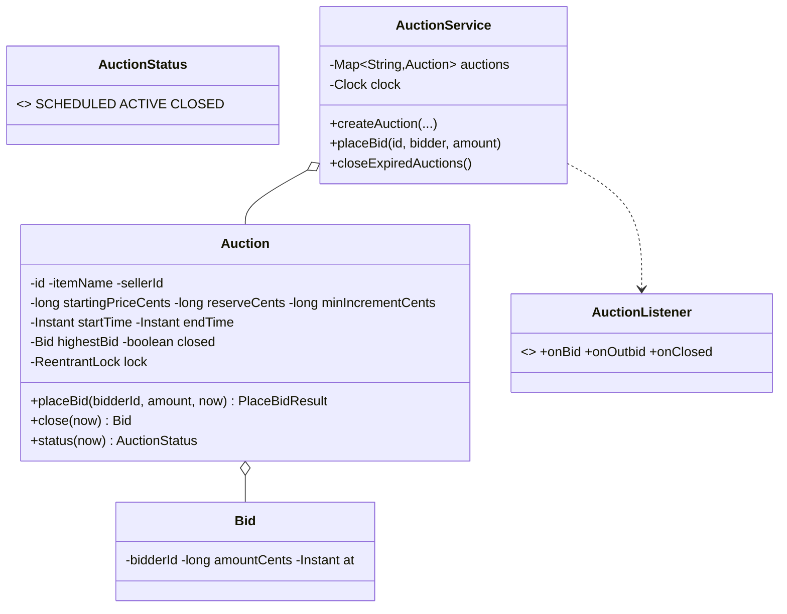

# Design an Online Auction System

> An auction is a **time-windowed, concurrent bidding** problem. The two things to get right: bids on the same item must be **serialized** so the highest always wins, and the **active window / close** must be driven by an **injected clock** so it's testable.

## 1. How to attack this in an interview

### Clarifying questions
| Question | Assumption we lock in |
| --- | --- |
| Bid rules? | Each bid must beat the current highest by a **minimum increment**. |
| Time window? | Auction is ACTIVE only between start and end; bids outside are rejected. |
| Reserve price? | Optional — if the top bid is below reserve, there's no winner. |
| Who wins? | Highest bidder at close, provided reserve is met. |
| Concurrency? | Many bidders hit the same item at once — must stay consistent. |

### What earns points
- Serializing bids per auction so there's **no lost update** (two bids can't both "win").
- Deriving ACTIVE/SCHEDULED/CLOSED from an **injected clock** and closing on expiry — then testing it by advancing a fake clock.
- Notifying the **outbid** bidder (Observer).

## 2. Requirements

**Functional:** create an auction (item, seller, starting price, reserve, start/end, min increment); place bids (validated); auto/explicit close determines the winner; notify on bid/outbid/close.

**Non-functional:** correct under concurrent bids; time is injected and testable; money is integer cents; extensible bid rules & notifications.

## 3. Core entities

- **`Bid`** — bidder, amount (cents), time.
- **`AuctionStatus`** — SCHEDULED / ACTIVE / CLOSED (derived from the clock + a closed flag).
- **`Auction`** — item, prices, window, current highest bid; guards bidding with a `ReentrantLock`.
- **`AuctionListener`** (Observer) — bid / outbid / closed notifications.
- **`AuctionService`** — Facade + repository + injected clock/ids.

## 4. Class diagram



## 5. Design patterns

| Pattern | Where | Why |
| --- | --- | --- |
| **State machine** | `AuctionStatus` derived from the clock | Clean SCHEDULED→ACTIVE→CLOSED lifecycle; bids only in ACTIVE. |
| **Observer** | `AuctionListener` | Outbid/won notifications decoupled from bidding. |
| **Facade** | `AuctionService` | One API over auctions, clock, notifications. |
| **Repository** | auction map | Swap storage later. |

## 6. Concurrency

Bidding on a hot item is the contended path. Each `Auction` guards `highestBid` with its own `ReentrantLock`; `placeBid` validates against the current highest and installs the new highest **atomically**.

> `// INTERVIEW INSIGHT:` the classic bug is "read highest, compare, then set" without a lock — two concurrent bids both read the old highest and one overwrites the other (lost update). The per-auction lock fuses validate-and-set. Different auctions never contend, so throughput scales with the number of live auctions.

## 7. Testability

- **`Clock` injected.** The active window is `now ∈ [start, end)`; `status(now)` and expiry all read the clock. A test advances a `MutableClock` to move an auction SCHEDULED → ACTIVE → CLOSED **instantly**.
- **Deterministic winner** — assert exact winning bidder/amount, and "no winner" when the reserve isn't met.
- **Concurrency test:** many threads bid distinct increasing amounts; the final highest must equal the global maximum (no lost update).

## 8. API walkthrough

```java
AuctionService svc = new AuctionService(clock, idGen);
Auction a = svc.createAuction("Painting", seller, 10_000, 12_000, 100, start, end);
clock.setInstant(start);                 // window opens
svc.placeBid(a.getId(), "alice", 10_100);
svc.placeBid(a.getId(), "bob", 12_500);  // alice is notified she's outbid
clock.setInstant(end);                    // window closes
svc.closeExpiredAuctions();               // bob wins (>= reserve)
```
