# Design a Car Rental System

> This mirrors the repository reference structure: *Clarify → Requirements → Core Entities → Class Diagram → Patterns → Concurrency → Testability → API walkthrough*.

---

## 1. How to attack this in an interview

Do **not** start with classes. First pin down whether we rent a category ("any SUV") or one physical vehicle. This implementation reserves a **specific vehicle** because that is where the double-booking race appears.

### Clarifying questions to ask
| Question | Why it matters | Assumption we lock in |
| --- | --- | --- |
| One store or many? | Search is scoped by location | Many stores, each vehicle belongs to one store |
| Reserve category or vehicle? | Changes concurrency and inventory modelling | Reserve a specific vehicle id |
| Date semantics? | Avoid off-by-one pricing/overlap bugs | Half-open `[start, end)` `LocalDate` ranges |
| Pricing model? | Strategy hook | Per-day by vehicle type plus add-ons |
| Add-ons? | Price extension point | Optional per-day add-ons |
| Concurrent bookings? | The crux | Many threads may reserve the same car at once |
| Payment? | Can consume the interview | Out of scope; compute quoted price only |

### What earns points
- Calling out the **check-then-act race** in booking before coding.
- Using a per-vehicle lock instead of a global lock, so unrelated cars can be reserved concurrently.
- Injecting `Clock` and id generation for deterministic tests.

---

## 2. Requirements

**Functional**
1. Maintain a fleet of vehicles across stores/locations.
2. Search available vehicles for a date range and optional type.
3. Reserve a specific vehicle for a non-overlapping date range.
4. Pick up, return, or cancel a reservation.
5. Compute price by duration, vehicle type, and optional add-ons.

**Non-functional**
1. **Thread-safe**: overlapping reservations for the same vehicle must never both succeed.
2. **Extensible**: pricing, vehicle construction, and lifecycle rules are isolated behind patterns.
3. **Testable**: deterministic time/ids; no sleeps.

---

## 3. Core entities

- **`VehicleType`** — `ECONOMY`, `SUV`, `LUXURY`, `VAN`; carries seats, bags, and cents-per-day.
- **`Vehicle`** — one physical rentable asset with id, plate, type, and store id.
- **`VehicleFactory`** — creates vehicles from a type and shared attributes.
- **`DateRange`** — validated half-open rental range with overlap logic.
- **`AddOn`** — optional per-day extras.
- **`Reservation`** — built with a Builder; owns lifecycle state and timestamps.
- **`ReservationState`** — State pattern for legal transitions.
- **`VehicleRepository` / `ReservationRepository`** — in-memory repositories.
- **`PricingStrategy`** — price calculation strategy.
- **`CarRentalService`** — Facade API over repositories, pricing, clock, and locks.

---

## 4. Class diagram

```mermaid
classDiagram
    class VehicleType { <<enum>> ECONOMY SUV LUXURY VAN }
    class AddOn { <<enum>> GPS CHILD_SEAT INSURANCE }
    class DateRange { -start -end +overlaps(DateRange) bool +days() long }

    class Vehicle { -id -type -licensePlate -storeId -make -model }
    class VehicleFactory { +create(id,type,plate,store,make,model) Vehicle }

    class PricingStrategy { <<interface>> +calculate(vehicle, range, addOns) BigDecimal }
    class PerDayPricingStrategy
    PricingStrategy <|.. PerDayPricingStrategy

    class ReservationState { <<interface>> +pickUp(reservation, now) +returnVehicle(reservation, now) +cancel(reservation, now) }
    class ReservedState
    class OngoingState
    class CompletedState
    class CancelledState
    ReservationState <|.. ReservedState
    ReservationState <|.. OngoingState
    ReservationState <|.. CompletedState
    ReservationState <|.. CancelledState

    class Reservation { -id -vehicleId -customerId -range -state -createdAt -price +builder() Builder }
    Reservation o-- ReservationState

    class VehicleRepository { +save(vehicle) +findById(id) +findAll() }
    class ReservationRepository { +save(reservation) +findById(id) +activeForVehicle(id) }
    class CarRentalService { -vehicleRepository -reservationRepository -locks -pricingStrategy -clock +searchAvailable(...) +reserve(...) +pickUp(...) +returnVehicle(...) +cancel(...) }

    CarRentalService ..> PricingStrategy
    CarRentalService o-- VehicleRepository
    CarRentalService o-- ReservationRepository
    Reservation ..> DateRange
    Reservation ..> Vehicle
```



---

## 5. Design patterns used

| Pattern | Where | Why |
| --- | --- | --- |
| **Strategy** | `PricingStrategy`, `PerDayPricingStrategy` | Swap flat, seasonal, coupon, or dynamic pricing without changing the service. |
| **Repository** | `VehicleRepository`, `ReservationRepository` | Hide storage details from the facade. |
| **Facade** | `CarRentalService` | One interview-friendly API over inventory, reservations, pricing, lifecycle, and locks. |
| **Builder** | `Reservation.Builder` | Reservation has many required/optional fields; builder keeps construction readable and valid. |
| **Factory** | `VehicleFactory` | Centralizes construction for different vehicle types. |
| **State** | `ReservationState` implementations | Legal transitions live with states, not scattered `if` statements. |

**Deliberately NOT a Singleton.** A rental company may have multiple services in tests or deployments; dependency injection keeps state isolated and resettable.

---

## 6. Concurrency — the part that separates seniors from juniors

The dangerous code is:

```
if (!hasOverlap(vehicleId, range)) {
    save(newReservation);
}
```

Two threads can both observe "no overlap" and both insert. That is the classic **check-then-act race**.

**Our fix — per-vehicle lock:**
- `CarRentalService` keeps a lock keyed by `vehicleId`.
- Reservation performs overlap check **and** insert inside `synchronized(lockFor(vehicleId))`.
- Different vehicles use different locks, so reserving car A does not block reserving car B.
- The overlap rule is half-open: `[start1,end1)` overlaps `[start2,end2)` iff `start1 < end2 && start2 < end1`.

---

## 7. Testability

- **`Clock` is injected** into `CarRentalService`; reservation creation, pickup, return, and cancellation timestamps use `clock.instant()`.
- **Ids are injected** using `Supplier<String>`, so tests can assert exact ids without UUID randomness.
- **Pricing is injected** as a strategy and can be replaced independently.
- Concurrency tests use `CountDownLatch` to release many threads together and assert exactly one successful reservation; no `Thread.sleep`.

---

## 8. API walkthrough

```java
CarRentalService service = new CarRentalService(
        Clock.systemUTC(),
        () -> UUID.randomUUID().toString(),
        new PerDayPricingStrategy());

Vehicle car = VehicleFactory.create("veh-1", VehicleType.SUV, "KA-01-1234", "BLR", "Toyota", "Fortuner");
service.addVehicle(car);

DateRange range = new DateRange(LocalDate.of(2026, 8, 1), LocalDate.of(2026, 8, 4));
Reservation reservation = service.reserve("customer-1", "veh-1", range, Set.of(AddOn.GPS));
service.pickUp(reservation.getId());
Reservation completed = service.returnVehicle(reservation.getId());
```
