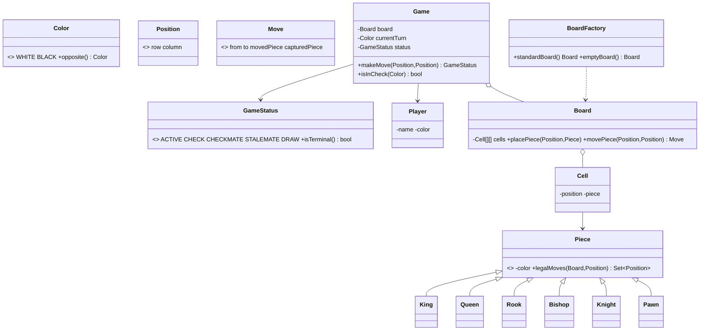

# Design a Chess Game

> This follows the repo structure: *Clarify → Requirements → Core Entities → Class Diagram → Patterns → Concurrency → Testability → API walkthrough*.

---

## 1. How to attack this in an interview

Start by bounding the game before coding: standard board, move validation depth, special moves, game-ending states, and whether many callers can hit the same game object.

### Clarifying questions to ask
| Question | Why it matters | Assumption we lock in |
| --- | --- | --- |
| Standard 8x8 board? | Determines coordinates and setup | Yes, standard starting position |
| Which rules are mandatory? | Chess has many edge cases | Six core piece movements, captures, check, checkmate |
| Special moves? | Castling/en passant/promotion can dominate time | Promotion implemented; castling/en passant are extensions |
| How are illegal moves reported? | API contract for clients/tests | `InvalidMoveException` |
| What should `makeMove` return? | Makes tests deterministic | The resulting `GameStatus` |
| Concurrent callers? | Race on turn-taking and board mutation | `makeMove` is synchronized per game |

### What earns points
- Name **Strategy / polymorphism** as the headline pattern: every `Piece` subtype computes its legal moves. A giant switch on piece type is the anti-pattern.
- Keep status explicit with an enum state machine: `ACTIVE`, `CHECK`, `CHECKMATE`, `STALEMATE`, `DRAW`.
- Explain that geometric movement is not enough: a legal move must not leave the mover's own king in check.

---

## 2. Requirements

**Functional**
1. Create an 8x8 board with the standard starting position.
2. Support King, Queen, Rook, Bishop, Knight, and Pawn movement rules.
3. Alternate White and Black turns.
4. Reject wrong-turn moves, blocked paths, illegal piece movement, own-piece captures, and moves after terminal status.
5. Support captures and automatic pawn promotion to queen.
6. Detect check, checkmate, and stalemate after every move.

**Non-functional**
1. **Thread-safe** move application.
2. **Extensible** movement and setup logic through polymorphism/factory seams.
3. **Testable** deterministic API with custom board setup.

---

## 3. Core entities

- **`Game`** — facade and state machine; owns turn order, move history, and status.
- **`Board`** — 8x8 collection of `Cell`s plus placement/move helpers.
- **`Cell`** — one square on the board; holds an optional `Piece`.
- **`Position`** — immutable row/column coordinate.
- **`Piece`** — abstract movement strategy → `King`, `Queen`, `Rook`, `Bishop`, `Knight`, `Pawn`.
- **`Player`** — name plus assigned `Color`.
- **`Move`** — immutable record of source, destination, moved piece, and captured piece.
- **`BoardFactory`** — creates standard or empty boards.

---

## 4. Class diagram



---

## 5. Design patterns used

| Pattern | Where | Why |
| --- | --- | --- |
| **Strategy / polymorphism** | `Piece.legalMoves` implemented by each concrete piece | Adds movement rules without editing a central switch; this is the headline interview pattern. |
| **State machine** | `GameStatus` plus `Game.calculateStatusFor` | Active, check, checkmate, stalemate, and draw are explicit and testable. |
| **Factory** | `BoardFactory` | Standard chess setup is centralized and reusable. |
| **Facade** | `Game` | One clean API: `makeMove(from, to)`. |
| **Command (extension)** | `Move` record | Captures enough data to support undo later; full undo command stack is intentionally not implemented. |

---

## 6. Concurrency — correctness over cleverness

Chess is turn-based, but two UI/network threads may still call `makeMove` concurrently.

```
Thread A sees WHITE turn; Thread B sees WHITE turn; both try to mutate the board before the turn switches.
```

`Game.makeMove` is `synchronized`, so validation, board mutation, promotion, turn switching, and status recalculation happen as one atomic critical section.

> `// CONCURRENCY:` A lightweight per-game lock preserves turn-taking correctness. Different `Game` instances do not block each other.

---

## 7. Testability

- `makeMove(from, to)` returns `GameStatus`, so tests assert outcomes directly.
- `Game.emptyGame()` plus `Board.placePiece(...)` creates focused scenarios for check/checkmate without replaying an opening.
- No randomness, clock, sleep, console input, or external service exists.
- `Piece.legalMoves` can be tested independently because movement is polymorphic and deterministic.

> `// TESTABILITY:` Custom board setup is deliberate; chess checkmate tests are otherwise noisy and brittle.

---

## 8. API walkthrough

```java
Game game = Game.defaultGame();

game.makeMove(new Position(6, 5), new Position(5, 5)); // f2 -> f3
game.makeMove(new Position(1, 4), new Position(3, 4)); // e7 -> e5
game.makeMove(new Position(6, 6), new Position(4, 6)); // g2 -> g4
GameStatus status = game.makeMove(new Position(0, 3), new Position(4, 7)); // Qh4#
```

`// DESIGN PATTERN:` Add a new movement rule by adding/changing a `Piece` subtype, not by editing a giant switch.
`// INTERVIEW INSIGHT:` Checkmate is "king in check and no legal escape", not "king captured".
`// EXTENSIBILITY:` Castling, en passant, richer draw rules, and explicit promotion choice can be layered in as move validators/commands.
