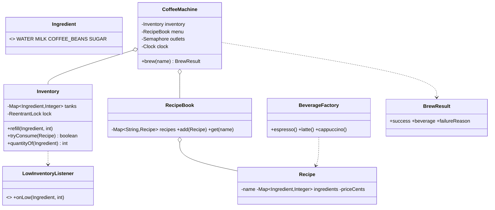

# Design a Coffee Vending Machine

> Sibling of the Vending Machine, but the interesting part is different: a coffee machine has **N serving outlets that brew in parallel** while sharing **common ingredient tanks**. That makes it a genuine concurrency problem, not a state-machine problem.

## 1. How to attack this in an interview

### Clarifying questions
| Question | Assumption we lock in |
| --- | --- |
| Fixed menu or custom drinks? | Fixed recipes (Espresso, Latte, Cappuccino), each a map of ingredient → amount. |
| One spout or several? | **N outlets** can brew simultaneously (this is the crux). |
| Shared ingredients? | Yes — all outlets draw from shared tanks (water, milk, beans, sugar). |
| What if two drinks need the last of an ingredient? | All-or-nothing reservation: exactly one brew succeeds, the other fails cleanly. |
| Expected vs. unexpected failures? | "Out of ingredient" / "all outlets busy" are **expected** → return a result object, don't throw. |

### What earns points
- Recognising the **multi-ingredient atomic reservation** ("reserve all or none") — the classic race.
- Bounding parallelism with a **Semaphore = number of outlets**, and holding the ingredient lock only for the *reservation*, not the slow brew, so outlets truly brew in parallel.
- Returning **result objects** for expected failures instead of exceptions.

## 2. Requirements

**Functional:** a menu of recipes (ingredients + price); brew a drink by name; brewing atomically consumes its ingredients; refill tanks; up to N concurrent brews; report low-ingredient conditions.

**Non-functional:** thread-safe under many concurrent brews; never over-consume a tank; extensible menu/ingredients; deterministic + unit-testable.

## 3. Core entities

- **`Ingredient`** — enum (WATER, MILK, COFFEE_BEANS, SUGAR).
- **`Inventory`** — the shared tanks; the atomic `tryConsume(recipe)` lives here.
- **`Recipe`** — name + `Map<Ingredient,Integer>` + price (integer cents).
- **`RecipeBook`** — the menu.
- **`BeverageFactory`** — builds the standard recipes (Factory).
- **`BrewResult`** — success/failure value object.
- **`CoffeeMachine`** — orchestrates outlets (Semaphore) + inventory + menu + injected clock.
- **`LowInventoryListener`** — observer for "refill me" alerts.

## 4. Class diagram



## 5. Design patterns

| Pattern | Where | Why |
| --- | --- | --- |
| **Factory** | `BeverageFactory` | Centralize construction of the standard recipes. |
| **Builder** | `CoffeeMachine.Builder` | Assemble machine (tanks, menu, outlet count, clock) readably. |
| **Observer** | `LowInventoryListener` | Alert an operator/telemetry when a tank runs low — inventory doesn't know who listens. |
| **Strategy** (implicit) | `Recipe` as data | Adding drinks = adding data, not code. |
| **Facade** | `CoffeeMachine` | One `brew(name)` call over outlets + inventory + menu. |

## 6. Concurrency — the whole point

Two independent concerns, solved separately:

1. **Bounded parallelism (outlets).** A `Semaphore(nOutlets)` caps concurrent brews at the number of physical spouts. If all are busy, `brew` returns `BrewResult.fail("all outlets busy")` rather than blocking forever.

2. **Atomic multi-ingredient reservation.** `Inventory.tryConsume(recipe)` takes a single `ReentrantLock` and, in one critical section, **checks that every required ingredient is available and only then decrements them all** (all-or-nothing). If two brews race for the last of the water, exactly one wins; the other sees the shortfall and fails without partially consuming anything.

> `// INTERVIEW INSIGHT:` The lock is held only for the *reservation* (a few map reads/writes), **not** for the slow physical brew. So after reserving, outlets brew fully in parallel — we get correctness *and* throughput. Also note the alternative of per-ingredient locks with a **consistent global lock order** to avoid deadlock; we choose one coarse lock for clarity and call out the trade-off.

## 7. Testability

- **Result objects** make every outcome assertable (`success`, `failureReason`) — no exception plumbing.
- **`Clock` injected** to timestamp served drinks deterministically.
- **Concurrency test:** set a tank to exactly one drink's worth, fire many concurrent brews, assert **exactly one** succeeds and the tank is never negative (no over-pour).

## 8. API walkthrough

```java
CoffeeMachine machine = CoffeeMachine.builder()
        .clock(Clock.systemUTC())
        .outlets(2)
        .refill(Ingredient.WATER, 1000)
        .refill(Ingredient.MILK, 500)
        .refill(Ingredient.COFFEE_BEANS, 300)
        .addRecipe(BeverageFactory.latte())
        .build();

BrewResult result = machine.brew("Latte");
if (result.success()) { /* enjoy */ } else { /* result.failureReason() */ }
```
