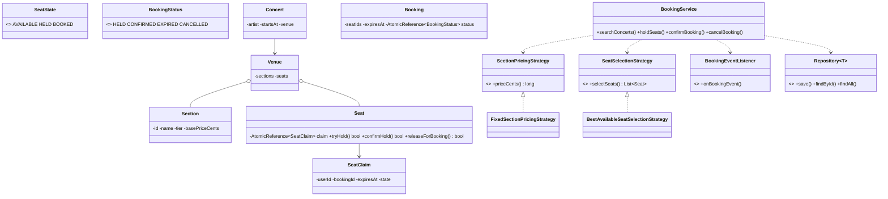

# Design a Concert Ticket Booking System

> This problem is about scoping the user journey, then defending the hard part: **atomic seat holds with deterministic expiry**.

---

## 1. How to attack this in an interview

Start by separating browsing from booking. Searching concerts is read-heavy and simple; the interview signal is the two-phase seat lifecycle: temporarily hold seats while payment happens, then confirm or expire.

### Clarifying questions to ask
| Question | Why it matters | Assumption we lock in |
| --- | --- | --- |
| Are seats assigned or general admission? | Drives the seat state machine | Assigned seats |
| How long is a hold valid? | Drives expiry/testability | Configurable, default 5 minutes |
| Can users pick exact seats? | Drives API and contention | Yes, plus best-available strategy |
| Can pricing vary by section? | Drives Strategy | Yes, each section has a tier/price |
| How is payment integrated? | Prevents scope creep | Payment is external; success calls confirm |
| Concurrent users? | The crux | Many users may race for the same seat |
| Cancel confirmed bookings? | Drives release transition | Yes, cancellation frees seats |

### What earns points
- Naming **State** for `AVAILABLE -> HELD -> BOOKED` and booking `HELD -> CONFIRMED/EXPIRED/CANCELLED`.
- Solving the "two users, one seat" race with per-seat CAS instead of a global lock.
- Injecting `Clock` and storing absolute `expiresAt = now + holdDuration`, so tests advance `MutableClock` and never sleep.
- Keeping pricing/selection swappable with **Strategy** and storage hidden by **Repository**.

---

## 2. Requirements

**Functional**
1. Create venues with sections and seats.
2. Create/search concerts by artist or venue.
3. Hold chosen seats for a user for a limited time.
4. Confirm a valid hold after payment.
5. Expire stale holds and release seats.
6. Cancel a held/confirmed booking and release seats.
7. Price seats by section.

**Non-functional**
1. **Thread-safe:** a seat is never double-held or double-booked.
2. **Testable:** time and ids are injected; no sleeping in tests.
3. **Extensible:** pricing, seat selection, notification, and persistence are replaceable.

---

## 3. Core entities

- **`Venue`** — contains `Section`s and physical `Seat`s.
- **`Section`** — pricing tier and base price in integer cents.
- **`Concert`** — event at a venue and time; owns a fresh seat inventory for that date.
- **`Seat`** — owns an `AtomicReference<SeatClaim>`; `null` means available.
- **`SeatClaim`** — immutable held/booked claim with user, booking id, expiry, state.
- **`Booking`** — user, concert, seats, price, expiry, lifecycle status.
- **`BookingService`** — Facade for search, hold, confirm, cancel, expiry sweep.
- **`SectionPricingStrategy`** — section-based price policy.
- **`SeatSelectionStrategy`** — best-available policy.
- **`BookingEventListener`** — Observer for hold/confirm/expire/cancel events.
- **`Repository<T>`** — persistence boundary.

---

## 4. Class diagram



---

## 5. Patterns table

| Pattern | Where | Why |
| --- | --- | --- |
| **State** | `Seat`, `Booking` | Centralizes legal lifecycle transitions. |
| **Strategy** | `SectionPricingStrategy`, `SeatSelectionStrategy` | Swap fixed pricing or best-seat rules. |
| **Facade** | `BookingService` | One clean API over repositories and state transitions. |
| **Observer** | `BookingEventListener` | Email/SMS/analytics react without coupling. |
| **Repository** | `Repository<T>`, `InMemoryRepository<T>` | Storage is replaceable. |
| **Builder** | `Venue.Builder`, `BookingService.Builder` | Readable setup and dependency injection. |

---

## 6. Concurrency

The dangerous bug is:

```
if (seat is available) {
    hold(seat);
}
```

Two users can both pass the check. Our fix is per-seat CAS:

- `Seat` stores `AtomicReference<SeatClaim>`.
- Available is `null`.
- `tryHold` performs `compareAndSet(null, newHold)`.
- If 100 users race for one seat, exactly one CAS succeeds.
- `confirmHold` uses CAS again for `HELD -> BOOKED`, so a stale confirmer cannot book a released/re-held seat.

`BookingService` synchronizes on a single `Booking` during confirm/cancel/expire to keep the booking status and its seat releases aligned without serializing unrelated bookings.

---

## 7. Testability

- `Clock` is injected. Hold expiry is `clock.instant().plus(holdDuration)`.
- Expiry is lazy: service calls `cleanupExpiredHolds`, and seats also release expired claims on access.
- Tests use `MutableClock.atEpoch()` and `advance(Duration.ofMinutes(6))` to prove another user can hold the same seat instantly.
- `Supplier<String>` is injected for deterministic booking ids.
- Money is represented as integer cents (`long`), never `double`.

---

## 8. API walkthrough

```java
MutableClock clock = MutableClock.atEpoch();
BookingService service = BookingService.builder()
        .clock(clock)
        .holdDuration(Duration.ofMinutes(5))
        .idGenerator(new AtomicIntegerIdSupplier())
        .build();

Venue venue = Venue.builder("v1", "City Arena")
        .addSection(new Section("vip", "VIP", "GOLD", 25000))
        .addSeat(new Seat("A1", "vip", "A", 1))
        .build();

Concert concert = service.createConcert(new Concert("c1", "The Patterns", clock.instant(), venue));
Booking hold = service.holdSeats(concert.getId(), "user-1", List.of("A1"));
service.confirmBooking(hold.getId(), "user-1");
```
