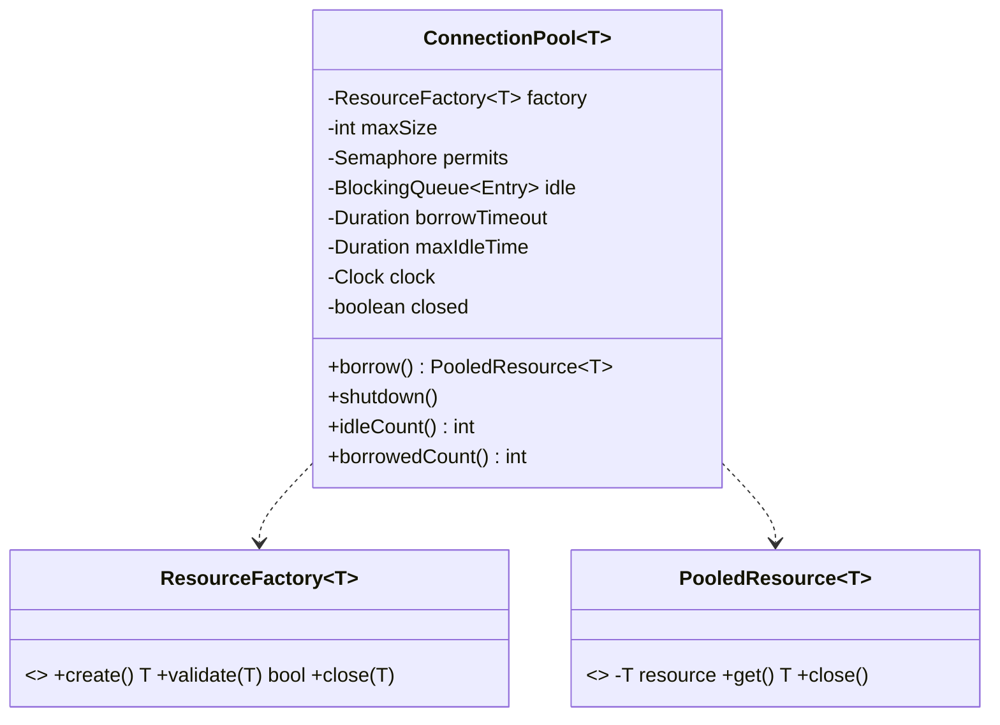

# Design a Connection Pool

> The Object Pool pattern under real concurrency. The interviewer probes: **bounded** resources, **block-with-timeout** on exhaustion, **validation/eviction**, and clean **shutdown** — all thread-safe. Making creation injectable + eviction clock-driven is what makes it testable.

## 1. How to attack this in an interview

### Clarifying questions
| Question | Assumption we lock in |
| --- | --- |
| Fixed max size? | Yes — never more than `maxSize` live resources. |
| Lazy or eager creation? | Lazy: create on demand up to `maxSize`, reuse idle ones. |
| Behaviour when exhausted? | **Block** for a bounded timeout, then throw. |
| Validate resources? | Yes — validate on borrow; discard & replace bad ones. |
| Idle/lifetime eviction? | Optional idle-timeout eviction driven by an injected clock. |
| Shutdown? | Close idle now; close borrowed ones on return; reject new borrows. |

### What earns points
- Bounding total resources with a **`Semaphore(maxSize)`** while reusing idle ones from a queue — and explaining why the invariant "live ≤ maxSize" holds.
- **Block-with-timeout** via `Semaphore.tryAcquire(timeout)` instead of spinning or blocking forever.
- Returning an **`AutoCloseable` handle** so `try-with-resources` returns the resource automatically (HikariCP-style proxy idea).

## 2. Requirements

**Functional:** `borrow()` a resource (reuse idle or lazily create, up to max; block up to a timeout when full), use it, `close()`/return it; validate on borrow; optional idle-timeout eviction; `shutdown()`.

**Non-functional:** thread-safe & correct under heavy contention; never exceed `maxSize`; deterministic/testable (injected factory + clock); no leaks.

## 3. Core entities

- **`ResourceFactory<T>`** — creates / validates / closes resources (injected → tests use fakes).
- **`ConnectionPool<T>`** — the pool: a `Semaphore` bounding size + an idle queue + a clock.
- **`PooledResource<T>`** — an `AutoCloseable` borrow handle that returns the resource on `close()`.
- Exceptions: **`PoolExhaustedException`**, **`PoolClosedException`**.

## 4. Class diagram



## 5. Design patterns

| Pattern | Where | Why |
| --- | --- | --- |
| **Object Pool** | `ConnectionPool` | Reuse expensive-to-create resources; bound their number. |
| **Factory** | `ResourceFactory` | Decouples the pool from how resources are made/validated/closed; the test seam. |
| **Handle / RAII (AutoCloseable)** | `PooledResource` | `try-with-resources` guarantees return even on exceptions. |
| **Builder** | `ConnectionPool.Builder` | Configure size/timeout/eviction/clock readably. |

## 6. Concurrency — the invariant and how we hold it

- A **`Semaphore` initialized to `maxSize`** is the gatekeeper. `borrow()` must acquire a permit *before* obtaining a resource; `release` returns the permit. Thus **borrowed ≤ maxSize** always.
- Idle resources sit in a `BlockingQueue`. On borrow we prefer an idle resource; only when the queue is empty (while holding a permit) do we **create** a new one. Because creation happens only under a held permit with an empty idle queue, **total live resources (borrowed + idle) never exceeds `maxSize`.**
- **Exhaustion** = `tryAcquire(borrowTimeout)` returns false → `PoolExhaustedException`. No spinning; the thread parks until a permit frees or the timeout elapses.

> `// INTERVIEW INSIGHT:` The subtle bug people miss: acquiring the resource *before* the permit (or creating without bounding) lets the pool blow past `maxSize`. Permit-first is the discipline that makes the bound airtight.

- **Shutdown** flips a `closed` flag, drains and closes idle resources; resources still borrowed are closed when returned (`release` sees `closed`). New borrows throw `PoolClosedException`.

## 7. Testability

- **`ResourceFactory` injected** → tests use fake connections (with an id and a flippable `valid`/`closed` flag) to assert reuse, validation-replacement, and that bad/evicted resources are actually closed.
- **`Clock` injected** → idle-timeout eviction is tested by advancing a `MutableClock` past `maxIdleTime` and asserting the stale resource is closed and a fresh one is created — no real waiting.
- **Concurrency test:** many threads borrow/use/return; a live counter proves the pool **never exceeds `maxSize`** concurrently and every resource is returned.

## 8. API walkthrough

```java
ConnectionPool<Conn> pool = ConnectionPool.<Conn>builder()
        .factory(new JdbcConnectionFactory())
        .maxSize(10)
        .borrowTimeout(Duration.ofSeconds(2))
        .maxIdleTime(Duration.ofMinutes(5))
        .clock(Clock.systemUTC())
        .build();

try (PooledResource<Conn> handle = pool.borrow()) {   // blocks up to 2s if full
    handle.get().executeQuery("...");
} // auto-returned to the pool here
```
