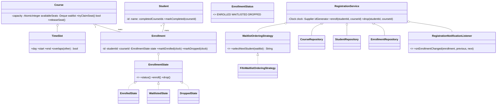

# Design a Course Registration System

> This follows the repo reference structure: Clarify → Requirements → Core Entities → Class Diagram → Patterns → Concurrency → Testability → API walkthrough.

---

## 1. How to attack this in an interview

Start by separating the **course catalog** (capacity, prerequisites, schedule) from each student's
**enrollment record** (ENROLLED, WAITLISTED, DROPPED). Most bugs come from checking availability and
then writing later.

### Clarifying questions to ask
| Question | Why it matters | Assumption we lock in |
| --- | --- | --- |
| Can students be waitlisted? | Drives queue and notification design | Yes, FIFO per course |
| Do prerequisites apply before waitlisting? | Prevents impossible promotions | Yes |
| Do waitlisted courses block time slots? | Affects conflict rules | We reject conflicts before joining the course |
| Can many students enroll concurrently? | This is the crux | Yes; no over-enrollment |
| How are notifications delivered? | Drives Observer | Listener interface; tests use an in-memory listener |
| Should ids/time be deterministic? | Drives test seams | Inject `Supplier<String>` and `Clock` |

### What earns points
- Name Observer, Strategy, State, Repository and Facade explicitly.
- Call out the capacity race: `if (available > 0) available--` is not atomic.
- Use CAS or a per-course lock for the check-and-claim operation.

---

## 2. Requirements

**Functional**
1. Courses have capacity, prerequisites and one weekly `TimeSlot`.
2. Students enroll in and drop courses.
3. Full courses place students on a FIFO waitlist.
4. Dropping an enrolled seat auto-promotes the head of the waitlist and notifies observers.
5. Missing prerequisites are rejected.
6. Overlapping enrolled schedules are rejected.

**Non-functional**
1. **Thread-safe**: concurrent enrollment must never exceed course capacity.
2. **Extensible**: waitlist ordering can change without rewriting the facade.
3. **Testable**: injectable `Clock` and id supplier; no `Thread.sleep`.
4. **Interview-friendly**: small in-memory repositories and simple domain objects.

---

## 3. Core entities

- **`Course`** — capacity, prerequisites, `TimeSlot`, atomic available-seat counter and FIFO waitlist.
- **`Student`** — identity plus completed prerequisite courses.
- **`Enrollment`** — stateful registration record with timestamps.
- **`EnrollmentState`** — State pattern for ENROLLED / WAITLISTED / DROPPED transitions.
- **`WaitlistOrderingStrategy`** — Strategy hook; default `FifoWaitlistOrderingStrategy`.
- **Repositories** — in-memory stores for courses, students and enrollments.
- **`RegistrationService`** — facade API used by tests/interview clients.
- **`RegistrationNotificationListener`** — observer notified on waitlist, enrollment, drop and promotion.

---

## 4. Class diagram



---

## 5. Design patterns used

| Pattern | Where | Why |
| --- | --- | --- |
| **Observer** | `RegistrationNotificationListener` | Promotion/enrollment notifications are decoupled from registration logic. |
| **Strategy** | `WaitlistOrderingStrategy` | FIFO can be replaced with priority ordering without changing `RegistrationService`. |
| **State** | `EnrollmentState` and implementations | Legal status transitions are localized and interview-visible. |
| **Repository** | `CourseRepository`, `StudentRepository`, `EnrollmentRepository` | Storage can move from memory to DB later. |
| **Facade** | `RegistrationService` | One clean API over validation, repositories, locking and notifications. |

// DESIGN PATTERN: The service is deliberately not a Singleton; dependency injection keeps tests isolated.

---

## 6. Concurrency — the part that separates seniors from juniors

The key race: many students see one seat remaining and all try to enroll.

**Naive bug:**
```
if (course.availableSeats() > 0) {
    course.decrementSeats();
}
```
The gap between check and decrement can over-enroll the course.

**Our fix — CAS plus course-level waitlist lock:**
- `Course` owns an `AtomicInteger availableSeats`.
- `tryClaimSeat()` performs a compare-and-set loop from `n` to `n - 1`.
- The waitlist queue is protected by the course lock so enqueue, drop and promotion are linearized.
- Dropping releases one seat and promotes the selected waitlisted student while still holding the same course lock.

// CONCURRENCY: The CAS counter is the authoritative capacity guard; the lock only keeps the FIFO queue and promotion sequence consistent.

---

## 7. Testability

- `RegistrationService.Builder.clock(...)` injects time; tests use `MutableClock`.
- `idGenerator` is injected so tests get deterministic ids.
- `RecordingRegistrationNotificationListener` captures observer events without mocks.
- The concurrency test uses latches to release workers at once; no sleeps.

// TESTABILITY: No production code calls `Instant.now()` or `UUID.randomUUID()` outside builder defaults.

---

## 8. API walkthrough

```java
RegistrationService service = RegistrationService.builder()
        .clock(Clock.systemUTC())
        .idGenerator(() -> UUID.randomUUID().toString())
        .build();

Course dsa = service.createCourse("Data Structures", 2, Set.of(),
        new TimeSlot(DayOfWeek.MONDAY, LocalTime.of(9, 0), LocalTime.of(10, 0)));
Course algorithms = service.createCourse("Algorithms", 1, Set.of(dsa.getId()),
        new TimeSlot(DayOfWeek.TUESDAY, LocalTime.of(9, 0), LocalTime.of(10, 0)));

Student student = service.registerStudent("Asha");
service.markCourseCompleted(student.getId(), dsa.getId());
Enrollment enrollment = service.enroll(student.getId(), algorithms.getId());
service.drop(student.getId(), algorithms.getId());
```

// EXTENSIBILITY: Add a `GraduatingSoonWaitlistStrategy` or persistent repositories as new classes; the facade API stays stable.
