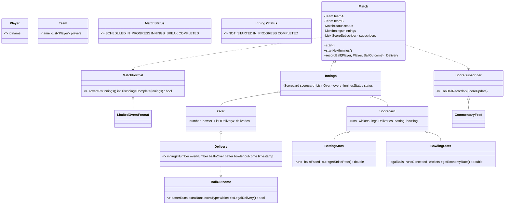

# Design CricInfo (Live Cricket Scoring)

> This problem follows the repo structure: *Clarify → Requirements → Core Entities → Class Diagram → Patterns → Concurrency → Testability → API walkthrough*.

---

## 1. How to attack this in an interview

Start by separating **scoring rules** from **live distribution**. The core aggregate must record a ball atomically; subscribers are secondary observers.

### Clarifying questions to ask
| Question | Why it matters | Assumption we lock in |
| --- | --- | --- |
| Which formats? | Defines innings length | Strategy: T20 = 20 overs, ODI = 50 overs |
| What outcomes per ball? | Drives scorecard mutation | Runs, wickets, wides, no-balls |
| Do extras consume balls? | Common scoring trap | Wides/no-balls add runs but do not consume legal deliveries |
| Need live updates? | Drives Observer | Subscribers receive one update per ball |
| Concurrent scoring/subscribers? | Drives locking boundary | Score mutation is locked; observer list is copy-on-write |
| Deterministic tests? | Avoids flaky clocks | Inject `Clock`; tests use `MutableClock` |

### What earns points
- Calling out that wides/no-balls affect runs but not overs.
- Encoding match/innings transitions as state-machine data.
- Notifying observers with a consistent snapshot outside the score lock.

---

## 2. Requirements

**Functional**
1. Model a `Match` between two `Team`s of `Player`s.
2. A match contains `Innings`; an innings contains `Over`s; overs contain `Delivery` records.
3. Record ball outcomes: runs, wicket, wide, no-ball.
4. Maintain team score, batsman runs/balls/strike rate, bowler overs/runs/wickets/economy.
5. Track states: `SCHEDULED → IN_PROGRESS → INNINGS_BREAK → COMPLETED`.
6. Determine result after both innings.
7. Push live updates to subscribers/commentary feed.

**Non-functional**
1. **Thread-safe** scoring: concurrent deliveries cannot interleave partial score mutations.
2. **Extensible** formats: add a new format by implementing `MatchFormat`.
3. **Testable**: injected `Clock`, scripted ball outcomes, no sleeps.

---

## 3. Core entities

- **`Player`** — immutable id/name value object.
- **`Team`** — immutable squad container.
- **`Match`** — facade aggregate; owns state, innings and observers.
- **`Innings`** — batting team, bowling team, overs and `Scorecard`.
- **`Over`** — six legal balls plus any extras.
- **`Delivery`** — one timestamped ball entry.
- **`BallOutcome`** — runs/extras/wicket and whether the ball is legal.
- **`Scorecard`** — team score plus batting/bowling maps.
- **`BattingStats` / `BowlingStats`** — derived player figures.
- **`MatchFormat`** — Strategy for innings completion rules.
- **`ScoreSubscriber`** — Observer for live score updates.

---

## 4. Class diagram



---

## 5. Design patterns used

| Pattern | Where | Why |
| --- | --- | --- |
| **Observer** | `ScoreSubscriber`, `CommentaryFeed` | Live score displays/commentary react to every ball without coupling to `Match`. |
| **State machine** | `MatchStatus`, `InningsStatus` | Legal transitions are centralized as data, avoiding scattered conditionals. |
| **Strategy** | `MatchFormat` | T20/ODI/custom formats decide innings length and completion. |
| **Builder** | `Match.Builder` | Readable setup for teams, format, clock and subscribers. |
| **Factory** | `MatchFactory` | Named constructors for T20/ODI/common match setup. |
| **Facade** | `Match` | One interview-friendly API over innings, overs, scorecards and updates. |

---

## 6. Concurrency — the part that separates seniors from juniors

Multiple callers may record balls while several subscribers consume live updates. The danger is a partial update: team score increments but batsman/bowler stats do not, or observers see a stale half-mutated scorecard.

**Our fix:** `Match.recordBall` uses a private score lock as the linearization point.

```
lock:
  validate match is IN_PROGRESS
  create timestamped Delivery from injected Clock
  append to Over/Innings
  mutate Scorecard
  close innings/match if needed
  copy Scorecard snapshot
unlock
notify observers with snapshot
```

`// CONCURRENCY:` observers are stored in `CopyOnWriteArrayList`, so subscribers can be added/removed while updates are being published. Notifications happen after releasing the score lock so a slow subscriber cannot deadlock scoring.

---

## 7. Testability

- `Clock` is injected into `Match`; tests use `in.neelporiya.testutil.MutableClock`.
- `MatchFormat.limitedOvers(1)` makes over-limit tests tiny and deterministic.
- Ball scripts use `BallOutcome.runs(4)`, `wide()`, `wicketBall()` and `noBall(...)`.
- No `Thread.sleep`; exact assertions cover runs, wickets, overs, strike rate, economy and observer call count.

---

## 8. API walkthrough

```java
Team india = new Team("India", List.of(new Player("ro", "Rohit")));
Team aus = new Team("Australia", List.of(new Player("st", "Starc")));

CommentaryFeed feed = new CommentaryFeed();
Match match = Match.builder()
        .teams(india, aus)
        .battingFirst(india)
        .format(MatchFormat.t20())
        .clock(Clock.systemUTC())
        .addSubscriber(feed)
        .build();

match.start();
match.recordBall(india.getPlayers().get(0), aus.getPlayers().get(0), BallOutcome.runs(4));
Scorecard live = match.currentScorecard(); // 4/0 in 0.1 overs
```

