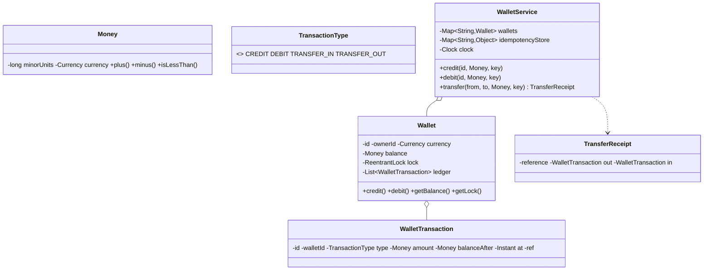

# Design a Digital Wallet Service

> This is a **money + concurrency** problem. Two things must be flawless: (1) transfers are **atomic and deadlock-free**, and (2) operations are **idempotent** so a client retry never double-spends. Nail those and you've passed.

## 1. How to attack this in an interview

### Clarifying questions
| Question | Assumption we lock in |
| --- | --- |
| Single or multi-currency? | Multi-currency wallets; a wallet has one currency; cross-currency is out of scope (reject mismatches). |
| Overdraft allowed? | No — a debit that would go negative is rejected. |
| Exactly-once semantics on retry? | Yes — every mutating op carries an **idempotency key**. |
| Need a transaction history? | Yes — an append-only ledger per wallet. |
| Concurrency? | Yes — concurrent transfers between the same accounts must not deadlock or lose money. |

### What earns points
- Representing money as **integer minor units + currency** (never `double`).
- Solving the **transfer deadlock**: two threads doing A→B and B→A lock in opposite order → deadlock. Fix: acquire wallet locks in a **global order** (by id).
- **Idempotency keys** so a retried transfer applies exactly once — the #1 real-world payments concern.

## 2. Requirements

**Functional:** create wallets; credit; debit (no overdraft); transfer between wallets atomically; balance inquiry; per-wallet transaction history. Every mutation is idempotent by key.

**Non-functional:** correct under heavy concurrency; deadlock-free; money is exact; deterministic/testable time.

## 3. Core entities

- **`Money`** — `(minorUnits, Currency)` with checked arithmetic (rejects currency mismatch).
- **`Wallet`** — id, owner, currency, balance (guarded by a `ReentrantLock`), append-only ledger.
- **`WalletTransaction`** — ledger entry: type, amount, balance-after, timestamp, reference.
- **`TransactionType`** — CREDIT / DEBIT / TRANSFER_IN / TRANSFER_OUT.
- **`TransferReceipt`** — the two legs of a transfer.
- **`TransactionListener`** (Observer) — notifications/metrics.
- **`WalletService`** — the Facade; owns wallets, clock, ids, and the idempotency store.

## 4. Class diagram



## 5. Design patterns

| Pattern | Where | Why |
| --- | --- | --- |
| **Value Object** | `Money` | Immutable, currency-safe arithmetic; no floating-point money bugs. |
| **Facade** | `WalletService` | One API over wallets, ledger, idempotency, clock. |
| **Repository** | wallet map | Swap in a DB later. |
| **Observer** | `TransactionListener` | Notifications/fraud checks react to transactions without coupling. |

## 6. Concurrency — the two hard problems

**(a) Atomic, deadlock-free transfer.** A transfer must debit one wallet and credit another as one indivisible step, so it holds **both** wallet locks. The danger: thread 1 transfers A→B (locks A then B) while thread 2 transfers B→A (locks B then A) — classic **deadlock**.

> `// INTERVIEW INSIGHT:` The fix is a **global lock ordering**: always lock the wallet with the smaller id first, regardless of transfer direction. With a consistent order, a cycle is impossible, so deadlock is impossible.

Single-wallet `credit`/`debit` lock just that wallet. The lock is a **reentrant** `ReentrantLock`, so the transfer can hold the outer ordered locks and still call `wallet.debit()`/`wallet.credit()` (which re-lock reentrantly) without issue.

**(b) Idempotency.** Each mutation takes an idempotency key. The service uses `ConcurrentHashMap.computeIfAbsent(key, …)` to run the operation **exactly once per key**: concurrent retries with the same key all receive the single memoized result, and the balance moves once. A *failed* op (e.g. insufficient funds) stores nothing, so it can be legitimately retried.

## 7. Testability

- **`Clock` and id generator injected** → deterministic timestamps/ids.
- **Money is exact** → assert precise balances.
- **Deadlock test:** N threads transfer A→B while N transfer B→A; the test must complete within a timeout (proving no deadlock) and the **sum of balances is conserved** (proving atomicity), with no wallet ever negative.
- **Idempotency test:** call transfer twice with the same key → balances move once, same receipt returned.

## 8. API walkthrough

```java
WalletService svc = new WalletService(clock, idGen);
Wallet alice = svc.createWallet("alice", Currency.USD);
Wallet bob   = svc.createWallet("bob", Currency.USD);
svc.credit(alice.getId(), Money.of(10_000, Currency.USD), "topup-1"); // $100.00
svc.transfer(alice.getId(), bob.getId(), Money.of(2_500, Currency.USD), "txn-abc"); // idempotent
```
