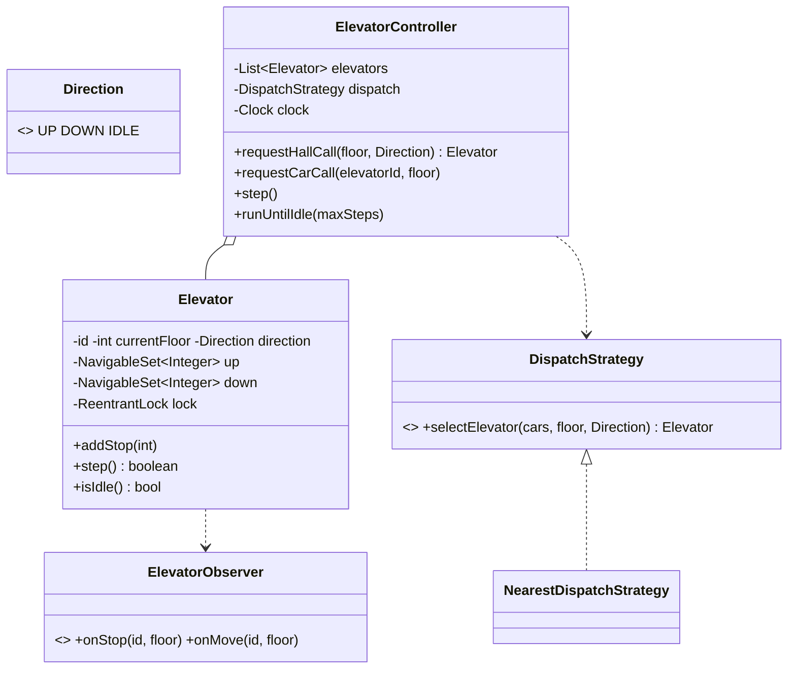

# Design an Elevator System

> The interviewer wants two things: a correct **scheduling algorithm** (LOOK/SCAN, not naive FCFS) and a **dispatcher** that picks the best car. The senior move is making the whole thing **tick-driven off an injected clock** so it's testable without real time.

## 1. How to attack this in an interview

### Clarifying questions
| Question | Assumption we lock in |
| --- | --- |
| One car or several? | Several — a dispatcher assigns hall calls. |
| Request types? | **Hall calls** (floor + desired direction) and **car calls** (destination button inside). |
| Scheduling policy? | **LOOK**: keep going in the current direction serving stops, then reverse — no needless full-length sweeps. |
| How is a car chosen for a hall call? | Pluggable dispatch strategy (default: nearest suitable car). |
| Real-time threads? | Model movement as discrete `step()`s driven by a clock so it's deterministic & testable. |

### What earns points
- **LOOK** over FCFS (FCFS makes the car yo-yo; LOOK is what real elevators do).
- Separating **dispatch** (which car) from **scheduling** (what order a car serves its stops) — two Strategies.
- Driving movement with `step()` + an injected clock so tests assert exact positions with no `Thread.sleep`.

## 2. Requirements

**Functional:** submit hall/car calls; each car serves its stops in LOOK order; a dispatcher assigns hall calls to the best car; observers see floor changes and stops.

**Non-functional:** thread-safe request submission; deterministic, tick-driven simulation (testable); extensible dispatch & scheduling.

## 3. Core entities

- **`Direction`** — UP / DOWN / IDLE.
- **`Elevator`** — current floor, direction, and its pending stops (`up`/`down` sorted sets) guarded by a lock; implements the LOOK `step()`.
- **`DispatchStrategy`** (Strategy) → `NearestDispatchStrategy` — picks a car for a hall call.
- **`ElevatorObserver`** (Observer) — floor-change / stop notifications (displays).
- **`ElevatorController`** — the Facade: holds cars, routes requests, advances the simulation.

## 4. Class diagram



## 5. Design patterns

| Pattern | Where | Why |
| --- | --- | --- |
| **Strategy** | `DispatchStrategy` | Swap car-selection (nearest / same-direction / least-loaded) without touching the controller. |
| **State machine** | `Direction` transitions in `Elevator.step` | LOOK is a small, explicit state machine (UP→DOWN→IDLE). |
| **Observer** | `ElevatorObserver` | Floor indicators / logs react to movement. |
| **Facade** | `ElevatorController` | One API over cars + dispatch + simulation. |

## 6. Concurrency

- Hall/car calls can arrive from many threads. Each `Elevator` guards its `up`/`down` stop sets with a `ReentrantLock`; `addStop` and `step` are atomic, so a call added mid-step is never lost or corrupted.
- The controller's elevator list is fixed after construction (effectively immutable), so routing needs no lock beyond each car's own.
- `// INTERVIEW INSIGHT:` we deliberately keep the *decision* logic (LOOK) synchronous and tick-driven rather than spawning a thread per car. A real deployment wraps `step()` in a scheduled loop, but the core stays a pure, testable state machine.

## 7. Testability

- **Movement is `step()`-driven** and time comes from an injected `Clock`, so a test submits calls, pumps `step()` (or `runUntilIdle`) and asserts exact floors and the **stop order** — completely deterministic, no real waiting.
- Dispatch is a pure function of car states → assert which car is chosen.
- A concurrency test submits many hall calls from many threads, then pumps the simulation and asserts every requested floor was served (no lost requests).

## 8. API walkthrough

```java
ElevatorController controller = new ElevatorController(
        List.of(new Elevator("A", 0), new Elevator("B", 9)),
        new NearestDispatchStrategy(), clock);

controller.requestHallCall(5, Direction.UP);   // dispatched to the nearer car
controller.requestCarCall("A", 8);
controller.runUntilIdle(100);                  // pump the simulation to completion
```
