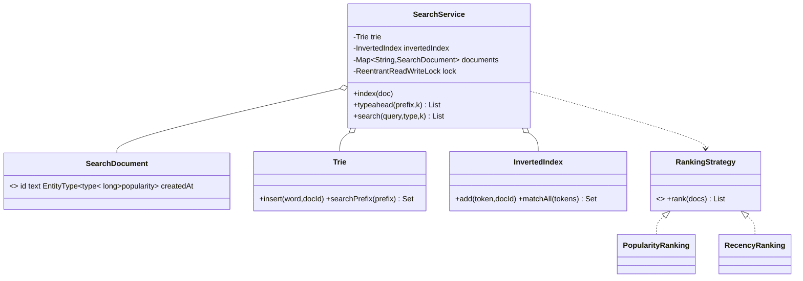

# Design Facebook Search (typeahead + entity search)

> This is the **data-structures** LLD. Two indexes do the heavy lifting: a **Trie** for instant
> prefix **typeahead** ("joh" → John…), and an **inverted index** for full-text **entity search**
> (find docs containing all query words). A pluggable **ranking Strategy** orders the matches.

## 1. How to attack this in an interview

### Clarifying questions
| Question | Assumption we lock in |
| --- | --- |
| Typeahead, full search, or both? | Both — prefix autocomplete AND multi-word search. |
| Prefix of the whole string or any word? | Any word — "smi" matches "John **Smi**th". So index per-word. |
| What's searchable? | Users, Pages, Groups, Posts — one `EntityType` per document. |
| Ranking? | Pluggable: by popularity or recency; can filter by type. |
| Read/write mix? | Mostly reads (searches), occasional writes (indexing) → read/write lock. |

### What earns points
- Choosing the **right structure for each job**: trie for prefix, inverted index for full-text — and tokenizing **once** so both agree on word boundaries.
- Storing doc ids at **every trie node** for O(prefix) typeahead, and naming the **top-k-per-node** optimization for scale.
- Ranking as a **Strategy** and a **`ReentrantReadWriteLock`** (many readers, rare writer).

## 2. Requirements

**Functional:** index a document (id, text, type, popularity, createdAt); typeahead by prefix (top-k,
ranked); full-text AND search (top-k, ranked, optional type filter); swap ranking per call.

**Non-functional:** fast prefix lookup; deterministic ranking (stable tie-break); safe under
concurrent index/search; extensible ranking.

## 3. Core entities

- **`SearchDocument`** — record: id, text, `EntityType`, popularity, createdAt (the ranking features).
- **`Tokenizer`** — the single normalize-to-words front door for both indexes.
- **`Trie`** — per-word prefix index; node → ids of docs with that prefix.
- **`InvertedIndex`** — token → posting set; `matchAll` intersects postings (AND).
- **`RankingStrategy`** (Strategy) — `PopularityRanking`, `RecencyRanking`.
- **`SearchService`** (Facade) — indexes + ranking + read/write lock.

## 4. Class diagram



## 5. Design patterns

| Pattern | Where | Why |
| --- | --- | --- |
| **Strategy** | `RankingStrategy` | Popularity vs recency vs ML, chosen per query. |
| **Facade** | `SearchService` | One API over two indexes + ranking + locking. |
| **Value Object** | `SearchDocument` | Immutable doc carrying ranking features. |
| **(Index structures)** | `Trie`, `InvertedIndex` | Right tool per query shape. |

## 6. Concurrency

Search traffic is ~all reads with the odd write when content is created/edited. A
`ReentrantReadWriteLock` lets **many searches run in parallel**; `index` takes the **write** lock so it
mutates the trie, inverted index and document map **together, atomically** — a doc can never be half
indexed (visible to typeahead but not full search).

> `// INTERVIEW INSIGHT:` if writes became hot, you'd move to a lock-free read path over an immutable
> index snapshot that's rebuilt/swapped in the background (copy-on-write), so readers never block.

## 7. Testability

- Deterministic ranking (stable id tie-break) → exact assertions on result order.
- Injected/overridable ranking per call → assert popularity vs recency orderings on the same corpus.
- Prefix, word-boundary and AND semantics asserted directly on `Trie` / `InvertedIndex`.
- **Concurrency test:** many threads index distinct docs while others search — no exceptions, and every
  indexed doc is findable afterwards (indexes stayed consistent).

## 8. API walkthrough

```java
SearchService search = new SearchService(); // default: popularity ranking
search.index(new SearchDocument("u1", "John Smith", EntityType.USER, 500, t0));
search.index(new SearchDocument("u2", "Johnny Appleseed", EntityType.USER, 900, t1));

search.typeahead("joh", 10);                 // both, most-popular first: [u2, u1]
search.search("john smith", 10);             // AND full-text: [u1]
search.search("john", EntityType.USER, 5, new RecencyRanking()); // newest first
```
