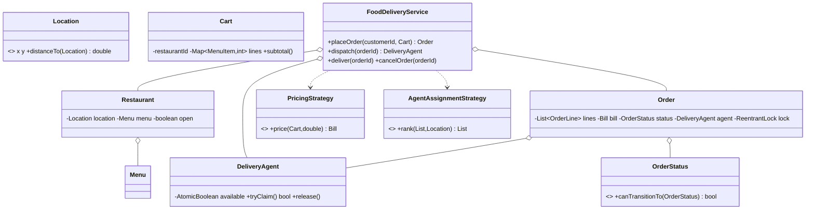

# Design an Online Food Delivery System (Swiggy)

> Three moving parts: an **order lifecycle** (a guarded state machine), **courier dispatch** (an
> atomic claim so no two orders grab the same rider), and **pricing** (a swappable strategy over a
> cart + delivery distance). Restaurants, menus and a single-restaurant cart are the supporting cast.

## 1. How to attack this in an interview

### Clarifying questions
| Question | Assumption we lock in |
| --- | --- |
| One restaurant per cart? | Yes — Swiggy carts don't mix kitchens. |
| Order lifecycle? | PLACED → ACCEPTED → PREPARING → READY → OUT_FOR_DELIVERY → DELIVERED, cancellable until it's out for delivery. |
| How is a courier chosen? | A strategy ranks free couriers (nearest by default); dispatch claims one atomically. |
| Pricing? | subtotal + distance-based delivery fee + tax, as a pluggable strategy. |
| Concurrency worry? | Two ready orders must not be assigned the SAME courier. |

### What earns points
- The lifecycle as a **transition table** (one source of truth) rather than scattered `if`s.
- Courier assignment as an **atomic compare-and-set claim** (`tryClaim`) driven by a **ranking strategy** — the strategy expresses preference, the CAS wins the race.
- Rejecting closed restaurants / unavailable items / empty carts **up front**.

## 2. Requirements

**Functional:** onboard restaurants (with menus + availability), couriers and customers; search open
restaurants; build a cart; place an order (priced by distance); drive it accept→prepare→ready; dispatch
a courier; deliver; cancel before dispatch.

**Non-functional:** no courier double-booked; illegal transitions rejected; deterministic pricing &
dispatch (injected strategies, clock, ids); thread-safe.

## 3. Core entities

- **`Location`** — 2-D point with `distanceTo` (Euclidean; swap for Haversine).
- **`MenuItem` / `Menu`** — priced items; the menu tracks live availability.
- **`Restaurant`** — location + menu + open flag.
- **`Customer`**, **`DeliveryAgent`** (atomic `tryClaim`/`release`).
- **`Cart` → `OrderLine`s** — one restaurant, accumulated quantities, subtotal.
- **`OrderStatus`** — the transition table. **`Order`** — lines + `Bill` + status + assigned agent + its own lock.
- **`PricingStrategy`** (StandardPricing) and **`AgentAssignmentStrategy`** (Nearest / FirstAvailable).
- **`OrderListener`** (Observer). **`FoodDeliveryService`** (Facade).

## 4. Class diagram



## 5. Design patterns

| Pattern | Where | Why |
| --- | --- | --- |
| **State machine** | `OrderStatus` transition table | One legal-lifecycle source of truth. |
| **Strategy** | `PricingStrategy`, `AgentAssignmentStrategy` | Swap pricing / courier-selection independently. |
| **Facade** | `FoodDeliveryService` | One API over the whole flow. |
| **Observer** | `OrderListener` | Push lifecycle events to apps/dashboards. |
| **Value Object** | `Location`, `MenuItem`, `Bill`, `OrderLine` | Immutable data. |

## 6. Concurrency

Two concerns, two mechanisms:

1. **Per-order transition** — each `Order` has a `ReentrantLock`; the service holds it across
   *check-status-then-transition* so an order can't be advanced two ways at once.
2. **Courier claim** — `DeliveryAgent.tryClaim()` is a `compareAndSet(true,false)`. `dispatch` snapshots
   the free couriers, lets the strategy rank them, then iterates trying to claim; the first successful
   CAS wins. If two ready orders both prefer the same nearest rider, exactly one claims it and the
   other falls through to the next candidate (or `NoAgentAvailableException`).

> `// INTERVIEW INSIGHT:` the ranking strategy is intentionally NOT responsible for winning the race —
> it only expresses preference. Correctness lives in the atomic claim, so any strategy is safe.

## 7. Testability

- Injected **`StandardPricing`** with fixed base/per-distance/tax → exact `Bill` assertions.
- Euclidean `Location` → exact distances → exact delivery fees.
- Injected **clock + id generator** → stable ids and timestamps.
- **Concurrency test:** N ready orders, M<N couriers, all dispatched at once → exactly M succeed, N−M
  get `NoAgentAvailableException`, and no courier is assigned twice.

## 8. API walkthrough

```java
FoodDeliveryService app = new FoodDeliveryService(
        new StandardPricing(new BigDecimal("20"), new BigDecimal("5"), new BigDecimal("0.05")),
        new NearestAgentStrategy(), Clock.systemUTC());

Restaurant r = app.registerRestaurant("Dosa Place", new Location(0, 0));
MenuItem dosa = r.getMenu().addItem(new MenuItem("m1", "Masala Dosa", new BigDecimal("100")));
app.registerAgent("rider-1", new Location(1, 0));
Customer c = app.registerCustomer("alice", new Location(3, 4)); // distance 5

Cart cart = app.newCart(r.getId()).add(dosa, 2);
Order order = app.placeOrder(c.getId(), cart);   // bill: 200 + (20+5*5) + 5% tax
app.acceptOrder(order.getId());
app.startPreparing(order.getId());
app.markReady(order.getId());
app.dispatch(order.getId());                      // claims nearest free rider
app.deliver(order.getId());                       // rider freed
```
