# Design a Hotel Management System

> This mirrors the repository reference structure: *Clarify → Requirements → Core Entities → Class Diagram → Patterns → Concurrency → Testability → API walkthrough*.

---

## 1. How to attack this in an interview

Do not start by drawing every possible hotel feature. First pin down whether the system books a **specific physical room** or just a room type. This implementation supports both, but treats specific-room booking as the core because that is where the double-booking race appears.

### Clarifying questions to ask
| Question | Why it matters | Assumption we lock in |
| --- | --- | --- |
| One hotel or many? | Changes inventory scoping | One hotel with many rooms |
| Book type or specific room? | Changes concurrency and APIs | Specific room, plus helper to book any room of a type |
| Date semantics? | Avoid off-by-one pricing/overlap bugs | Half-open `[checkIn, checkOut)` `LocalDate` ranges |
| Room categories? | Drives search and pricing | `STANDARD`, `DELUXE`, `SUITE` |
| Pricing model? | Strategy hook | Nights × room rate; optional tax/discount strategy |
| Concurrent bookings? | The crux | Many threads may book the same room at once |
| Payment? | Can consume the interview | Out of scope; compute quoted price only |

### What earns points
- Calling out the **check-then-act race** in booking before coding.
- Using a per-room lock instead of a global hotel lock, so unrelated rooms can be booked concurrently.
- Injecting `Clock` and id generation for deterministic tests.
- Modelling lifecycle with State instead of scattered `if` statements.

---

## 2. Requirements

**Functional**
1. Maintain rooms of several `RoomType`s, each with a nightly rate in cents.
2. Search available rooms for a check-in/check-out range and optional type.
3. Book a specific room or first available room of a type.
4. Check in, check out, or cancel a reservation.
5. Compute quoted price from nights × rate, with optional tax/discount strategy.
6. Notify observers on booking, cancellation, check-in, and check-out.

**Non-functional**
1. **Thread-safe**: overlapping reservations for the same room must never both succeed.
2. **Extensible**: pricing, search, construction, lifecycle, and persistence are isolated behind patterns.
3. **Testable**: deterministic time/ids; no sleeps; money is integer cents.

---

## 3. Core entities

- **`RoomType`** — `STANDARD`, `DELUXE`, `SUITE`; carries cents-per-night.
- **`Room`** — one physical room with id, number, type, and floor.
- **`RoomFactory`** — centralizes room construction.
- **`StayRange`** — validated half-open stay range with overlap logic.
- **`Reservation`** — built with a Builder; owns lifecycle state and timestamps.
- **`ReservationState`** — State pattern for legal transitions.
- **`RoomRepository` / `ReservationRepository`** — in-memory repositories.
- **`PricingStrategy`** — quoted-price calculation strategy.
- **`SearchStrategy`** — room availability ordering/filter strategy.
- **`ReservationEventListener`** — Observer hook for notifications.
- **`HotelService`** — Facade API over inventory, reservations, pricing, lifecycle, notifications, and locks.

---

## 4. Class diagram

```mermaid
classDiagram
    class RoomType { <<enum>> STANDARD DELUXE SUITE }
    class StayRange { -checkIn -checkOut +overlaps(StayRange) bool +nights() long }
    class Room { -id -number -type -floor }
    class RoomFactory { +create(id,number,type,floor) Room }

    class PricingStrategy { <<interface>> +calculateCents(room, range) long }
    class NightlyRatePricingStrategy
    class TaxDiscountPricingStrategy
    PricingStrategy <|.. NightlyRatePricingStrategy
    PricingStrategy <|.. TaxDiscountPricingStrategy

    class SearchStrategy { <<interface>> +search(rooms,reservations,range,type) List~Room~ }
    class DefaultRoomSearchStrategy
    SearchStrategy <|.. DefaultRoomSearchStrategy

    class ReservationState { <<interface>> +checkIn(reservation,now) +checkOut(reservation,now) +cancel(reservation,now) }
    class ConfirmedState
    class CheckedInState
    class CheckedOutState
    class CancelledState
    ReservationState <|.. ConfirmedState
    ReservationState <|.. CheckedInState
    ReservationState <|.. CheckedOutState
    ReservationState <|.. CancelledState

    class Reservation { -id -roomId -guestId -range -quotedPriceCents -state +builder() Builder }
    Reservation o-- ReservationState

    class RoomRepository { +save(room) +findById(id) +findAll() }
    class ReservationRepository { +save(reservation) +findById(id) +activeForRoom(id) }
    class ReservationEventListener { <<interface>> +onBooked(reservation) +onCancelled(reservation) }
    class HotelService { -locksByRoomId +searchAvailable(...) +bookRoom(...) +bookRoomOfType(...) +checkIn(...) +checkOut(...) +cancel(...) }

    HotelService ..> PricingStrategy
    HotelService ..> SearchStrategy
    HotelService ..> ReservationEventListener
    HotelService o-- RoomRepository
    HotelService o-- ReservationRepository
    Reservation ..> StayRange
    Reservation ..> Room
```



---

## 5. Design patterns used

| Pattern | Where | Why |
| --- | --- | --- |
| **Strategy** | `PricingStrategy`, `SearchStrategy` | Swap pricing/search policies without changing `HotelService`. |
| **Repository** | `RoomRepository`, `ReservationRepository` | Hide storage details from the facade. |
| **Facade** | `HotelService` | One interview-friendly API over rooms, reservations, pricing, lifecycle, events, and locks. |
| **Builder** | `Reservation.Builder` | Reservation has several required fields; builder keeps construction readable and valid. |
| **Factory** | `RoomFactory` | Centralizes construction for room inventory. |
| **State** | `ReservationState` implementations | Legal transitions live with states, not scattered conditionals. |
| **Observer** | `ReservationEventListener` | Notifications are decoupled from booking logic. |

**Deliberately NOT a Singleton.** A hotel service should be resettable in tests and could represent different hotels in production; dependency injection keeps state isolated.

---

## 6. Concurrency — the part that separates seniors from juniors

The dangerous code is:

```
if (!hasOverlap(roomId, range)) {
    save(newReservation);
}
```

Two threads can both observe "no overlap" and both insert. That is the classic **check-then-act race**.

**Our fix — per-room lock:**
- `HotelService` keeps a lock keyed by `roomId`.
- Booking performs overlap check **and** insert inside `synchronized(lockFor(roomId))`.
- Different rooms use different locks, so booking room 101 does not block booking room 205.
- The overlap rule is half-open: `[in1,out1)` overlaps `[in2,out2)` iff `in1 < out2 && in2 < out1`.

---

## 7. Testability

- **`Clock` is injected** into `HotelService`; reservation creation, check-in, check-out, and cancellation timestamps use `clock.instant()`.
- **Ids are injected** using `Supplier<String>`, so tests assert exact ids without UUID randomness.
- **Pricing and search are injected** as strategies and can be replaced independently.
- Concurrency tests use `CountDownLatch` to release many threads together and assert exactly one successful booking; no `Thread.sleep`.

---

## 8. API walkthrough

```java
HotelService service = new HotelService(
        Clock.systemUTC(),
        () -> UUID.randomUUID().toString(),
        new NightlyRatePricingStrategy(),
        new DefaultRoomSearchStrategy());

service.addRoom(RoomFactory.create("room-101", "101", RoomType.DELUXE, 1));
StayRange range = new StayRange(LocalDate.of(2026, 8, 1), LocalDate.of(2026, 8, 4));

Reservation reservation = service.bookRoom("guest-1", "room-101", range);
service.checkIn(reservation.getId());
service.checkOut(reservation.getId());
```
