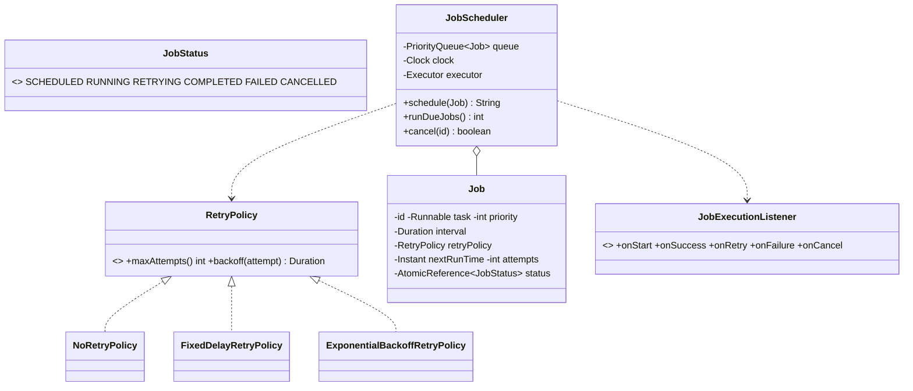

# Design a Job/Task Scheduler

> A scheduler that runs jobs **now / after a delay / on a repeating interval**, with **priorities**, **retries**, and **cancellation**. The senior move: make the "what's due?" decision read an **injected clock** and expose a `runDueJobs()` pump, so the whole thing is deterministic under test.

## 1. How to attack this in an interview

### Clarifying questions
| Question | Assumption we lock in |
| --- | --- |
| Schedule kinds? | One-shot with delay + fixed-interval recurring. |
| Priorities? | Yes — among jobs due at the same time, higher priority runs first. |
| Failure handling? | Pluggable **retry policy** (max attempts + backoff). |
| Cancellation? | Yes — a scheduled/retrying job can be cancelled. |
| Execution model? | A due job is dispatched to an injected `Executor` (thread pool in prod, inline in tests). |

### What earns points
- A **priority queue keyed by next-run-time** + a `runDueJobs()` pump driven by an **injected clock** (deterministic, no real timers in tests).
- Injecting the **`Executor`** so tests run jobs inline while prod uses a thread pool.
- **Retry policy as a Strategy** (fixed / exponential backoff) and clean **cancellation**.

## 2. Requirements

**Functional:** schedule one-shot (with delay) and recurring jobs with a priority; execute due jobs on a worker pool; retry failures per policy; cancel jobs; report status.

**Non-functional:** thread-safe; deterministic/testable time & execution; extensible retry/schedule.

## 3. Core entities

- **`Job`** — task + priority + schedule (delay/interval) + retry policy + runtime state (next-run-time, attempts, status).
- **`JobStatus`** — SCHEDULED / RUNNING / RETRYING / COMPLETED / FAILED / CANCELLED.
- **`RetryPolicy`** (Strategy) — `NoRetryPolicy`, `FixedDelayRetryPolicy`, `ExponentialBackoffRetryPolicy`.
- **`JobExecutionListener`** (Observer) — lifecycle hooks.
- **`JobScheduler`** — Facade: priority queue + clock + executor.

## 4. Class diagram



## 5. Design patterns

| Pattern | Where | Why |
| --- | --- | --- |
| **Command** | `Job` wraps a `Runnable` | The unit of work is a first-class, queueable object. |
| **Strategy** | `RetryPolicy` | Fixed / exponential backoff swapped without touching the scheduler. |
| **Observer** | `JobExecutionListener` | Metrics/alerting react to job lifecycle. |
| **Priority Queue** | due-job ordering | O(log n) "next job due" by (time, priority). |
| **Facade** | `JobScheduler` | One API over queue + clock + executor. |

## 6. Concurrency

- The ready queue is a `PriorityQueue` guarded by a `ReentrantLock`, ordered by `(nextRunTime, -priority)`. `runDueJobs()` drains everything due under the lock, then dispatches to the `Executor` **outside** the lock (so job execution never blocks scheduling).
- Jobs run on the injected `Executor` (a thread pool in production) — many run in parallel. Rescheduling a recurring/retrying job re-enqueues it under the lock.
- **Cancellation** flips an `AtomicReference<JobStatus>` to `CANCELLED` and removes the job; a job cancelled while queued is skipped when drained; one cancelled mid-flight simply isn't rescheduled.

> `// INTERVIEW INSIGHT:` separating "decide what's due" (clock-driven, in `runDueJobs`) from "execute" (the `Executor`) is the key seam. Production wraps `runDueJobs()` in a tiny loop thread; tests call it directly after advancing a fake clock — identical logic, zero flakiness.

## 7. Testability

- **`Clock` injected** → schedule at `now + 10s`, then `clock.advance(10s)` + `runDueJobs()` to fire it instantly.
- **`Executor` injected** → tests pass an inline executor (`Runnable::run`) so a dispatched job runs synchronously and assertions are immediate; prod passes a thread pool.
- Retries/recurrence are deterministic: advance the clock and pump; assert exact run counts, attempts and final status.

## 8. API walkthrough

```java
JobScheduler scheduler = new JobScheduler(clock, Runnable::run); // inline executor in tests
String id = scheduler.schedule(Job.builder()
        .task(() -> doWork())
        .priority(5)
        .delay(Duration.ofSeconds(10))
        .interval(Duration.ofMinutes(1))               // recurring
        .retryPolicy(new FixedDelayRetryPolicy(3, Duration.ofSeconds(1)))
        .build());
// ... later, in a prod loop: scheduler.runDueJobs();
scheduler.cancel(id);
```
