# Design a Library Management System

> This follows the repo reference structure: Clarify → Requirements → Core Entities → Class Diagram → Patterns → Concurrency → Testability → API walkthrough.

---

## 1. How to attack this in an interview

Start by separating the **logical catalog** (a title such as Clean Code) from **physical inventory** (barcode copies). Most library bugs come from mixing those two.

### Clarifying questions to ask
| Question | Why it matters | Assumption we lock in |
| --- | --- | --- |
| Do books have many copies? | Drives `Book` vs `BookItem` | Yes, every copy has a unique barcode |
| What search fields matter? | Drives Strategy hooks | Title, author, subject |
| What is the checkout limit? | Drives member state and validation | Configurable max books/member |
| How are fines computed? | Pricing varies by library | Strategy; default = per overdue day |
| Can members reserve unavailable books? | Drives hold queue and notifications | FIFO holds per book |
| Can multiple librarians/members act concurrently? | This is the crux | Yes; checkout must never double-loan a copy |
| Should time be testable? | Due dates/fines need deterministic tests | Inject `Clock`; no sleeping |

### What earns points
- Say **Book != BookItem** before coding.
- Name Strategy, Repository, Facade, Observer, Builder/Factory seams.
- Call out the last-copy race and solve the check-and-act gap with CAS.

---

## 2. Requirements

**Functional**
1. Librarians add catalog books and physical copies.
2. Members search by title, author, or subject.
3. Members check out an available physical copy and receive a due date.
4. Members return a copy and get an overdue fine in integer cents.
5. Members can place a hold when no copies are available.
6. The next waiting member is notified when a copy is returned.
7. Enforce a max active-books-per-member limit.

**Non-functional**
1. **Thread-safe**: concurrent checkout of the last copy must produce exactly one loan.
2. **Extensible**: search fields and fine policies should be pluggable.
3. **Testable**: injectable `Clock` and id generator; no `Thread.sleep`.
4. **Money-safe**: fines are integer cents, never floating point.

---

## 3. Core entities

- **`Book`** — logical catalog metadata (`title`, `author`, `subject`, `isbn`).
- **`BookItem`** — physical copy with unique `barcode` and atomic state.
- **`Member`** — patron with atomic active-loan count.
- **`Loan`** — checkout record with due date, return timestamp and `fineCents`.
- **`Hold`** — FIFO reservation request for a book.
- **`SearchStrategy`** — `ByTitleSearchStrategy`, `ByAuthorSearchStrategy`, `BySubjectSearchStrategy`.
- **`FineStrategy`** — `PerDayLateFineStrategy`.
- **Repositories** — in-memory stores for books, members, loans and holds.
- **`LibraryService`** — facade API used by tests/interview clients.
- **`HoldNotificationListener`** — observer notified when a reserved copy is ready.

---

## 4. Class diagram

```mermaid
classDiagram
    class Book { -id -isbn -title -author -subject +builder() }
    class BookItem { -barcode -bookId -AtomicReference~State~ state +tryCheckout() bool +markReturnedAvailable() bool }
    class BookItemStatus { <<enum>> AVAILABLE CHECKED_OUT RESERVED REMOVED }
    class Member { -id -name -AtomicInteger activeLoanCount +tryAcquireBorrowSlot(max) bool }
    class Loan { -id -memberId -bookId -barcode -checkedOutAt -dueAt -fineCents +close(returnedAt, fineCents) }
    class Hold { -id -bookId -memberId -createdAt -notifiedAt -reservedBarcode }
    class ReturnReceipt { <<record>> loanId barcode returnedAt fineCents }

    class SearchStrategy { <<interface>> +search(books, query) List~Book~ }
    class ByTitleSearchStrategy
    class ByAuthorSearchStrategy
    class BySubjectSearchStrategy
    SearchStrategy <|.. ByTitleSearchStrategy
    SearchStrategy <|.. ByAuthorSearchStrategy
    SearchStrategy <|.. BySubjectSearchStrategy

    class FineStrategy { <<interface>> +calculateFineCents(loan, returnedAt) long }
    class PerDayLateFineStrategy
    FineStrategy <|.. PerDayLateFineStrategy

    class BookRepository
    class MemberRepository
    class LoanRepository
    class HoldRepository
    class HoldNotificationListener { <<interface>> +onHoldAvailable(hold, item) }

    class LibraryService { -Clock clock -Supplier idGenerator -FineStrategy fineStrategy +checkout(memberId, bookId) Loan +checkoutCopy(memberId, barcode) Loan +returnBook(loanId) ReturnReceipt +placeHold(memberId, bookId) Hold }

    Book "1" o-- "many" BookItem
    Member "1" o-- "many" Loan
    Book "1" o-- "many" Hold
    LibraryService ..> SearchStrategy
    LibraryService ..> FineStrategy
    LibraryService o-- BookRepository
    LibraryService o-- MemberRepository
    LibraryService o-- LoanRepository
    LibraryService o-- HoldRepository
    LibraryService o-- HoldNotificationListener
```



---

## 5. Design patterns used

| Pattern | Where | Why |
| --- | --- | --- |
| **Strategy** | `SearchStrategy`, `FineStrategy` | Search and fine policies vary independently from circulation. |
| **Repository** | `BookRepository`, `MemberRepository`, `LoanRepository`, `HoldRepository` | Storage can move from memory to DB without changing the facade. |
| **Facade** | `LibraryService` | One clean API for interview clients. |
| **Observer** | `HoldNotificationListener` | Email/SMS/UI notification can react to returned copies without coupling. |
| **Builder** | `Book.Builder`, `LibraryService.Builder` | Readable construction with injectable test seams. |

// DESIGN PATTERN: The service is deliberately not a Singleton; dependency injection keeps tests isolated and supports multiple library branches.

---

## 6. Concurrency — the part that separates seniors from juniors

The key race: two members search availability, both see one free copy, and both try to check it out.

**Naive bug:**
```
if (copy.isAvailable()) {
    copy.setCheckedOut();
}
```
The gap between check and set can double-loan the same barcode.

**Our fix — CAS per `BookItem`:**
- `BookItem` owns an `AtomicReference<State>`.
- `tryCheckout()` loops over the current state and performs `compareAndSet(AVAILABLE, CHECKED_OUT)`.
- If 100 members race for one copy, one CAS wins; all others get `false` and the facade rejects them or lets them place a hold.
- Availability is a safe snapshot, not an authority. The authoritative write is the copy-level CAS.

// CONCURRENCY: Returning is also linearized: `LoanRepository.removeActive(loanId)` ensures the same loan is returned once, then the copy atomically transitions to `AVAILABLE` or `RESERVED` for the next hold.

---

## 7. Testability

- `LibraryService.Builder.clock(...)` injects time. Tests use `in.neelporiya.testutil.MutableClock`, advance 16 days instantly, and assert exact `fineCents`.
- `idGenerator` is injected so tests assert deterministic ids if needed.
- Strategies are injected, so fine/search behavior can be tested independently.
- The concurrency test uses latches, not sleeps, to release many checkout attempts at once.

// TESTABILITY: No production code calls `Instant.now()` or `UUID.randomUUID()` directly outside builder defaults.

---

## 8. API walkthrough

```java
LibraryService library = LibraryService.builder()
        .clock(Clock.systemUTC())
        .maxBooksPerMember(5)
        .fineStrategy(new PerDayLateFineStrategy(100))
        .build();

Book book = library.addBook("978-0132350884", "Clean Code", "Robert Martin", "Programming");
library.addBookCopy(book.getId(), "BC-1001");
Member member = library.registerMember("Asha");

List<Book> matches = library.search("clean", new ByTitleSearchStrategy());
Loan loan = library.checkout(member.getId(), book.getId());
// Or atomically target a specific barcode: library.checkoutCopy(member.getId(), "BC-1001");
ReturnReceipt receipt = library.returnBook(loan.getId()); // receipt.fineCents() is integer cents
```

// EXTENSIBILITY: Add `ByIsbnSearchStrategy` or `GracePeriodFineStrategy` as new classes; `LibraryService` does not change.
