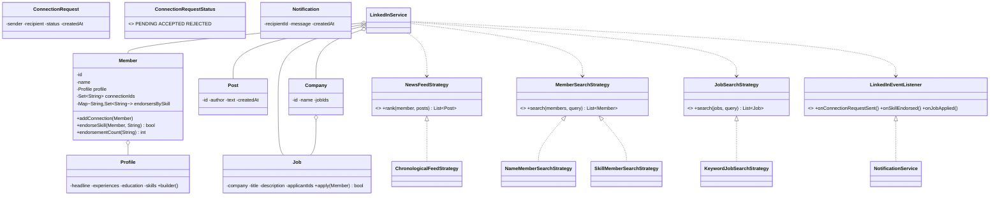

# Design LinkedIn

## 1. How to attack this in an interview

LinkedIn is a **professional graph + content + jobs** system. The trap is trying to build all of LinkedIn (messaging, ads, premium, recommendations). Anchor on the core loop: *create a profile → connect with professionals → endorse skills → publish updates → see a feed → apply to jobs → receive notifications*.

### Clarifying questions
| Question | Assumption we lock in |
| --- | --- |
| Are connections one-way or mutual? | A connection request becomes a bidirectional connection only after acceptance. |
| How far should degree computation go? | Return direct = 1st degree, friend-of-friend = 2nd degree, otherwise not connected. |
| Can a member endorse the same skill repeatedly? | No. Endorsement is idempotent per `(endorser, endorsed member, skill)`. |
| What appears in the feed? | Connections' posts, ranked by a pluggable strategy; default is newest first. |
| What events notify users/companies? | Connection request, skill endorsement, and job application. |
| Scale/concurrency? | Requests, endorsements, and applications can arrive concurrently and must stay exact. |

### What earns points
- Calling out that **endorsements are a set, not a counter-first design**. Counts derived from the set stay exact under double-clicks.
- Updating both sides of a connection under deterministic locking so the professional graph never becomes one-sided.
- Separating feed ranking and search behind **Strategy** interfaces so relevance ranking or indexed search can be added later.

## 2. Requirements

**Functional:** members with professional profiles (headline, experience, education, skills); send/accept/reject connection requests; mutual connections; compute 1st/2nd degree; endorse skills idempotently; post updates; view a news feed of connections' posts; companies post jobs; members apply; search members by name/skill and jobs by keyword; notifications for request/endorsement/application.

**Non-functional:** thread-safe connection acceptance, endorsements, and job applications; exact endorsement counts under contention; deterministic timestamps with injected `Clock`; injected id `Supplier<String>`; repositories and strategies are swappable.

## 3. Core entities

- **`Member`** — id, name, `Profile`, concurrent connection ids, and skill endorsement sets.
- **`Profile`** — headline, experiences, education, and skills built with a Builder.
- **`ConnectionRequest`** — sender, recipient, status, and creation time.
- **`Post`** — author, text, and injected creation time.
- **`Company`** — company account that owns posted job ids.
- **`Job`** — company, title, description, post time, and concurrent applicant set.
- **`Notification`** — recipient id, message, timestamp.
- **Repositories** — `MemberRepository`, `CompanyRepository`, `JobRepository`, `PostRepository`.
- **Strategies** — `NewsFeedStrategy`, member search strategies, and job search strategy.
- **`LinkedInEventListener`** — Observer hook implemented by `NotificationService`.
- **`LinkedInService`** — Facade clients call.

## 4. Class diagram



## 5. Design patterns

| Pattern | Where | Why |
| --- | --- | --- |
| **Observer** | `LinkedInEventListener` → `NotificationService` | Connection/endorsement/application events notify recipients without coupling core actions to delivery. |
| **Strategy** | `NewsFeedStrategy`, `MemberSearchStrategy`, `JobSearchStrategy` | Feed ranking and search dimensions are swappable policies, not `if/else` inside the facade. |
| **Repository** | `MemberRepository`, `CompanyRepository`, `JobRepository`, `PostRepository` | Persistence concerns stay outside model and service orchestration. |
| **Facade** | `LinkedInService` | One clean API over graph, endorsements, posts, feed, jobs, search, and notifications. |
| **Builder** | `Profile.Builder` | Professional profiles have many optional fields; construction remains readable. |
| **Factory** | `NotificationFactory` | Centralizes notification id/time/message creation. |

## 6. Concurrency — graph consistency and exact endorsements

Connection acceptance has a two-part invariant: the request must transition once, and the connection must be written on **both** members. `LinkedInService.acceptConnectionRequest` synchronizes on the request so accept/reject cannot both win, then locks the two `Member` objects in sorted id order before updating both connection sets. Sorted locking prevents deadlock while preserving the bidirectional invariant.

Endorsements are the hot counter. A naïve `count++` breaks on double-clicks and races. `Member` stores `Map<skill, Set<endorserId>>` using `ConcurrentHashMap` key sets. `add(endorserId)` is atomic and returns `false` on retries, so each `(endorser, member, skill)` counts once. The endorsement count is `set.size()`, which is exact under contention.

Job applications use the same idempotent-set idea: `Job.apply(member)` stores applicant ids in a concurrent set, so a member can apply once even when two clicks race.

> `// INTERVIEW INSIGHT:` for idempotent social actions, model the unique actors first (sets), then derive counts. Counters alone need extra locking and still do not encode the business rule.

## 7. Testability

- **`Clock` injected** into `LinkedInService`; posts, requests, jobs, applications, and notifications use it. Tests use `MutableClock` to advance time without sleeping.
- **Id `Supplier<String>` injected** so tests assert stable ids and deterministic notification creation.
- **Strategies and listeners injected** so feed ranking, search, and notification behavior can be asserted directly.
- **Concurrency test** launches many endorsers against one skill and asserts the final count equals the number of distinct endorsers.

## 8. API walkthrough

```java
LinkedInService service = new LinkedInService(clock, () -> "id-1");
Member alice = service.registerMember("Alice", Profile.builder()
        .headline("Staff Engineer")
        .addSkill("java")
        .build());
Member bob = service.registerMember("Bob", Profile.builder()
        .headline("Backend Engineer")
        .addSkill("distributed systems")
        .build());

ConnectionRequest request = service.sendConnectionRequest(alice, bob);
service.acceptConnectionRequest(request);
service.endorseSkill(bob, alice, "java");

Post update = service.createPost(alice, "Shipping a new platform feature");
List<Post> feed = service.newsFeedFor(bob);

Company acme = service.registerCompany("Acme");
Job job = service.postJob(acme, "Java Developer", "Build backend systems");
service.applyToJob(alice, job);
```
