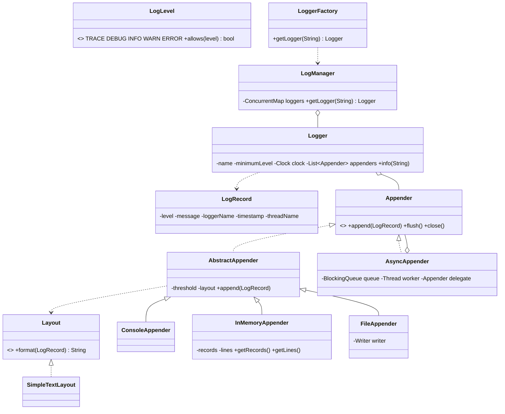

# Design a Logging Framework

## 1. How to attack this in an interview

A logging framework looks simple until the interviewer asks about high concurrency. Anchor on the
pipeline: *logger API → level filtering → immutable record → layout strategy → one or more appenders*.
Then call out that production logging often needs async delivery so application threads do not block
on slow I/O.

### Clarifying questions
| Question | Why it matters | Assumption we lock in |
| --- | --- | --- |
| Which levels and ordering? | Drives threshold filtering semantics | `TRACE < DEBUG < INFO < WARN < ERROR` |
| Logger-level, appender-level, or both thresholds? | Avoids surprise filtering | Both can filter; logger filters first |
| What sinks are needed? | Determines appender abstraction | Console, in-memory, file-like writer |
| How is output formatted? | Formatting should not be hard-coded | `Layout` Strategy; default simple text |
| Is async required? | Concurrency and lifecycle become the hard part | `AsyncAppender` with `flush()` / `close()` |
| Do tests need exact timestamps? | Wall-clock time makes tests flaky | Inject `Clock` |

### What earns points
- Naming **Strategy** for layouts before writing the formatter.
- Explaining the **Observer/Composite** relationship: one logger fans out to many appenders.
- Treating async shutdown as a correctness problem, not a `Thread.sleep` problem.

## 2. Requirements

**Functional**
1. Named `Logger`s expose `trace/debug/info/warn/error(String message)`.
2. `LogLevel` threshold drops messages below the configured minimum.
3. Each accepted message becomes an immutable `LogRecord` with level, message, logger name,
   timestamp, and thread name.
4. A logger can dispatch to multiple appenders.
5. Appenders include console, in-memory, file-like writer, and an async wrapper.
6. A `Layout` formats each record into text; `SimpleTextLayout` is provided.

**Non-functional**
1. **Thread-safe**: many application threads may log at once without interleaving writes.
2. **Deterministic async lifecycle**: `flush()` and `close()` drain queued records and join the worker.
3. **Testable**: clock and appenders are injectable; no real sleeps are required.
4. **Extensible**: new layouts or appenders can be added without editing `Logger`.

## 3. Core entities

- **`LogLevel`** — ordered enum used for threshold checks.
- **`LogRecord`** — immutable event captured at the logging call site.
- **`Logger`** — facade used by application code; filters and broadcasts records.
- **`LogManager` / `LoggerFactory`** — singleton registry and static facade for named loggers.
- **`Appender`** — sink interface.
- **`AbstractAppender`** — common threshold filtering, layout rendering, and synchronized append.
- **`ConsoleAppender`**, **`InMemoryAppender`**, **`FileAppender`** — concrete sinks.
- **`AsyncAppender`** — decorator that queues records and drains them on a worker thread.
- **`Layout`** / **`SimpleTextLayout`** — formatting strategy.

## 4. Class diagram



## 5. Design patterns

| Pattern | Where | Why |
| --- | --- | --- |
| **Strategy** | `Layout` → `SimpleTextLayout` | Swap text/JSON/custom formatting without touching appenders. |
| **Observer/Composite** | `Logger` owns a collection of `Appender`s | One log event is broadcast to every registered sink. |
| **Singleton** | `LogManager` holder idiom | Provides a familiar global registry like real logging frameworks. |
| **Builder** | `Logger.Builder` | Readable logger setup with level, clock, and appenders. |
| **Decorator** | `AsyncAppender` wrapping another `Appender` | Adds async behavior without changing the delegate sink. |
| **Chain of Responsibility / Threshold filter** | `Logger` and `AbstractAppender` thresholds | Low-level messages stop at the first filter that rejects them. |

The singleton is deliberately limited to `LogManager`. `Logger` remains constructible with injected
dependencies because global mutable state hurts tests and libraries.

## 6. Concurrency

Every concrete appender writes under its own synchronized `append` path. That keeps a console/file
line atomic: two threads cannot render half of one line and half of another into the same writer.
`InMemoryAppender` stores records in `CopyOnWriteArrayList`, so tests can read stable snapshots while
other threads are appending.

`AsyncAppender` uses a `LinkedBlockingQueue` and a dedicated daemon worker. Records and control
messages share the same queue:
1. Application threads enqueue records quickly.
2. `flush()` enqueues a flush marker and waits for the worker to process all earlier records.
3. `close()` prevents new records, flushes, enqueues a stop marker, joins the worker, then closes the
   delegate.

> `// INTERVIEW INSIGHT:` checking "queue is empty" is not a correct flush because the worker may
> already have removed a record but not written it yet. A queued flush marker proves all earlier work
> has been appended.

## 7. Testability

- **`Clock` injected** into `Logger`; tests use `MutableClock` to assert exact timestamps.
- **`InMemoryAppender`** captures records and formatted lines for direct assertions.
- **Async tests call `flush()` / `close()`** and never rely on timing sleeps.
- Thread names are captured for realism but tests do not assert a specific worker or pool name.

## 8. API walkthrough

```java
InMemoryAppender memory = new InMemoryAppender();

Logger logger = Logger.builder("orders")
        .minimumLevel(LogLevel.INFO)
        .clock(Clock.systemUTC())
        .addAppender(memory)
        .addAppender(new AsyncAppender(new ConsoleAppender()))
        .build();

logger.debug("dropped because logger minimum is INFO");
logger.info("order created");

logger.flush();
logger.close();
```
