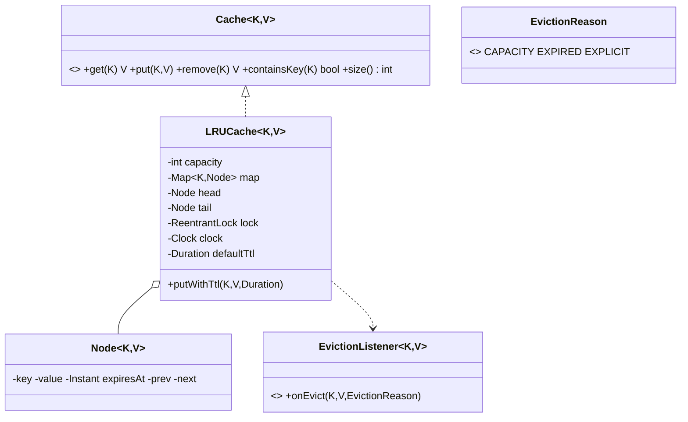

# Design an LRU Cache

> The interviewer is really testing three things: (1) can you get **O(1) get/put** with a HashMap + doubly-linked list, (2) can you make it **thread-safe** correctly, and (3) bonus — can you add **TTL** without your tests sleeping. We nail all three.

## 1. How to attack this in an interview

### Clarifying questions
| Question | Assumption we lock in |
| --- | --- |
| Fixed capacity, evict LRU on overflow? | Yes. |
| Must get/put be O(1)? | Yes → HashMap for lookup + doubly-linked list for recency ordering. |
| Thread-safe? | Yes — concurrent get/put from many threads. |
| TTL / expiry? | Yes, optional per-entry TTL; expired = logically absent. |
| Notify on eviction? | Yes — an eviction listener (for write-back caches, metrics). |

### What earns points
- Explaining **why** you need *both* a map and a linked list: the map gives O(1) lookup, the list gives O(1) "move to most-recently-used" and O(1) "evict least-recently-used". A `LinkedHashMap(accessOrder=true)` does this out of the box — mention it, then hand-roll the DLL to show you understand it.
- Explaining why a bare `ConcurrentHashMap` is **not enough**: updating recency is a read-modify-write spanning two structures, so it needs mutual exclusion.
- Making **time injectable** so TTL is testable instantly.

## 2. Requirements

**Functional:** `get`, `put`, `remove`, `containsKey`, `size`; evict least-recently-used when over capacity; optional per-entry TTL (expired entries are treated as absent and reclaimed lazily); notify listeners on eviction with a reason.

**Non-functional:** O(1) `get`/`put`; thread-safe; generic `<K,V>`; deterministic/testable time.

## 3. Core entities

- **`Cache<K,V>`** — the interface.
- **`LRUCache<K,V>`** — HashMap + intrinsic doubly-linked list (sentinel head/tail) + `ReentrantLock` + injected `Clock`.
- **`Node<K,V>`** — DLL node holding key, value, `expiresAt`, prev/next (private).
- **`EvictionListener<K,V>`** + **`EvictionReason`** (CAPACITY / EXPIRED / EXPLICIT) — Observer.

## 4. Class diagram



## 5. Design patterns

| Pattern | Where | Why |
| --- | --- | --- |
| **Strategy (interface)** | `Cache<K,V>` | Callers depend on the abstraction; an LFU/FIFO cache could drop in. |
| **Observer** | `EvictionListener` | React to evictions (write-back, metrics) without the cache knowing who listens. |
| **Sentinel nodes** | DLL head/tail | Removes null-checking edge cases in list splicing — cleaner O(1) ops. |

## 6. Concurrency

Every public operation takes a single `ReentrantLock`. That is deliberate:

> `// INTERVIEW INSIGHT:` A `ConcurrentHashMap` makes the *map* thread-safe, but an LRU update is "look up the node, unlink it, and splice it to the front" — a compound mutation across the map **and** the linked list. Without mutual exclusion, two threads reordering the list concurrently corrupt the `prev`/`next` pointers. So we guard the whole compound operation with one lock.

To scale beyond one lock you would **stripe** the cache into N independent shards (each its own lock + list), keyed by `hash(key) % N` — near-linear read/write scaling at the cost of a global LRU order. We mention this rather than prematurely building it.

**Listeners are invoked after the lock is released** (we collect evicted entries into a local list first). Running arbitrary callback code while holding the lock is a deadlock risk.

## 7. Testability

- **`Clock` is injected.** An entry stores an absolute `expiresAt = now + ttl`. Expiry is `!now.isBefore(expiresAt)`. Tests construct the cache with a `MutableClock`, `put` with a 5-minute TTL, then `clock.advance(6 minutes)` and assert the entry is gone — **instantly**, with zero `Thread.sleep`.
- **Eviction is deterministic**, so we assert exactly which key was evicted and with which `EvictionReason`.
- A package-private `isConsistent()` invariant (map size == list length) lets the concurrency test prove the structure never corrupts.

## 8. API walkthrough

```java
LRUCache<String,Integer> cache = LRUCache.<String,Integer>builder()
        .capacity(2)
        .clock(clock)                       // MutableClock in tests
        .defaultTtl(Duration.ofMinutes(5))  // optional
        .evictionListener((k,v,reason) -> log(k, reason))
        .build();

cache.put("a", 1);
cache.put("b", 2);
cache.get("a");        // "a" is now most-recently-used
cache.put("c", 3);     // evicts "b" (least-recently-used), listener fires CAPACITY
```
