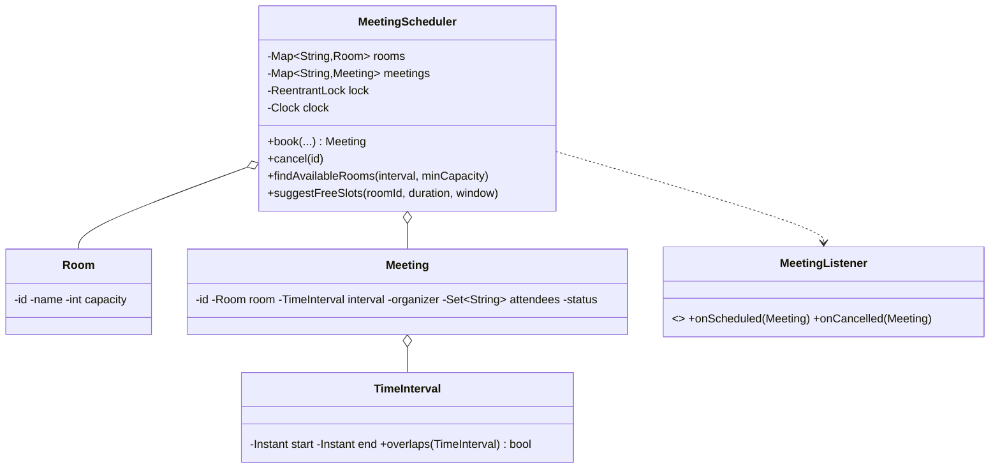

# Design a Meeting Scheduler

> The core is **interval conflict detection**: a room (and each attendee) can't be double-booked for overlapping times. The interesting bits are the overlap predicate, finding free slots, and booking atomically across multiple entities (room + attendees).

## 1. How to attack this in an interview

### Clarifying questions
| Question | Assumption we lock in |
| --- | --- |
| What can conflict? | A room and each attendee — neither can have two overlapping meetings. |
| Interval semantics? | Half-open `[start, end)`, so back-to-back meetings (10–11, 11–12) don't conflict. |
| Find available rooms / suggest slots? | Yes — by interval + capacity; suggest free gaps of a duration. |
| Capacity? | A room must fit the participant count. |
| Concurrency? | Two organizers booking the same room/attendee at once must not both win. |

### What earns points
- The clean **overlap rule**: `a.start < b.end && b.start < a.end`.
- Booking **atomically across room + all attendees** (multi-entity invariant) — and being honest about the locking trade-off.
- Offering **free-slot suggestions** (gap-finding), and noting an **interval tree** for scale.

## 2. Requirements

**Functional:** rooms with capacity; book a meeting (room, interval, organizer, attendees) rejecting conflicts; cancel; find available rooms for an interval+capacity; check room/attendee availability; suggest free slots of a duration within a window.

**Non-functional:** no double-booking under concurrency; deterministic/testable; extensible selection.

## 3. Core entities

- **`TimeInterval`** — half-open `[start, end)` with an `overlaps` predicate.
- **`Room`** — id, name, capacity.
- **`Meeting`** — id, room, interval, organizer, attendees, status.
- **`MeetingListener`** (Observer) — invite/cancel notifications.
- **`MeetingScheduler`** — Facade holding rooms + bookings + clock.

## 4. Class diagram



## 5. Design patterns

| Pattern | Where | Why |
| --- | --- | --- |
| **Value Object** | `TimeInterval` | Immutable interval owning the overlap logic. |
| **Facade** | `MeetingScheduler` | One API over rooms, bookings, availability. |
| **Observer** | `MeetingListener` | Attendee notifications decoupled from booking. |
| **Repository** | room/meeting maps | Swap storage later. |

## 6. Concurrency

Booking must check that the **room is free AND every attendee is free** for the interval and then insert — a **multi-entity invariant**. We guard `book`/`cancel` with a single `ReentrantLock` so that whole check-and-insert is atomic; two organizers racing for the same room (or a shared attendee) can't both succeed.

> `// INTERVIEW INSIGHT:` a coarse scheduler lock is the honest choice when the invariant spans several entities at once. Per-room + per-attendee locks would need a consistent global lock ordering (à la the wallet transfer) to avoid deadlock. Mention the trade-off; pick correctness first, then note sharding by room for scale.

Availability *queries* also take the lock to read a consistent snapshot.

## 7. Testability

- **Explicit `Instant` intervals** drive determinism (no reliance on wall-clock); an injected `Clock` timestamps creation and powers "upcoming" filters.
- Overlap, capacity, free-slot suggestions are pure functions → asserted exactly.
- **Concurrency test:** many organizers race to book the same room/slot; exactly one succeeds, the rest get a conflict.

## 8. API walkthrough

```java
MeetingScheduler scheduler = new MeetingScheduler(clock, idGen);
Room r = scheduler.addRoom("Boardroom", 10);
TimeInterval slot = new TimeInterval(t10, t11);
scheduler.book(r.id(), slot, "alice", Set.of("alice","bob"), "Design review");
scheduler.findAvailableRooms(new TimeInterval(t10, t11), 4);       // rooms free & big enough
scheduler.suggestFreeSlots(r.id(), Duration.ofMinutes(30), t9, t18); // open gaps
```
