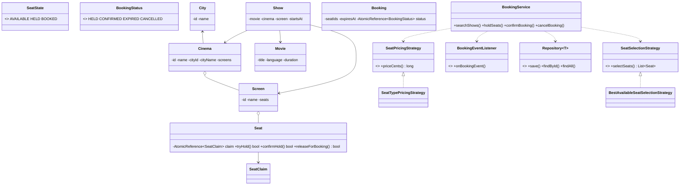

# Design a Movie Ticket Booking System

> This problem looks like browsing movies, but the interview hinge is **atomic show-seat holds with deterministic expiry**.

---

## 1. How to attack this in an interview

Separate catalog/search from checkout. City, cinema, screen, movie, and show are mostly read models; the hard path is a two-phase seat lifecycle: hold seats during payment, then confirm, cancel, or expire.

### Clarifying questions to ask
| Question | Why it matters | Assumption we lock in |
| --- | --- | --- |
| Are seats assigned per show? | Drives the seat state machine | Yes, exact seats are selected |
| How long is payment time? | Drives TTL behavior | Configurable hold duration |
| Can pricing differ by seat type? | Drives Strategy | REGULAR/PREMIUM seats carry cents prices |
| Can multiple shows share one screen layout? | Drives inventory modeling | Each show gets a fresh seat inventory copy |
| Is payment in scope? | Prevents scope creep | Payment is external; success calls confirm |
| What about concurrent users? | Core correctness issue | Many users can race for the same show seat |
| Can confirmed tickets be cancelled? | Drives release transition | Yes, cancellation frees seats |

### What earns points
- Naming **State** for `AVAILABLE -> HELD -> BOOKED` and booking `HELD -> CONFIRMED/EXPIRED/CANCELLED`.
- Solving "two users, one seat" with per-seat CAS instead of a global cinema lock.
- Injecting `Clock` and storing absolute `expiresAt = now + holdDuration` so tests advance `MutableClock` and never sleep.
- Keeping pricing, seat selection, notifications, and persistence replaceable.

---

## 2. Requirements

**Functional**
1. Model `City -> Cinema -> Screen` with a seat map.
2. Model movies and shows for a movie on a screen at a start time.
3. Search shows by city and movie.
4. Hold selected seats for a user while payment is attempted.
5. Confirm a valid hold after successful payment.
6. Expire stale holds and release seats.
7. Cancel held/confirmed bookings and release seats.
8. Price seats in integer cents by seat type.

**Non-functional**
1. **Thread-safe:** a show seat is never double-held or double-booked.
2. **Testable:** time and ids are injected; no sleeping.
3. **Extensible:** pricing, selection, listeners, and repositories are interfaces/builders.

---

## 3. Core entities

- **`City`** — market where cinemas operate.
- **`Cinema`** — belongs to a city and owns screens.
- **`Screen`** — hall layout with physical seat labels.
- **`Seat`** — show-specific inventory cell with an `AtomicReference<SeatClaim>`.
- **`Movie`** — title/language/duration.
- **`Show`** — movie + cinema + copied screen inventory + start time.
- **`SeatClaim`** — immutable held/booked claim with user, booking id, expiry, state.
- **`Booking`** — user, show, seats, total cents, expiry, lifecycle status.
- **`BookingService`** — Facade for search, hold, confirm, cancel, and cleanup.
- **`SeatPricingStrategy`** — pricing policy by seat/show.
- **`SeatSelectionStrategy`** — best-available policy.
- **`BookingEventListener`** — Observer for hold/confirm/expire/cancel.
- **`Repository<T>`** — persistence boundary.

---

## 4. Class diagram



---

## 5. Patterns table

| Pattern | Where | Why |
| --- | --- | --- |
| **State** | `Seat`, `Booking` | Encapsulates legal lifecycle transitions. |
| **Strategy** | `SeatPricingStrategy`, `SeatSelectionStrategy` | Swap pricing/selection without touching booking flow. |
| **Facade** | `BookingService` | One clean API over repositories and domain transitions. |
| **Observer** | `BookingEventListener` | Notifications/analytics react outside core logic. |
| **Repository** | `Repository<T>`, `InMemoryRepository<T>` | Storage is replaceable. |
| **Factory/Builder** | `SeatFactory`, `Screen.Builder`, `Cinema.Builder`, `BookingService.Builder` | Readable setup and dependency injection. |

---

## 6. Concurrency

The dangerous bug is:

```
if (seat is available) {
    hold(seat);
}
```

Two users can both pass the check. The fix is per-seat CAS:

- `Seat` stores `AtomicReference<SeatClaim>`.
- Available is `null`.
- `tryHold` performs `compareAndSet(null, newHold)`.
- If 100 users race for one show seat, exactly one CAS succeeds.
- `confirmHold` uses CAS for `HELD -> BOOKED`, so an expired/released/re-held seat cannot be booked by a stale confirmer.

`BookingService` synchronizes on one `Booking` during confirm/cancel/expire to keep booking status and seat releases aligned without serializing unrelated shows or seats.

---

## 7. Testability

- `Clock` is injected. A hold stores `expiresAt = clock.instant().plus(holdDuration)`.
- Expiry is lazy: service APIs call `cleanupExpiredHolds`, and seats release expired claims on access.
- Tests use `MutableClock.atEpoch()` and `advance(Duration.ofMinutes(6))`; no `Thread.sleep`.
- `Supplier<String>` is injected for deterministic booking ids.
- Money is `long` cents, never `double`.

---

## 8. API walkthrough

```java
MutableClock clock = MutableClock.atEpoch();
BookingService service = BookingService.builder()
        .clock(clock)
        .holdDuration(Duration.ofMinutes(5))
        .idGenerator(new AtomicIntegerIdSupplier())
        .build();

City city = service.createCity(new City("blr", "Bengaluru"));
Screen screen = Screen.builder("screen-1", "Audi 1")
        .addSeat(new Seat("A1", "A", 1, SeatType.PREMIUM, 30000))
        .addSeat(new Seat("B1", "B", 1, SeatType.REGULAR, 12000))
        .build();
Cinema cinema = service.createCinema(Cinema.builder("c1", "Galaxy", city)
        .addScreen(screen)
        .build());
Movie movie = service.createMovie(new Movie("m1", "The Patterns", "EN", Duration.ofMinutes(140)));
Show show = service.createShow(new Show("s1", movie, cinema, screen, clock.instant()));

Booking hold = service.holdSeats(show.getId(), "user-1", List.of("A1"));
service.confirmBooking(hold.getId(), "user-1");
```
