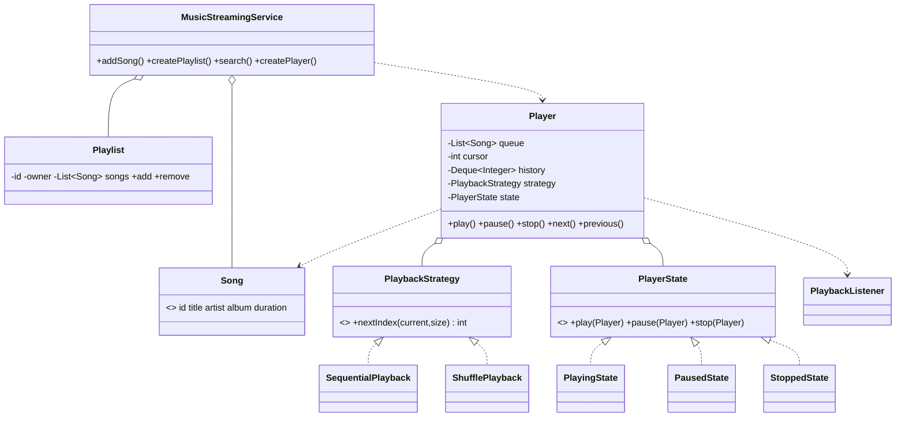

# Design a Music Streaming Service (Spotify)

> Two things make this interesting: a **Player** that is a genuine **state machine** (stopped ↔
> playing ↔ paused with illegal transitions guarded), and **what-plays-next** being a swappable
> **Strategy** (sequential / shuffle / repeat-one / repeat-all). Catalogue + playlists + search are
> the supporting cast.

## 1. How to attack this in an interview

### Clarifying questions
| Question | Assumption we lock in |
| --- | --- |
| Scope? | Catalogue, playlists, search, and a playback engine — not audio codecs or CDN. |
| Playback modes? | Sequential, shuffle, repeat-one, repeat-all — pluggable. |
| Player transitions? | STOPPED/PLAYING/PAUSED; pausing a stopped player is illegal; play is idempotent while playing. |
| Does "previous" respect shuffle? | Yes — keep a play **history** so back-navigation is exact even when shuffled. |
| Concurrency? | A player may be driven from UI + remote at once; controls must be serialized. |

### What earns points
- Modelling the player as a **State pattern** (each state is an object that permits/forbids transitions) rather than a tangle of `if (state == ...)`.
- Making the next-track rule a **Strategy** with an **injected `Random`** for shuffle, so tests are deterministic.
- A **history stack** so `previous()` works under shuffle.

## 2. Requirements

**Functional:** add songs; create playlists and add/remove songs; search by title/artist/album; a
player that loads a queue, plays/pauses/resumes/stops, skips next/previous, and honours a playback
strategy.

**Non-functional:** illegal transitions rejected clearly; deterministic shuffle; thread-safe player;
strategy swappable at runtime.

## 3. Core entities

- **`Song`** — record: id/title/artist/album/duration.
- **`Playlist`** — ordered, mutable, owner-scoped song list.
- **`PlaybackStrategy`** (Strategy) — `nextIndex(current, size)`; Sequential / RepeatAll / RepeatOne / Shuffle(Random).
- **`PlayerState`** (State) — `Stopped` / `Playing` / `Paused` singletons deciding legal transitions.
- **`Player`** — queue + cursor + history + current state + strategy; the control surface.
- **`PlaybackListener`** (Observer) — started / paused / resumed / stopped events.
- **`MusicStreamingService`** (Facade) — catalogue, playlists, search, player factory.

## 4. Class diagram



## 5. Design patterns

| Pattern | Where | Why |
| --- | --- | --- |
| **State** | `PlayerState` + Stopped/Playing/Paused | Legal transitions live in the state objects. |
| **Strategy** | `PlaybackStrategy` | Sequential/shuffle/repeat swap without touching the player. |
| **Observer** | `PlaybackListener` | Now-playing UI / scrobbler decoupled from the engine. |
| **Facade** | `MusicStreamingService` | One API over catalogue, playlists, search, players. |
| **Value Object** | `Song` | Immutable track identity. |

## 6. Concurrency

A `Player` may be driven from multiple surfaces (phone UI + smart speaker). All controls take one
**reentrant** lock, so cursor/state/history mutate atomically. The lock is reentrant on purpose: a
public method holds it and delegates to a state object that calls back into the player (`beginAt`,
`setState`) under the same lock — no re-acquire deadlock.

> `// INTERVIEW INSIGHT:` the State objects are stateless singletons, so they're trivially shareable
> across threads and players; all mutable data lives on the `Player` behind its lock.

## 7. Testability

- **Shuffle** takes an injected `Random`; `new Random(seed)` makes the "random" order reproducible, so
  two players with the same seed produce identical sequences.
- The state machine is asserted directly: `pause()` on a stopped player throws; `next()` past the end
  of a sequential queue stops the player; repeat-one keeps the same track; repeat-all wraps to 0.
- A **concurrency test** hammers `next()` from many threads and asserts the cursor stays in range.

## 8. API walkthrough

```java
MusicStreamingService service = new MusicStreamingService();
Song a = service.addSong("Song A", "Artist", "Album", Duration.ofMinutes(3));
Song b = service.addSong("Song B", "Artist", "Album", Duration.ofMinutes(4));

Player player = service.createPlayer(new SequentialPlayback());
player.load(List.of(a, b));
player.play();      // -> PLAYING, onSongStarted(a)
player.next();      // -> onSongStarted(b)
player.pause();     // -> PAUSED
player.setStrategy(new ShufflePlayback(new Random(42))); // switch mode live
```
