# Design an Online Shopping System like Amazon

> This problem follows the repo structure: *Clarify → Requirements → Core Entities → Class Diagram → Patterns → Concurrency → Testability → API walkthrough*.

---

## 1. How to attack this in an interview

Do not start with databases. First bound the problem to catalog search, cart management, checkout, payment, inventory, and order lifecycle.

### Clarifying questions to ask
| Question | Why it matters | Assumption we lock in |
| --- | --- | --- |
| Marketplace or first-party store? | Seller/payout logic can dominate the design | First-party catalog |
| Can cart contain many products? | Checkout must reserve multiple SKUs atomically | Yes |
| What happens on insufficient stock? | Defines failure semantics | Reject checkout; reserve nothing |
| Payment methods? | Natural Strategy seam | Pluggable `PaymentMethod` |
| Discounts/taxes? | Pricing must be swappable | Pluggable `PricingStrategy` |
| Concurrent buyers for last item? | The crux race | Must never oversell |
| Order workflow? | State machine needed | `PLACED -> PAID -> SHIPPED -> DELIVERED`, plus `CANCELLED` |

### What earns points
- Calling out oversell as the key concurrency risk.
- Encoding order transitions as data, not scattered conditionals.
- Injecting `Clock` and id suppliers for deterministic tests.
- Using integer cents for all money.

---

## 2. Requirements

**Functional**
1. Products live in a searchable catalog.
2. Inventory tracks stock per product.
3. Customers create carts and add products.
4. Checkout reserves stock, computes total, processes payment, and creates an order.
5. Order status changes follow legal lifecycle transitions.
6. Cancelling a paid/placed order restocks its items.
7. Observers receive order-status notifications.

**Non-functional**
1. **Thread-safe** checkout: many buyers must never oversell the last units.
2. **Extensible** strategies for search, payment, pricing/discount/tax.
3. **Testable** deterministic ids, time, and totals; no sleeping.

---

## 3. Core entities

- **`Product`** — immutable catalog item; price in integer cents.
- **`Inventory`** — stock per product; all-or-nothing reservation.
- **`Cart` / `CartItem`** — customer-selected products; cart uses a Builder.
- **`Order` / `OrderItem`** — checkout snapshot; order uses a Builder.
- **`OrderStatus`** — state machine with legal transitions as data.
- **`PaymentMethod`** — payment Strategy.
- **`PricingStrategy`** — discount/tax Strategy.
- **`CatalogSearchStrategy`** — search Strategy.
- **Repositories** — product/cart/order storage boundary.
- **`OrderStatusListener`** — Observer for notifications.
- **`ShoppingService`** — Facade over the whole use case.

---

## 4. Class diagram

```mermaid
classDiagram
    class Product { +id +name +priceCents }
    class Inventory { +addStock(productId, qty) +tryReserve(map) bool +restock(map) }
    class Cart { +addProduct(Product, qty) +items() }
    class CartItem { +Product product +quantity +lineTotalCents() }
    class OrderStatus { <<enum>> PLACED PAID SHIPPED DELIVERED CANCELLED +canTransitionTo(next) bool }
    class Order { +markPaid(receipt) +transitionTo(status) }
    class PaymentMethod { <<interface>> +pay(request) PaymentReceipt }
    class PricingStrategy { <<interface>> +totalCents(items) long }
    class CatalogSearchStrategy { <<interface>> +search(products, query) List~Product~ }
    class ProductRepository { <<interface>> +save(product) +findById(id) }
    class OrderStatusListener { <<interface>> +onStatusChanged(order, old, next) }
    class ShoppingService { +createCart(customerId) +addToCart(cartId, productId, qty) +checkout(cartId) +updateOrderStatus(orderId, status) }

    Cart o-- CartItem
    CartItem --> Product
    Order o-- OrderItem
    Order --> OrderStatus
    ShoppingService --> Inventory
    ShoppingService ..> PaymentMethod
    ShoppingService ..> PricingStrategy
    ShoppingService ..> CatalogSearchStrategy
    ShoppingService ..> ProductRepository
    ShoppingService ..> OrderStatusListener
```



---

## 5. Design patterns used

| Pattern | Where | Why |
| --- | --- | --- |
| **State machine** | `OrderStatus` | Legal lifecycle transitions are centralized as data. |
| **Strategy** | `PaymentMethod`, `PricingStrategy`, `CatalogSearchStrategy` | Swap payment, discount/tax, and search policies independently. |
| **Observer** | `OrderStatusListener` | Email/SMS/warehouse integrations react without coupling to service logic. |
| **Repository** | Product/cart/order repositories | Storage is replaceable. |
| **Facade** | `ShoppingService` | One API hides catalog, inventory, cart, payment, and orders. |
| **Builder** | `Cart.Builder`, `Order.Builder`, `ShoppingService.Builder` | Readable construction with deterministic test seams. |

---

## 6. Concurrency — the part that separates seniors from juniors

The danger is a check-then-act race: two customers both see one unit available, both decrement, and stock becomes negative.

**Naïve fix:** one global checkout lock. Correct, but it serializes the whole store.

**Our fix — per-product locks with deterministic ordering:**
- `Inventory.tryReserve` receives the whole cart's product quantities.
- It sorts product ids and locks only those product rows in that order.
- Phase 1 checks every requested quantity while all locks are held.
- Phase 2 decrements all quantities only if every item is available.
- Locks are released in reverse order.

This mirrors the coffee vending machine's all-or-nothing ingredient reservation: reserve the full recipe/cart, or reserve nothing.

> `// INTERVIEW INSIGHT:` an atomic decrement per line item is not enough for a multi-item cart unless the entire cart is reserved atomically.

---

## 7. Testability

- `ShoppingService` injects `Clock`; order/payment timestamps are deterministic.
- The id `Supplier<String>` is injected; tests do not depend on UUIDs.
- Money is integer cents; discounts/taxes use integer arithmetic.
- Strategies are injected, so pricing/payment/search can be tested independently.
- Concurrency tests use latches to start workers together and assert exactly stock-count successes, with no `Thread.sleep`.

---

## 8. API walkthrough

```java
ShoppingService service = ShoppingService.builder()
        .clock(Clock.systemUTC())
        .idGenerator(() -> UUID.randomUUID().toString())
        .pricingStrategy(new PercentageDiscountTaxPricingStrategy(10, 500))
        .build();

service.addProduct(new Product("phone", "Phone", "Smart phone", 50_000, Set.of("electronics")));
service.addStock("phone", 3);

Cart cart = service.createCart("customer-1");
service.addToCart(cart.getId(), "phone", 1);
Order order = service.checkout(cart.getId()); // reserves stock and marks order PAID
service.updateOrderStatus(order.getId(), OrderStatus.SHIPPED);
```
