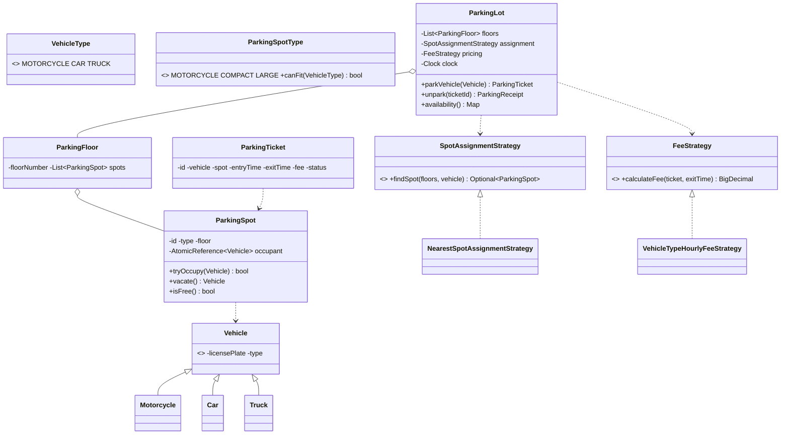

# Design a Parking Lot

> This is the reference problem for the whole repo. The **structure of this doc** — *Clarify → Requirements → Core Entities → Class Diagram → Patterns → Concurrency → Testability → API walkthrough* — is repeated for every problem.

---

## 1. How to attack this in an interview

Do **not** start coding. Spend the first 3–5 minutes turning a vague prompt ("design a parking lot") into a crisp, bounded problem. The interviewer is watching *how you scope*, not how fast you type.

### Clarifying questions to ask
| Question | Why it matters | Assumption we lock in |
| --- | --- | --- |
| One lot or many? Floors? | Drives the `ParkingLot → Floor → Spot` hierarchy | 1 lot, N floors |
| Vehicle types? | Drives spot sizing + pricing | `MOTORCYCLE`, `CAR`, `TRUCK` |
| Spot types & fitment rules? | A truck can't use a motorcycle spot | `MOTORCYCLE ⊂ COMPACT ⊂ LARGE` fitment |
| How is a spot chosen? | "Nearest to entrance" vs "first free" — this is a **Strategy** | Pluggable; default = nearest |
| Pricing model? | Flat, hourly, per-vehicle, dynamic — another **Strategy** | Pluggable; default = per-hour-by-type |
| Multiple entry/exit gates working at once? | This is the crux: **concurrency** | Yes — many threads park/unpark simultaneously |
| Payment scope? | Can eat the whole interview | Compute the fee + close the ticket; payment gateway is out of scope |

### What earns points
- Naming the **Strategy** hook points (spot selection & pricing) *before* writing them.
- Calling out the **race condition** (two cars, one spot) and solving it **lock-free with CAS** rather than a giant global lock.
- Making time **injectable** so fee calculation is unit-testable without sleeping.

---

## 2. Requirements

**Functional**
1. Park a vehicle → receive a `ParkingTicket` (records spot + entry time).
2. Unpark using the ticket → fee is computed from parked duration → ticket closes, spot frees.
3. A vehicle is assigned only a spot it fits in.
4. Spot selection and pricing are **swappable policies**.
5. Report availability (for display boards / "LOT FULL" signage).

**Non-functional**
1. **Thread-safe**: concurrent gates must never double-assign a spot.
2. **Extensible**: new vehicle types, spot types, pricing, and selection rules without editing existing classes (Open/Closed).
3. **Testable**: deterministic time and no `Thread.sleep` in tests.

---

## 3. Core entities

- **`Vehicle`** (abstract) → `Motorcycle`, `Car`, `Truck`. Carries a `VehicleType`.
- **`ParkingSpotType`** — `MOTORCYCLE`, `COMPACT`, `LARGE`; knows which `VehicleType`s it `canFit`.
- **`ParkingSpot`** — one physical spot; holds an occupying vehicle **atomically**.
- **`ParkingFloor`** — a collection of spots.
- **`ParkingTicket`** — issued at entry; closed at exit with a fee.
- **`SpotAssignmentStrategy`** — chooses a spot for a vehicle (Strategy).
- **`FeeStrategy`** — computes the fee (Strategy).
- **`ParkingLot`** — the facade the client talks to; wires floors + strategies + clock.
- **`ParkingEventListener`** — observers notified on park/unpark (Observer) e.g. display boards.

---

## 4. Class diagram



---

## 5. Design patterns used

| Pattern | Where | Why |
| --- | --- | --- |
| **Strategy** | `SpotAssignmentStrategy`, `FeeStrategy` | Swap "nearest spot" / "hourly pricing" without touching `ParkingLot`. The #1 pattern interviewers want here. |
| **Factory** | `VehicleFactory` | Create the right `Vehicle` subclass from a `VehicleType` — centralizes construction. |
| **Builder** | `ParkingLot.Builder` | Assemble a lot (floors, strategies, clock) readably and immutably. |
| **Observer** | `ParkingEventListener` | Display boards / analytics react to park/unpark without the lot knowing them. |
| **Facade** | `ParkingLot` | One clean entry point over floors, spots, strategies. |

**Deliberately NOT a Singleton.** A parking-lot Singleton is the classic textbook answer, but it hurts testability (global mutable state) and prevents modelling multiple lots. We inject a normal object instead. *Mention the Singleton option, then justify preferring DI — that contrast is what impresses.*

---

## 6. Concurrency — the part that separates seniors from juniors

Multiple gates call `parkVehicle` at the same time. The danger: **two threads pick the same free spot** (a lost-update / check-then-act race).

**Naïve fix:** one global `synchronized` — correct but serializes the whole lot; throughput dies.

**Our fix — lock-free Compare-And-Swap per spot:**
- Each `ParkingSpot` holds an `AtomicReference<Vehicle>`.
- `tryOccupy(v)` does `occupant.compareAndSet(null, v)`. If two threads race the same spot, **exactly one CAS wins**; the loser simply tries the next candidate spot.
- No global lock, no floor lock — spots are contended independently, so throughput scales with the number of free spots.

```
findSpot() returns an ordered stream of candidates;
for each candidate: if spot.tryOccupy(vehicle) succeeds -> done;
                    else keep going (someone beat us to it).
```

> `// INTERVIEW INSIGHT:` "check `isFree()` then `occupy()`" is a bug — the gap between the two is the race. `compareAndSet` fuses check-and-act into one atomic step.

Unparking is symmetric and idempotent-safe: a ticket maps to exactly one spot, and `vacate()` clears the reference.

---

## 7. Testability

- **`Clock` is injected** into `ParkingLot`. Entry time = `clock.instant()`. In tests we use a **`MutableClock`** and advance it (e.g. `+3 hours`) to assert fees *instantly* — no real waiting.
- **Strategies are injected**, so pricing/selection can be tested in isolation and swapped for deterministic fakes.
- **Concurrency is tested** by launching more threads than spots and asserting: (a) no spot is double-booked, (b) exactly `capacity` cars park and the rest are rejected.

---

## 8. API walkthrough

```java
ParkingLot lot = ParkingLot.builder()
        .clock(Clock.systemUTC())
        .addFloor(new ParkingFloor(1, List.of(/* spots */)))
        .assignmentStrategy(new NearestSpotAssignmentStrategy())
        .feeStrategy(new VehicleTypeHourlyFeeStrategy())
        .build();

ParkingTicket ticket = lot.parkVehicle(new Car("KA-01-1234"));
// ... time passes ...
ParkingReceipt receipt = lot.unpark(ticket.getId());   // fee computed, spot freed
```
