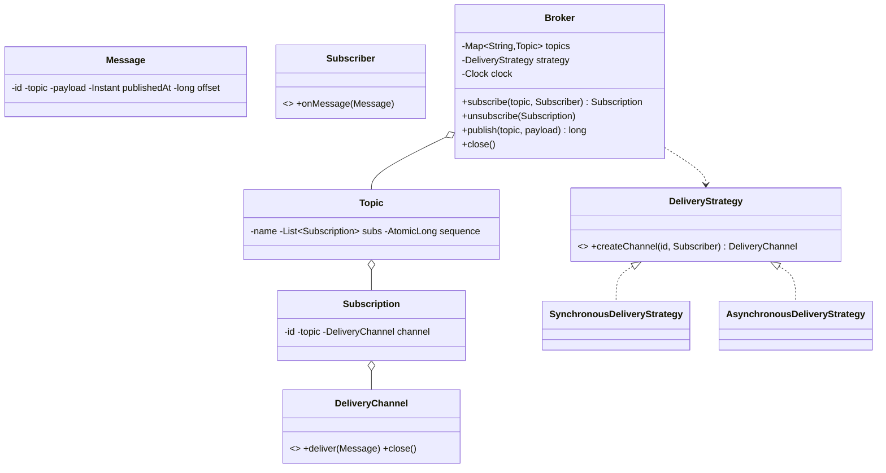

# Design a Pub/Sub System

> A message broker is the Observer pattern grown up. The interview depth is entirely in **delivery semantics and concurrency**: async fan-out, per-subscriber isolation, ordering, and clean shutdown.

## 1. How to attack this in an interview

### Clarifying questions
| Question | Assumption we lock in |
| --- | --- |
| Topics (many-to-many) or queues (point-to-point)? | Topics: a message fans out to all current subscribers. |
| Sync or async delivery? | **Async** in production so a slow subscriber can't block the publisher or peers — but make it pluggable. |
| Ordering guarantee? | Per-subscriber FIFO (each subscriber sees messages in the order it received them). |
| Retention / replay? | Out of scope: subscribers get messages published *after* they subscribe. (Offsets are modelled to show the extension.) |
| Delivery guarantee? | At-least-once to live subscribers (in-memory). |

### What earns points
- Isolating each subscriber behind its **own queue + worker thread**, so one slow/broken consumer degrades only itself (fault + latency isolation).
- Making delivery a **Strategy** (sync vs async) — sync makes tests trivially deterministic; async is production.
- A **clean shutdown** that drains queues and joins workers (no lost messages, no leaked threads).

## 2. Requirements

**Functional:** create topics implicitly on publish/subscribe; publish a message to a topic; subscribe/unsubscribe dynamically; each live subscriber receives every message published after it subscribed, in order.

**Non-functional:** thread-safe concurrent publish + (un)subscribe; a slow subscriber doesn't block others; a throwing subscriber doesn't kill delivery; deterministic tests; graceful shutdown.

## 3. Core entities

- **`Message`** — id, topic, payload, timestamp (injected clock), monotonically increasing per-topic `offset`.
- **`Subscriber`** — functional `onMessage(Message)`.
- **`Topic`** — name + copy-on-write subscription list + per-topic sequence.
- **`Subscription`** — a handle (id, topic, delivery channel) used to unsubscribe.
- **`DeliveryStrategy`** (Strategy) → **`DeliveryChannel`** per subscription: `SynchronousDeliveryStrategy`, `AsynchronousDeliveryStrategy`.
- **`Broker`** — the Facade clients use.

## 4. Class diagram



## 5. Design patterns

| Pattern | Where | Why |
| --- | --- | --- |
| **Observer** | Broker → Subscribers | The essence of pub/sub: publishers don't know subscribers. |
| **Strategy** | `DeliveryStrategy` | Swap sync (deterministic tests) for async (production) fan-out. |
| **Facade** | `Broker` | One API over topics, subscriptions, delivery, clock. |
| **Handle/Token** | `Subscription` | Returned on subscribe; closing it unsubscribes (no fragile identity matching). |

## 6. Concurrency

- **Topic registry** is a `ConcurrentHashMap`; topics are created atomically with `computeIfAbsent`.
- **Subscriber list** is a `CopyOnWriteArrayList`: `publish` iterates a stable snapshot while `subscribe`/`unsubscribe` mutate concurrently — no `ConcurrentModificationException`, no lock on the hot publish path.
- **Async delivery** gives each subscription its own `LinkedBlockingQueue` + one dedicated worker thread. `publish` just enqueues (fast, non-blocking); the worker drains and invokes `onMessage`.
  - `// CONCURRENCY:` A single worker per subscription preserves **per-subscriber FIFO** and means a slow consumer only backs up *its own* queue.
  - `// INTERVIEW INSIGHT:` The worker wraps `onMessage` in try/catch so a throwing subscriber is isolated — delivery to everyone else continues.
- **Shutdown** flips a flag and lets each worker drain its queue before exiting, then joins — no lost messages, no leaked threads.
- `// EXTENSIBILITY:` bounded queues would add backpressure; per-topic offsets are the seam for retention/replay.

## 7. Testability

- **`SynchronousDeliveryStrategy`** delivers inline on the publishing thread, so a test asserts received messages immediately — no waiting.
- **`AsynchronousDeliveryStrategy`** is tested with a `CountDownLatch` subscriber (await N messages) + `broker.close()` to force a full drain, so even the async path is deterministic without `Thread.sleep`.
- **`Clock` injected** → message timestamps/offsets are deterministic.

## 8. API walkthrough

```java
Broker broker = new Broker(new AsynchronousDeliveryStrategy(), Clock.systemUTC(), idGen);
Subscription sub = broker.subscribe("orders", msg -> process(msg));
broker.publish("orders", "order-42-created");
// ... later
broker.unsubscribe(sub);
broker.close(); // drains + joins all workers
```
