# Design a Restaurant Management System

> Mirrors the repository reference structure: Clarify → Requirements → Core Entities → Class Diagram → Patterns → Concurrency → Testability → API walkthrough.

---

## 1. How to attack this in an interview

Start by bounding the restaurant domain. A full POS can include inventory, staff shifts, payment gateways, refunds and delivery. This design focuses on the table-service flow that exercises state, billing, observers and concurrency.

### Clarifying questions to ask
| Question | Why it matters | Assumption we lock in |
| --- | --- | --- |
| One restaurant or many? | Changes tenant boundaries and table ids | One restaurant instance per `RestaurantService` |
| Can tables be reserved? | Drives time-slot overlap logic | Yes, per physical table |
| Can one order move backward? | Defines lifecycle graph | No; strict PLACED → PREPARING → READY → SERVED → PAID |
| Are taxes/tips fixed? | Billing varies by region and business | Pluggable strategies |
| Can kitchen/display systems react? | Avoids hard-coding side effects | Observer listeners |
| Concurrent hosts/waiters? | Double-booking and duplicate state transitions are likely | Yes; make critical sections atomic |

### What earns points
- Calling the order lifecycle a **State machine** and encoding legal transitions as data.
- Separating billing as **Strategy** objects for tax, discount and tip.
- Solving reservation double-booking with a **per-table lock**, not a global lock.
- Injecting `Clock` and id suppliers for deterministic tests.

---

## 2. Requirements

**Functional**
1. Maintain `Table`s with capacities.
2. Maintain a `Menu` of `MenuItem`s with integer-cent prices.
3. Place an `Order` containing line items for a table.
4. Move an order through PLACED → PREPARING → READY → SERVED → PAID; reject illegal transitions.
5. Compute a `Bill` from subtotal + tax + discount + tip.
6. Reserve a table for a time slot; reject overlapping reservations for the same table.
7. Notify kitchen displays / listeners on order placement and status changes.

**Non-functional**
1. **Thread-safe**: order transitions are atomic per order; reservations cannot double-book a table/slot.
2. **Extensible**: swap billing policies, repositories and observers.
3. **Testable**: no sleeps, deterministic time and ids.

---

## 3. Core entities

- **`Table`** — physical table id + seating capacity.
- **`MenuItem` / `Menu`** — item id, name and price in cents; menu lookup by id.
- **`OrderLineItem`** — menu-item snapshot + quantity.
- **`OrderStatus`** — lifecycle state machine with legal-transition data.
- **`Order`** — aggregate owning line items, status and timestamps.
- **`Bill`** — immutable result with subtotal, tax, discount, tip and total cents.
- **`TimeSlot` / `Reservation`** — half-open reservation interval for one table.
- **`RestaurantService`** — facade clients call.

---

## 4. Class diagram

```mermaid
classDiagram
    class Table { -id -capacity }
    class MenuItem { -id -name -priceCents }
    class Menu { +addItem(MenuItem) +requireItem(id) MenuItem }
    class OrderStatus { <<enum>> PLACED PREPARING READY SERVED PAID +canTransitionTo(next) bool }
    class OrderLineItem { -MenuItem -quantity +lineTotalCents() long }
    class Order { -id -Table -List~OrderLineItem~ -status +changeStatus(next, clock) OrderStatus +subtotalCents() long }
    class Bill { <<record>> orderId subtotalCents taxCents discountCents tipCents +totalCents() long }
    class TimeSlot { <<record>> start end +overlaps(other) bool }
    class Reservation { -id -Table -guestName -TimeSlot -createdAt }

    class TaxStrategy { <<interface>> +taxCents(order, subtotal) long }
    class DiscountStrategy { <<interface>> +discountCents(order, subtotal) long }
    class TipStrategy { <<interface>> +tipCents(order, subtotal) long }
    class BillCalculator { +calculate(Order) Bill }

    class OrderEventListener { <<interface>> +onOrderPlaced(order) +onOrderStatusChanged(order, previous, next) }
    class KitchenDisplay

    class OrderRepository
    class ReservationRepository
    class RestaurantService { +placeOrder(tableId, items) Order +changeOrderStatus(orderId, next) Order +bill(orderId) Bill +reserveTable(tableId, guest, slot) Reservation }

    Order o-- OrderLineItem
    Order --> Table
    OrderLineItem --> MenuItem
    Reservation --> Table
    Reservation --> TimeSlot
    BillCalculator ..> TaxStrategy
    BillCalculator ..> DiscountStrategy
    BillCalculator ..> TipStrategy
    KitchenDisplay ..|> OrderEventListener
    RestaurantService ..> OrderRepository
    RestaurantService ..> ReservationRepository
    RestaurantService ..> BillCalculator
    RestaurantService ..> OrderEventListener
```



---

## 5. Design patterns used

| Pattern | Where | Why |
| --- | --- | --- |
| **State machine** | `OrderStatus` allowed-transition map | Keeps workflow rules in one auditable place. |
| **Strategy** | `TaxStrategy`, `DiscountStrategy`, `TipStrategy` | Tax region, coupons and tips vary independently. |
| **Observer** | `OrderEventListener`, `KitchenDisplay` | Kitchen and notifications react without coupling to the facade. |
| **Repository** | `OrderRepository`, `ReservationRepository`, `TableRepository`, `MenuRepository` | Storage can change without rewriting business logic. |
| **Facade** | `RestaurantService` | Simple API over menu, orders, reservations and billing. |
| **Builder** | `Order.Builder`, `RestaurantService.Builder` | Readable construction with optional fields and injected seams. |

**Deliberately NOT a Singleton.** A singleton restaurant service would be hard to reset between tests and cannot model multiple restaurants. Dependency injection is simpler and more testable.

---

## 6. Concurrency — the part that separates seniors from juniors

There are two important races.

1. **Order state transitions:** two waiters might try to advance the same order at the same time. `Order.changeStatus` is synchronized, so validating the legal transition, updating status and stamping the timestamp happen as one critical section.

2. **Reservations:** two hosts can reserve the same table for the same slot. `ReservationRepository.saveIfAvailable` locks only that table id, then performs overlap-check + insert under the same lock.

```
lock(tableId)
  if any existing slot overlaps requested -> reject
  else insert reservation
unlock(tableId)
```

> `// INTERVIEW INSIGHT:` checking availability and inserting in separate operations is a check-then-act race. The lock makes the pair atomic while still allowing different tables to be reserved concurrently.

---

## 7. Testability

- `Clock` is injected into `RestaurantService`; tests use `MutableClock` for placed/ready/served/paid/reservation timestamps.
- Order and reservation ids come from injected `Supplier<String>` functions, so tests assert exact ids.
- Billing policies are injected strategies, so tax/discount/tip cases are deterministic.
- Concurrency tests use latches to start many workers together; no `Thread.sleep` is needed.

---

## 8. API walkthrough

```java
RestaurantService service = RestaurantService.builder()
        .clock(Clock.systemUTC())
        .orderIdGenerator(() -> "O-1")
        .reservationIdGenerator(() -> "R-1")
        .billCalculator(new BillCalculator(
                new PercentageTaxStrategy(1000),
                new FixedDiscountStrategy(100),
                new FixedTipStrategy(200)))
        .build();

service.addTable(new Table("T1", 4));
service.addMenuItem(new MenuItem("coffee", "Coffee", 250));
Order order = service.placeOrder("T1", List.of(new OrderRequestItem("coffee", 2)));
service.changeOrderStatus(order.getId(), OrderStatus.PREPARING);
Bill bill = service.bill(order.getId());
```
