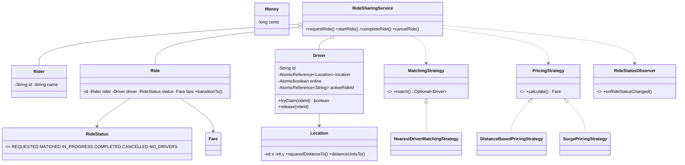

# Design a Ride-Sharing Service

> This is a **matching + concurrency** problem. The must-not-fail requirement is that two concurrent riders can never receive the same driver.

## 1. How to attack this in an interview

### Clarifying questions
| Question | Assumption we lock in |
| --- | --- |
| Matching rule? | Match the nearest online and unassigned driver. |
| Distance model? | Integer grid coordinates with Euclidean distance for deterministic tests. |
| Ride states? | `REQUESTED -> MATCHED -> IN_PROGRESS -> COMPLETED`, plus terminal `CANCELLED` and `NO_DRIVERS`. |
| Fare precision? | Integer cents only; no floating-point money. |
| Concurrency? | Driver assignment is an atomic claim using compare-and-set. |

### What earns points
- Atomic driver claim, not a check-then-act availability flag.
- Strategy interfaces for matching and pricing.
- State machine transitions in one enum.
- Observer notifications for rider/driver status updates.
- Injected `Clock`, id supplier, matching, and pricing for deterministic tests.

## 2. Requirements

**Functional:** register riders and drivers; drivers update location and go online/offline; riders request rides; system matches the nearest available driver; rides can start, complete, or cancel; fares include distance and time; no-driver requests are represented explicitly.

**Non-functional:** correct under concurrent requests; thread-safe driver location and availability; exact money; testable time and ids.

## 3. Core entities

- **`Location`** — integer `(x, y)` point with deterministic Euclidean distance helpers.
- **`Rider`** — immutable rider identity.
- **`Driver`** — identity plus atomic location, online flag, and active ride claim.
- **`Ride`** — trip aggregate with pickup, drop, status, timestamps, driver, and fare.
- **`RideStatus`** — legal lifecycle transitions.
- **`Fare` / `Money`** — exact integer-cent fare result.
- **`MatchingStrategy`** — pluggable driver matching.
- **`PricingStrategy`** — pluggable fare calculation.
- **`RideStatusObserver`** — status notification hook.
- **`RideSharingService`** — Facade over repositories and workflows.

## 4. Class diagram



## 5. Design patterns

| Pattern | Where | Why |
| --- | --- | --- |
| **Facade** | `RideSharingService` | One simple API hides repositories, matching, lifecycle, notifications, and pricing. |
| **Strategy** | `MatchingStrategy`, `PricingStrategy` | Swap matching or fare rules without rewriting orchestration. |
| **State machine** | `RideStatus` | Legal transitions are centralized and terminal states cannot reopen. |
| **Observer** | `RideStatusObserver` | Rider/driver notifications and analytics can subscribe independently. |
| **Repository** | `RiderRepository`, `DriverRepository`, `RideRepository` | In-memory storage can later become persistent storage. |

## 6. Concurrency — the atomic assignment race

The buggy approach is: find a nearby driver, check `isAvailable()`, then assign. Two request threads can both pass the check before either writes the assignment, causing one driver to be double-booked.

> `// CONCURRENCY:` `Driver.tryClaim(rideId)` uses `activeRideId.compareAndSet(null, rideId)`. The availability check and assignment are one atomic operation. If 100 riders race for 5 drivers, at most 5 claims can win.

Driver location is an `AtomicReference<Location>` and online state is an `AtomicBoolean`, so updates are safe while matching reads a moving snapshot. Cancelling or completing a ride releases the driver with a compare-and-set against that ride id, preventing one ride from accidentally freeing another ride's claim.

## 7. Testability

- **`Clock` injected** → ride timestamps and duration pricing use `MutableClock` in tests.
- **Id supplier injected** → stable ride ids.
- **Integer `Location`** → nearest-driver and fare tests are deterministic.
- **Strategies injected** → tests can use simple pricing constants and production can wrap with surge.
- **No sleeps** → concurrency tests use latches to start workers together and bounded awaits to finish.

## 8. API walkthrough

```java
RideSharingService service = new RideSharingService(
        new RiderRepository(),
        new DriverRepository(),
        new RideRepository(),
        new NearestDriverMatchingStrategy(),
        new DistanceBasedPricingStrategy(100, 150, 25),
        clock,
        idGenerator);

service.registerRider("r1", "Rider One");
service.registerDriver("d1", "Driver One", new Location(0, 0));
service.goOnline("d1");
Ride ride = service.requestRide("r1", new Location(0, 0), new Location(3, 4));
service.startRide(ride.getId());
service.completeRide(ride.getId());
```
