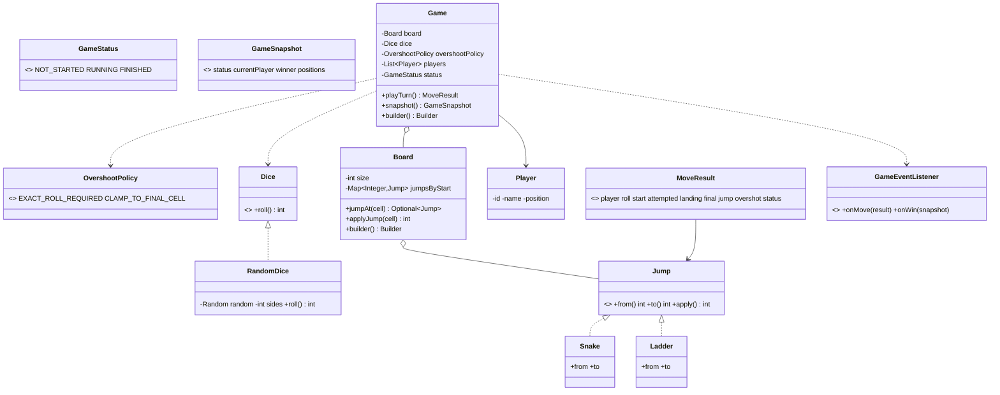

# Design a Snake and Ladder Game

> This follows the repo structure: *Clarify → Requirements → Core Entities → Class Diagram → Patterns → Concurrency → Testability → API walkthrough*.

---

## 1. How to attack this in an interview

Start by bounding the rules: board size, exact-win behavior, player count, deterministic dice, and event reporting.

### Clarifying questions to ask
| Question | Why it matters | Assumption we lock in |
| --- | --- | --- |
| Fixed 100 cells? | Drives board validation | Default 100, builder can customize for variants |
| Snakes/ladders configurable? | Drives board setup | Yes, via `Board.Builder` |
| Must roll exact 100? | Defines overshoot behavior | Default: exact roll required; policy is configurable |
| How many players? | Drives turn rotation | 2 or more |
| Real dice in tests? | Randomness makes game tests flaky | `Dice` Strategy is injected |
| Concurrent callers? | Race on turn order | `playTurn` is synchronized |

### What earns points
- Call out **Dice as Strategy** immediately.
- Emphasize `// TESTABILITY:` injecting `Dice` is the same idea as injecting `Clock`: it makes the whole game deterministic.
- Keep match status explicit with `NOT_STARTED`, `RUNNING`, `FINISHED`.
- Make board construction safe with a Builder/Factory and duplicate-jump validation.

---

## 2. Requirements

**Functional**
1. Board defaults to 100 cells.
2. Snakes move from head to lower tail; ladders move from bottom to higher top.
3. Multiple players take turns.
4. On each turn: roll dice → advance → apply snake/ladder → check winner.
5. First player to reach exactly cell 100 wins.
6. Default overshoot rule: if a roll exceeds 100, the player does not move. This is configurable via `OvershootPolicy`.
7. Report game state, move results, and winner.

**Non-functional**
1. **Thread-safe** turn advancement.
2. **Testable** deterministic games using scripted dice.
3. **Extensible** dice, board setup, overshoot rules, and observers.

---

## 3. Core entities

- **`Dice`** — Strategy interface: `int roll()`.
- **`RandomDice`** — production dice backed by injected `Random` / seed.
- **`Board`** — immutable cells plus configured `Jump`s.
- **`Jump`** → `Snake`, `Ladder` — board transitions.
- **`Player`** — identity and current position.
- **`GameStatus`** — enum state machine: `NOT_STARTED`, `RUNNING`, `FINISHED`.
- **`OvershootPolicy`** — configurable exact-roll vs clamp behavior.
- **`GameEventListener`** — Observer for move/win events.
- **`Game`** — Facade that owns turn order and match state.

---

## 4. Class diagram



---

## 5. Design patterns used

| Pattern | Where | Why |
| --- | --- | --- |
| **Strategy** | `Dice`, `RandomDice`, test scripted dice | Swap real randomness for deterministic dice. This is the headline pattern. |
| **State machine** | `GameStatus` | Makes lifecycle explicit: not started, running, finished. |
| **Builder / Factory** | `Board.Builder`, `Game.Builder`, `Board.standardBoard()` | Safe, readable setup of board and game dependencies. |
| **Observer** | `GameEventListener` | Scoreboards/logs react to move and win events without coupling to `Game`. |
| **Facade** | `Game` | One clean API for clients: `playTurn`, `snapshot`, `getWinner`. |
| **Model** | `Board`, `Player`, `Snake`, `Ladder`, `MoveResult` | Small objects keep responsibilities separated. |

`// DESIGN PATTERN:` Dice Strategy is deliberately preferred over directly calling `new Random()` inside `Game`.

---

## 6. Concurrency — turn order correctness

Snake and Ladder is turn-based, but UI/network callers can still race:

```
Thread A sees Alice's turn; Thread B also sees Alice's turn; both roll and mutate positions.
```

`Game.playTurn` is `synchronized`, so this whole sequence is atomic:

```
read current player -> roll -> update position -> apply jump -> check winner -> rotate turn
```

`// CONCURRENCY:` A per-game lock is enough because only one turn can legally happen at a time. Different `Game` instances do not block each other, and listeners are stored in `CopyOnWriteArrayList`.

---

## 7. Testability

- `Dice` is injected, so tests use a scripted fake: `new ScriptedDice(3, 4, 1)`.
- `RandomDice` accepts an injected `Random` or seed, so even production-like dice can be deterministic.
- With a fixed board and scripted dice, an entire game is predictable: exact positions, jumps, overshoots, turn rotation, and winner.
- `playTurn()` returns `MoveResult`; `snapshot()` returns `GameSnapshot`; tests assert state without parsing console output.

`// TESTABILITY:` Injecting the dice is to Snake and Ladder what injecting the Clock is to fee/elevator/time problems — it converts randomness into deterministic, unit-testable behavior.

---

## 8. API walkthrough

```java
Board board = Board.builder()
        .addLadder(3, 22)
        .addSnake(17, 7)
        .build();

Game game = Game.builder()
        .board(board)
        .dice(new RandomDice(new Random(42))) // or a scripted fake in tests
        .players(List.of(new Player("A", "Alice"), new Player("B", "Bob")))
        .overshootPolicy(OvershootPolicy.EXACT_ROLL_REQUIRED)
        .build();

MoveResult turn = game.playTurn();
GameSnapshot state = game.snapshot();
Optional<Player> winner = game.getWinner();
```

`// INTERVIEW INSIGHT:` Overshoot is a policy, not a hard-coded branch hidden throughout the code.  
`// EXTENSIBILITY:` New dice, jump types, observer outputs, and overshoot rules can be added without changing the core turn algorithm.
