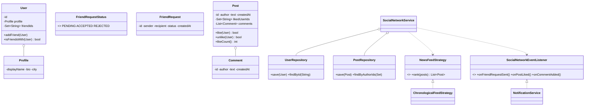

# Design a Social Network like Facebook

## 1. How to attack this in an interview

A social network is a **relationship + content feed** system. The trap is trying to build all of Facebook (groups, pages, ads, privacy, media). Anchor on the core loop: *connect with users → publish posts → react/comment → see a feed → receive notifications*.

### Clarifying questions
| Question | Assumption we lock in |
| --- | --- |
| Are friendships one-way or two-way? | Friend requests become bidirectional friendships only after acceptance. |
| Can a user like a post more than once? | No. Likes are idempotent per `(user, post)`. |
| What is in the feed? | The user's own posts and friends' posts. |
| How is the feed ranked? | Strategy; default is reverse chronological by post timestamp. |
| What events notify users? | Friend-request, like, and comment events. |
| Scale/concurrency? | Likes and friend requests can arrive concurrently and must remain exact. |

### What earns points
- Calling out that **likes are a set, not a counter-first design**. Counting the set avoids double-click inflation.
- Separating feed ranking behind a **Strategy** so "chronological today, edge-rank tomorrow" is a small swap.
- Wiring notifications as **Observers** so posting/liking/commenting does not know SMS/email/push details.

## 2. Requirements

**Functional:** users with profiles; send/accept/reject friend requests; bidirectional friendship; create text posts; comment; like/unlike idempotently; generate a news feed; notify on friend-request, like, and comment.

**Non-functional:** thread-safe likes and friend acceptance; exact like counts under contention; feed ordering is deterministic in tests; repositories and strategies are swappable.

## 3. Core entities

- **`User`** — id, profile, and a concurrent friendship set.
- **`Profile`** — display name, bio, city.
- **`FriendRequest`** — sender, recipient, status, and creation time.
- **`Post`** — id, author, text, creation time, concurrent like set, comments.
- **`Comment`** — author, text, creation time.
- **`UserRepository` / `PostRepository`** — in-memory repositories.
- **`NewsFeedStrategy`** — ranking strategy; `ChronologicalFeedStrategy` sorts newest first.
- **`SocialNetworkEventListener`** — notification observer hook.
- **`SocialNetworkService`** — Facade clients call.

## 4. Class diagram



## 5. Design patterns

| Pattern | Where | Why |
| --- | --- | --- |
| **Observer** | `SocialNetworkEventListener` → `NotificationService` | Notifications react to friend-request/like/comment events without coupling actions to delivery. |
| **Strategy** | `NewsFeedStrategy` | Chronological ranking is replaceable by relevance/edge-rank later. |
| **Repository** | `UserRepository`, `PostRepository` | Keeps persistence concerns out of the service and model. |
| **Facade** | `SocialNetworkService` | One clean API over users, relationships, posts, feed, and events. |
| **Factory/Builder** | `NotificationFactory`, `User.Builder` | Centralized notification creation and readable user construction. |

## 6. Concurrency — likes and friendship consistency

Hot posts receive simultaneous double-clicks. A naïve `int likeCount++` loses idempotency because the same user can increment twice. Here `Post` stores likes in a `ConcurrentHashMap.newKeySet()`: `add(userId)` is atomic and returns `false` when that user already liked the post. The count is derived from set size, so it is exact under contention.

Friend acceptance must update both users. `SocialNetworkService.acceptFriendRequest` synchronizes on the request, then locks the two `User` objects in deterministic id order before adding each side. That prevents accept/reject races and avoids deadlock while keeping friendship bidirectional.

> `// INTERVIEW INSIGHT:` a set is the domain model for likes. The counter is just a projection of that set.

## 7. Testability

- **`Clock` injected** for post/request/comment timestamps. Tests use `MutableClock` and advance time; no `Thread.sleep`.
- **Id `Supplier<String>` injected** so tests get deterministic ids.
- **Feed strategy and listeners injected** so feed ordering and notifications can be asserted directly.
- **Concurrency test** launches many threads liking the same post and asserts exact distinct-liker count.

## 8. API walkthrough

```java
SocialNetworkService service = new SocialNetworkService(clock, () -> "id-1");
User alice = service.registerUser(Profile.of("alice", "bio", "Pune"));
User bob = service.registerUser(Profile.of("bob", "bio", "Mumbai"));

FriendRequest request = service.sendFriendRequest(alice, bob);
service.acceptFriendRequest(request);

Post post = service.createPost(alice, "Hello world");
service.likePost(bob, post);
service.commentOnPost(bob, post, "Welcome!");

List<Post> feed = service.newsFeedFor(bob);
```
