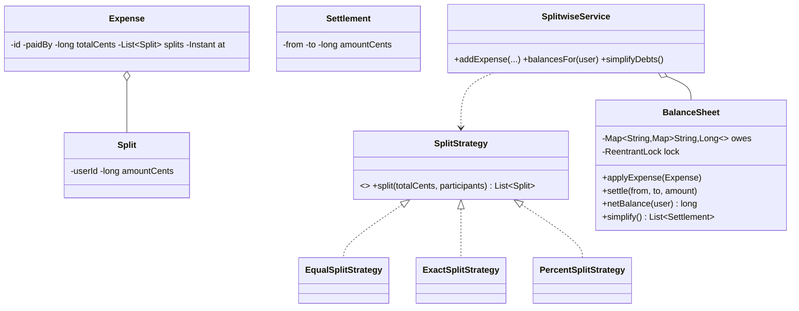

# Design Splitwise

> A shared-expense tracker. The interesting parts are **split strategies** (equal / exact / percentage with correct penny rounding), a **balance sheet** that nets who-owes-whom, and the **debt-simplification** algorithm that minimizes settlement transactions.

## 1. How to attack this in an interview

### Clarifying questions
| Question | Assumption we lock in |
| --- | --- |
| How can an expense be split? | Equal, exact amounts, or percentages (pluggable). |
| Do splits have to sum to the total? | Yes — validated; reject otherwise. |
| Do we net balances? | Yes — if A owes B and later B owes A, keep a single net direction. |
| "Simplify debts" feature? | Yes — minimize the number of settlement payments. |
| Money precision? | Integer cents; distribute rounding remainders deterministically. |

### What earns points
- **Strategy** for splitting + validating that shares sum to the total (rounding handled).
- A **balance sheet** that nets pairwise debts (never store both "A owes B" and "B owes A").
- The **greedy debt-simplification** (max-creditor vs max-debtor) and noting it minimizes transaction count.

## 2. Requirements

**Functional:** add users; record an expense (payer, total, participants, split method); track net balances; settle up; simplify group debts to the fewest payments; query balances.

**Non-functional:** money exact (integer cents); thread-safe balance updates; extensible split methods.

## 3. Core entities

- **`Split`** — a participant's share (userId, amountCents).
- **`SplitStrategy`** (Strategy) → `EqualSplitStrategy`, `ExactSplitStrategy`, `PercentSplitStrategy`.
- **`Expense`** — payer, total, splits, timestamp.
- **`BalanceSheet`** — the net directed debts; guarded by a lock.
- **`Settlement`** — a "from pays to amount" instruction (result of simplify).
- **`SplitwiseService`** — Facade.

## 4. Class diagram



## 5. Design patterns

| Pattern | Where | Why |
| --- | --- | --- |
| **Strategy** | `SplitStrategy` | Equal/exact/percent splitting are interchangeable; new methods don't touch the service. |
| **Facade** | `SplitwiseService` | One API over users, expenses, balances. |
| **Value Object** | `Split`, `Settlement` | Immutable money-carrying records. |

## 6. Concurrency

Balances are **interdependent** (one expense touches several pairs), so the `BalanceSheet` guards its nested map with a single `ReentrantLock`. Applying an expense — netting each participant's share against any reverse debt — happens atomically, so concurrent expense entries can't corrupt the sheet or lose a debt.

> `// INTERVIEW INSIGHT:` a coarse lock is the right call here because the invariant (each pair has at most one positive direction) spans multiple map entries; fine-grained per-pair locks would need careful ordering to stay consistent. For scale you'd shard by group.

## 7. Testability

- **Money is exact**; `EqualSplitStrategy` distributes leftover cents deterministically (first-N participants get the extra penny), so tests assert precise shares.
- The **balance sheet is deterministic**; tests assert exact net balances and that simplify produces the minimal settlements.
- **Concurrency test:** many threads add expenses; the total system balance must sum to zero (money is conserved) and no debt is lost.

## 8. API walkthrough

```java
SplitwiseService svc = new SplitwiseService(clock, idGen);
svc.addUser("alice"); svc.addUser("bob"); svc.addUser("carol");
// Alice pays 3000 cents, split equally among all three:
svc.addExpense("alice", 3000, new EqualSplitStrategy(), List.of("alice","bob","carol"), "Dinner");
svc.balancesFor("bob");     // bob owes alice 1000
List<Settlement> plan = svc.simplifyDebts(); // fewest payments to zero everything out
```
