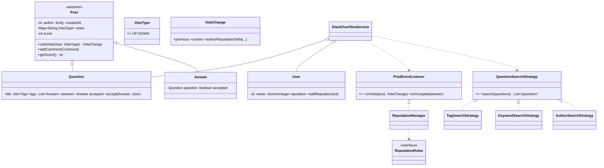

# Design Stack Overflow

## 1. How to attack this in an interview

A Q&A site is a **content + reputation** system. The trap is drowning in features (badges, moderation, edit history). Anchor on the core loop: *ask → answer → vote → reputation → accept*. Everything else is an extension.

### Clarifying questions
| Question | Assumption we lock in |
| --- | --- |
| What can be voted on? | Questions and Answers (not comments). |
| One vote per user per post? Can they change it? | Yes, one vote; up↔down↔none toggling allowed. |
| Who can accept an answer? | Only the question's author, and only one accepted answer. |
| How does reputation change? | Rule-driven (upvote answer +10, upvote question +5, downvote −2, accept +15). Must be pluggable. |
| Search dimensions? | By tag, by keyword, by author. Pluggable. |
| Scale/concurrency? | Many users vote on the same hot post at once — must be correct. |

### What earns points
- Spotting that **voting is a mini concurrency problem** (double-vote, toggling, reputation drift).
- Making **reputation rules a Strategy** and wiring them via **Observer** so posts don't depend on the reputation subsystem.
- Making **search a Strategy** instead of a pile of `if/else`.

## 2. Requirements

**Functional:** post questions (with tags) and answers; comment on both; up/down-vote questions & answers; a user votes at most once per post and may change/retract it; question author accepts one answer; reputation is derived from votes/acceptance; search by tag/keyword/author.

**Non-functional:** vote & reputation updates are **thread-safe**; reputation rules & search are **pluggable**; timestamps are **injected** (testable).

## 3. Core entities

- **`User`** — id, name, `reputation` (atomic), badges.
- **`Post`** (abstract) — id, author, body, creation time, comments, and the **voting engine** (who voted what + score).
- **`Question`** / **`Answer`** — extend `Post`; question owns tags + answers + the accepted answer.
- **`Comment`**, **`Tag`**, **`VoteType`**.
- **`ReputationRules`** (Strategy) + **`ReputationManager`** (Observer that applies rule deltas to users).
- **`PostEventListener`** (Observer) + **`VoteChange`** (what a vote did: previous → current).
- **`QuestionSearchStrategy`** (Strategy) → tag/keyword/author.
- **`StackOverflowService`** — Facade + in-memory repositories.

## 4. Class diagram

## 5. Design patterns

| Pattern | Where | Why |
| --- | --- | --- |
| **Strategy** | `ReputationRules`, `QuestionSearchStrategy` | Swap scoring rules / search dimensions without editing core classes. |
| **Observer** | `PostEventListener` → `ReputationManager` | Posts emit vote/accept events; reputation reacts. Post never imports the reputation package (decoupling + no cyclic deps). |
| **Template Method** | `Post` holds shared voting/commenting; subclasses specialise | DRY across Question/Answer. |
| **Facade** | `StackOverflowService` | Single API over repositories, voting, reputation, search. |

## 6. Concurrency — voting is the hot spot

Hundreds of users vote on the same trending post simultaneously. Three bugs to prevent:
1. **Double counting** — a user's vote must be counted once even if they spam-click.
2. **Toggle correctness** — up→down must move the score by −2, not −1.
3. **Reputation drift** — the author's reputation must reflect the *net* change.

**Design:** each `Post` guards its `votes` map + `score` with the post's **own lock** (`synchronized` on the post). Different posts are different locks, so unrelated posts never contend. The method computes `previous` and `current` vote atomically, updates the score by the exact delta, and returns a `VoteChange`. The author's `reputation` is an `AtomicInteger` because votes on *many* posts can touch the same author concurrently.

> `// INTERVIEW INSIGHT:` per-post locking keeps correctness simple while still allowing full parallelism across different posts. If a single post were a global hot spot you'd shard the counter (e.g. `LongAdder`) — mention it, but don't over-engineer.

Accepting an answer is guarded too: only the question author may accept, and switching the accepted answer moves reputation correctly.

## 7. Testability

- **`Clock` injected** for `createdAt` timestamps; **id generator injected** so tests assert real ids.
- **Reputation is deterministic**: fixed rules → assert exact reputation numbers.
- **Concurrency test**: N threads vote on one post; assert the final score and author reputation are exactly right and each user counted once.
