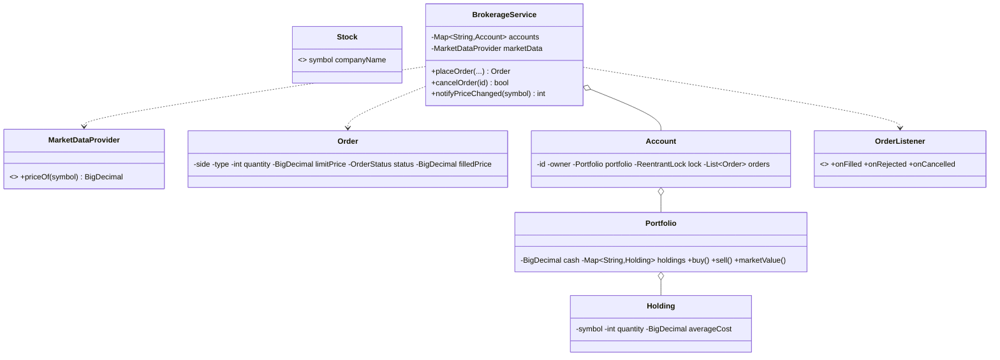

# Design an Online Stock Brokerage System

> A brokerage lets clients hold **cash + positions** and place **buy/sell** orders that execute
> against a **market price feed**. The heart of it is keeping cash and holdings consistent as orders
> fill — never overspending, never shorting — and modelling **market vs limit** orders, including
> limit orders that **rest** until the market moves to them.

## 1. How to attack this in an interview

### Clarifying questions
| Question | Assumption we lock in |
| --- | --- |
| Brokerage or exchange? | **Brokerage** — orders price off a market-data feed. Order-book matching (buyer ↔ seller) is the separate Stock Trading System (#38). |
| Order types? | MARKET (fill now at the feed price) and LIMIT (fill only at limit-or-better, else rest). |
| Shorting / margin? | No — a sell needs the shares, a buy needs the cash. |
| What happens to a limit order that isn't marketable? | It rests as OPEN and fills when the price moves (`notifyPriceChanged`). |
| Concurrency? | Many orders can hit one account at once; cash/holdings must never corrupt or go negative. |

### What earns points
- Splitting **brokerage** (this) from **matching engine** (#38) instead of conflating them.
- Modelling funding outcomes as **order state (FILLED/OPEN/REJECTED) + observer callbacks**, since a resting order can be rejected long after `placeOrder` returned.
- A **per-account lock** (not one global lock): the cash+holdings invariant is per account, so accounts trade in parallel.
- `BigDecimal` money and an **average cost basis** that updates correctly across multiple buys.

## 2. Requirements

**Functional:** list stocks; open accounts with cash; deposit/withdraw; place market & limit
buy/sell orders; fill immediately when marketable else rest; cancel resting orders; re-evaluate
resting orders on a price change; report cash, holdings, order history and mark-to-market value.

**Non-functional:** cash never negative, no shorting; correct under concurrent orders on one account;
deterministic/testable (injected price feed + clock + id generator); pluggable price source.

## 3. Core entities

- **`Stock`** — record: symbol + company.
- **`MarketDataProvider`** (Strategy) — `priceOf(symbol)`; `InMemoryMarketData` is the settable test/demo feed.
- **`Order`** (Command/Builder) — side, type, quantity, optional limit, plus runtime status/fill.
- **`Holding`** — a position: quantity + average cost.
- **`Portfolio`** — cash + holdings; owns the buy/sell/deposit/withdraw money rules.
- **`Account`** — owner + portfolio + order history + its own `ReentrantLock`.
- **`OrderListener`** (Observer) — filled / rejected / cancelled callbacks.
- **`BrokerageService`** (Facade) — the whole API.

## 4. Class diagram



## 5. Design patterns

| Pattern | Where | Why |
| --- | --- | --- |
| **Facade** | `BrokerageService` | One API over accounts, cash, catalog and execution. |
| **Strategy** | `MarketDataProvider` | Swap live feed vs deterministic test feed. |
| **Command** | `Order` (+ Builder) | A queueable, stateful trade instruction. |
| **Observer** | `OrderListener` | Fill/reject/cancel notifications decoupled from execution. |
| **Value Object** | `Stock` | Immutable instrument identity. |

## 6. Concurrency

The invariant "debit cash **and** grow the position" (or "reduce position **and** credit cash") is a
read-modify-write across two fields of one account, so it must be atomic. Each `Account` carries its
**own** `ReentrantLock`; `placeOrder`, `cancelOrder`, deposit/withdraw and resting-order fills all
take that account's lock.

> `// INTERVIEW INSIGHT:` a lock PER account (not one global lock) lets different accounts trade in
> parallel while serializing the same account. `notifyPriceChanged` locks each affected account one at
> a time (never two at once), so there's no lock-ordering/deadlock question — unlike a cash *transfer*
> between two accounts, which would need a consistent global lock order.

`Portfolio` is intentionally **not** self-synchronized: locking a single field would be a lie when the
invariant spans cash + a holding. It documents that the caller must hold the account lock.

## 7. Testability

- **`InMemoryMarketData`** makes the "current price" a dial we turn: set 100, buy, assert; drop to 90,
  `notifyPriceChanged`, assert the resting limit buy filled.
- Injected **id generator** gives deterministic account/order ids; injected **`Clock`** stamps orders.
- **Concurrency test:** one account with cash for exactly N shares, many threads each buy 1 — exactly
  N fill, the rest are REJECTED, cash lands at zero and is never negative.

## 8. API walkthrough

```java
InMemoryMarketData feed = new InMemoryMarketData().setPrice("AAPL", new BigDecimal("100"));
BrokerageService broker = new BrokerageService(feed, Clock.systemUTC());
broker.listStock("AAPL", "Apple Inc.");
Account acc = broker.openAccount("alice", new BigDecimal("1000"));

broker.marketOrder(acc.getId(), "AAPL", OrderSide.BUY, 5);          // fills at 100 -> cash 500, 5 shares
Order resting = broker.limitOrder(acc.getId(), "AAPL", OrderSide.BUY, 2, new BigDecimal("90")); // rests OPEN
feed.setPrice("AAPL", new BigDecimal("90"));
broker.notifyPriceChanged("AAPL");                                  // resting buy now fills
broker.portfolioValue(acc.getId());                                 // cash + shares * price
```
