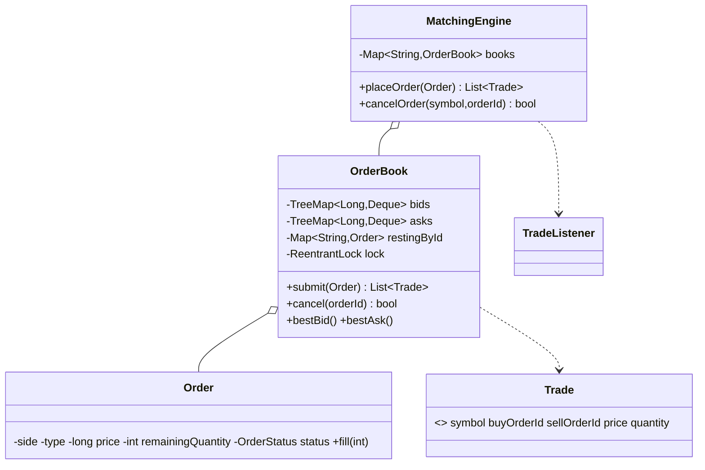

# Design a Stock Trading System (matching engine)

> This is the **exchange**: the engine that PAIRS a buyer with a seller. The core is a per-symbol
> **order book** matched with strict **price-time priority**, producing **trades**. (Contrast with the
> Online Stock Brokerage (#31), which prices a single client's orders off a market feed — no pairing.)

## 1. How to attack this in an interview

### Clarifying questions
| Question | Assumption we lock in |
| --- | --- |
| Matching rule? | Price-time priority: best price first; ties by arrival order (FIFO). |
| Order types? | LIMIT (rests if unmarketable) and MARKET (takes liquidity, never rests). |
| Trade price? | The RESTING (maker) price — the taker gets price improvement. |
| Partial fills? | Yes — an order can fill across several resting orders/levels. |
| Concurrency? | Different symbols match in parallel; one symbol's book is serialized. |

### What earns points
- The **price-time data structure**: `TreeMap<price, FIFO-deque>` per side → O(log P) best-price access and O(1) FIFO within a level.
- Correct **taker/maker** trade pricing and **partial fill** bookkeeping.
- **Per-symbol locking** for parallelism, and stating the conservation invariant (traded buy qty == traded sell qty).

## 2. Requirements

**Functional:** submit LIMIT/MARKET buy/sell orders per symbol; match by price-time priority; generate
trades at the maker price; support partial fills; rest unmarketable limit remainder; reject a market
order with no liquidity; cancel a resting order; expose best bid/ask.

**Non-functional:** deterministic matching; symbols independent (parallel); no lost/duplicated
quantity; observable via a trade feed.

## 3. Core entities

- **`Order`** — id, symbol, side, type, integer `price` (minor units), original/remaining qty, status.
- **`Trade`** — record: symbol, buy/sell order ids, price, quantity.
- **`OrderBook`** — one symbol; bids/asks as `TreeMap<price, Deque<Order>>` + id index; `submit`/`cancel`.
- **`TradeListener`** (Observer) — trade tape / rejection feed.
- **`MatchingEngine`** (Facade) — routes orders to books, matches under the book lock, publishes trades.

## 4. Class diagram



## 5. Design patterns

| Pattern | Where | Why |
| --- | --- | --- |
| **Facade** | `MatchingEngine` | Route + match + publish behind one method. |
| **Observer** | `TradeListener` | Trade tape decoupled from matching. |
| **Value Object** | `Trade` | Immutable execution record. |
| **(Structure)** | `OrderBook` price-time maps | The crux of the problem. |

## 6. Concurrency

Each `OrderBook` owns a `ReentrantLock`; `MatchingEngine.placeOrder` and `cancelOrder` take THAT
book's lock. Consequences:

- **Different symbols never contend** — AAPL and MSFT match on different locks, fully parallel.
- **One symbol is serialized** — a book is never mid-match when another order arrives, so price-time
  priority and quantity accounting can't be corrupted by a race.

> `// INTERVIEW INSIGHT:` the invariant that proves correctness under load: across all trades for a
> symbol, total bought quantity equals total sold quantity, and no order fills beyond its size. The
> concurrency test asserts exactly this — N buys and N sells at a crossing price yield N unit trades
> and an empty book, no matter the interleaving.

## 7. Testability

- Integer prices → exact, deterministic matches; no clock needed (arrival order = submission order).
- Trades assert maker-price execution, partial fills across levels, FIFO within a level, and market
  sweeps.
- **Concurrency test:** hammer one symbol with interleaved buys/sells → conservation holds and the
  book empties.

## 8. API walkthrough

```java
MatchingEngine engine = new MatchingEngine();
engine.addListener(trade -> System.out.println(trade));

engine.placeOrder(Order.limit("s1", "AAPL", OrderSide.SELL, 101, 100)); // rests: ask 101 x100
engine.placeOrder(Order.limit("s2", "AAPL", OrderSide.SELL, 100, 50));  // rests: ask 100 x50 (better)

// Buy 120 @ 101 sweeps: 50 @ 100 (best), then 70 @ 101 -> two trades, buyer fully filled.
List<Trade> trades = engine.placeOrder(Order.limit("b1", "AAPL", OrderSide.BUY, 101, 120));

engine.getOrderBook("AAPL").bestAsk();   // 101 with 30 left resting
```
