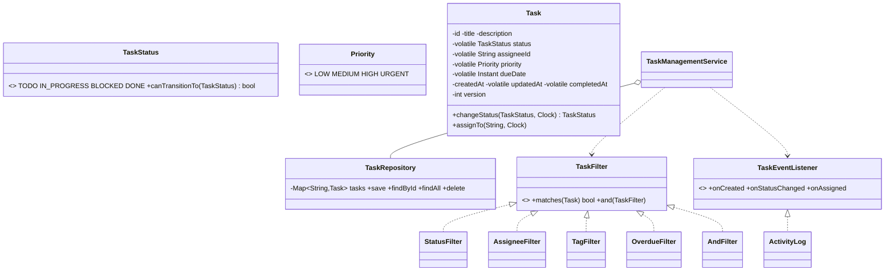

# Design a Task Management System

## 1. How to attack this in an interview

A task manager (Jira/Asana/Todoist-lite) is a **CRUD + workflow + query** system. The depth lives in three places: a **legal status workflow**, **pluggable filtering/sorting**, and **change notifications/audit**.

### Clarifying questions
| Question | Assumption we lock in |
| --- | --- |
| What states can a task be in, and which transitions are legal? | `TODO → IN_PROGRESS ⇄ BLOCKED → DONE`; `DONE` is terminal. Illegal jumps are rejected. |
| Assignment model? | One assignee per task (nullable), users are first-class. |
| How do users find tasks? | Filter by status/assignee/tag/overdue + sort by priority/due date — must be composable & pluggable. |
| Do we track history / notify? | Yes — every change emits an event (activity log + notifications). |
| Concurrency? | Many users mutate tasks concurrently; status changes must be atomic and workflow-safe. |

### What earns points
- Encoding the **workflow as data** (allowed-transitions map) instead of `if/else`.
- Making filters **composable** (AND of `TaskFilter`s) — Strategy + Composite.
- Using an injected **`Clock`** so "overdue" and timestamps are testable.
- Mentioning **optimistic concurrency** (a `version` per task) for lost-update detection.

## 2. Requirements

**Functional:** create/update/delete tasks (title, description, priority, tags, due date); assign/unassign; change status through legal transitions only; query with composable filters + sorting; list overdue tasks; emit events for every mutation (activity log, notifications).

**Non-functional:** thread-safe under concurrent mutation; workflow invariants never violated; filtering/sorting extensible; deterministic + testable time.

## 3. Core entities

- **`Task`** — the aggregate; guards its own mutable state (status, assignee, priority, timestamps, `version`).
- **`TaskStatus`** / **`Priority`** — enums; `TaskStatus` owns the legal-transition rules.
- **`User`** — id + name.
- **`TaskRepository`** — thread-safe in-memory store (Repository pattern).
- **`TaskFilter`** (Strategy) — `ByStatus`, `ByAssignee`, `ByTag`, `Overdue`, plus an `And` composite.
- **`TaskComparators`** — reusable sort orders (Strategy via `Comparator`).
- **`TaskEventListener`** (Observer) — `ActivityLog`, notifications.
- **`TaskManagementService`** — Facade orchestrating repo + events + clock + ids.

## 4. Class diagram



## 5. Design patterns

| Pattern | Where | Why |
| --- | --- | --- |
| **State machine** | `TaskStatus.canTransitionTo` | Legal workflow encoded as data; invalid transitions rejected in one place. |
| **Strategy** | `TaskFilter`, `Comparator`s | Pluggable, composable query building. |
| **Composite** | `AndFilter` / `TaskFilter.and` | Combine simple filters into complex predicates. |
| **Observer** | `TaskEventListener` | Activity log + notifications react to every change; service doesn't hard-code them. |
| **Repository** | `TaskRepository` | Isolates storage; swap in-memory for a DB later. |
| **Builder** | `Task.Builder` | Construct a task with many optional fields readably. |
| **Facade** | `TaskManagementService` | One API over repo + events + clock. |

## 6. Concurrency

- **Repository** is a `ConcurrentHashMap` — safe concurrent put/get/remove.
- **Per-task atomicity:** each `Task` guards its mutable state with its own intrinsic lock (`synchronized`). A status change validates the transition and updates status + `updatedAt` (+ `completedAt`) as one atomic step, so two concurrent transitions can't both "win" and corrupt the workflow. Mutable fields are `volatile` so readers see the latest values without locking.
- **Optimistic concurrency:** a `version` counter increments on each mutation. A client that read version *v* can detect a lost update if the task's version has since moved — the basis for `If-Match`/compare-and-set style updates in a real API. `// INTERVIEW INSIGHT:` this is how you avoid two editors silently clobbering each other.

## 7. Testability

- **`Clock` injected** into the service; `createdAt/updatedAt/completedAt` and "overdue" all derive from it, so tests advance a `MutableClock` to make a task overdue instantly.
- **Id generator injected** for stable ids in assertions.
- Filters/comparators are pure functions → trivially unit-tested.

## 8. API walkthrough

```java
TaskManagementService svc = new TaskManagementService(clock, idGen);
Task t = svc.createTask("Ship LLD repo", "...", Priority.HIGH, Set.of("work"), dueDate);
svc.assign(t.getId(), alice.getId());
svc.changeStatus(t.getId(), TaskStatus.IN_PROGRESS);   // legal
svc.changeStatus(t.getId(), TaskStatus.DONE);          // legal
List<Task> mine = svc.query(new AssigneeFilter(alice.getId()).and(new StatusFilter(TaskStatus.DONE)),
                            TaskComparators.BY_PRIORITY_DESC);
```
