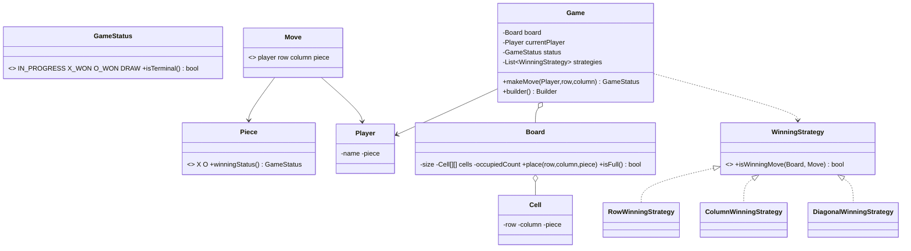

# Design a Tic Tac Toe Game

> This follows the repo structure: *Clarify → Requirements → Core Entities → Class Diagram → Patterns → Concurrency → Testability → API walkthrough*.

---

## 1. How to attack this in an interview

Start by bounding the game before coding: board size, player count, win rules, invalid moves, and whether concurrency matters.

### Clarifying questions to ask
| Question | Why it matters | Assumption we lock in |
| --- | --- | --- |
| Fixed 3x3 or generalized? | Drives board and strategy logic | NxN, default 3x3 |
| Two players only? | Keeps turn order simple | Two players: X and O |
| What is a win? | Determines strategy interfaces | Full row, column, or diagonal |
| What happens after game over? | Terminal state handling | Further moves are rejected |
| Concurrent callers? | Race on turn-taking and cell placement | makeMove is thread-safe |

### What earns points
- Name **Strategy** as the headline pattern for win detection before coding.
- Keep status explicit with an enum state machine: `IN_PROGRESS`, `X_WON`, `O_WON`, `DRAW`.
- Explain the O(1)-per-move counter optimization even if the simple strategy scans O(N).

---

## 2. Requirements

**Functional**
1. Two players alternate placing `X` and `O`.
2. Reject out-of-bounds moves, occupied cells, wrong turns, and moves after terminal status.
3. Detect full-row, full-column, primary-diagonal, and secondary-diagonal wins.
4. Detect draw when the board is full and nobody has won.
5. Return game status after every valid move.

**Non-functional**
1. **Thread-safe** move application.
2. **Extensible** win rules through strategies.
3. **Testable** deterministic API with no randomness or time dependency.

---

## 3. Core entities

- **`Game`** — facade and state machine; owns turn order and status.
- **`Board`** — NxN collection of `Cell`s plus occupancy count.
- **`Cell`** — coordinate and optional `Piece`.
- **`Player`** — name plus assigned `Piece`.
- **`Piece`** — `X` or `O`.
- **`Move`** — immutable record of a placement.
- **`WinningStrategy`** — pluggable rule for deciding whether the last move won.

---

## 4. Class diagram



---

## 5. Design patterns used

| Pattern | Where | Why |
| --- | --- | --- |
| **Strategy** | `WinningStrategy` and row/column/diagonal implementations | Add or replace win rules without editing `Game`. This is the headline interview choice. |
| **State pattern / enum state machine** | `GameStatus` | Terminal and in-progress behavior is explicit and easy to test. |
| **Builder** | `Game.Builder` | Readably constructs default or custom board/player/strategy setup. |
| **Facade** | `Game` | One clean API: `makeMove(player, row, col)`. |
| **Model** | `Board`, `Cell`, `Player`, `Piece`, `Move` | Small domain objects keep responsibilities separated. |

---

## 6. Concurrency — correctness over cleverness

A Tic Tac Toe match is turn-based, but APIs may still be called from two UI/network threads at once. The dangerous race is:

```
Thread A sees X turn; Thread B sees X turn; both place X before either switches to O.
```

`Game.makeMove` is `synchronized`, so validation, board mutation, win/draw detection, and turn switching happen as one atomic critical section.

> `// CONCURRENCY:` This lightweight per-game lock preserves turn-taking correctness. Different `Game` instances do not block each other.

---

## 7. Testability

- `makeMove(player, row, col)` returns `GameStatus`, so tests assert outcomes directly.
- No randomness, clock, sleep, or external service exists.
- Strategies are ordinary classes and can be unit-tested or swapped independently.
- A concurrency test can race two X moves and assert exactly one succeeds for the current turn.

> `// TESTABILITY:` The game is deterministic and exposes board/status inspection without requiring console input.

---

## 8. API walkthrough

```java
Game game = Game.defaultGame();
Player x = game.getXPlayer();
Player o = game.getOPlayer();

game.makeMove(x, 0, 0); // IN_PROGRESS
game.makeMove(o, 1, 0); // IN_PROGRESS
GameStatus status = game.makeMove(x, 0, 1);
```

`// DESIGN PATTERN:` To add a custom rule, implement `WinningStrategy` and register it with `Game.builder().addWinningStrategy(...)`.
`// INTERVIEW INSIGHT:` O(1) win detection is possible with per-player row/column/diagonal counters; the current Strategy implementation favors readability and correctness.
`// EXTENSIBILITY:` Board size is configured through the builder, so 4x4 and larger games use the same model.
