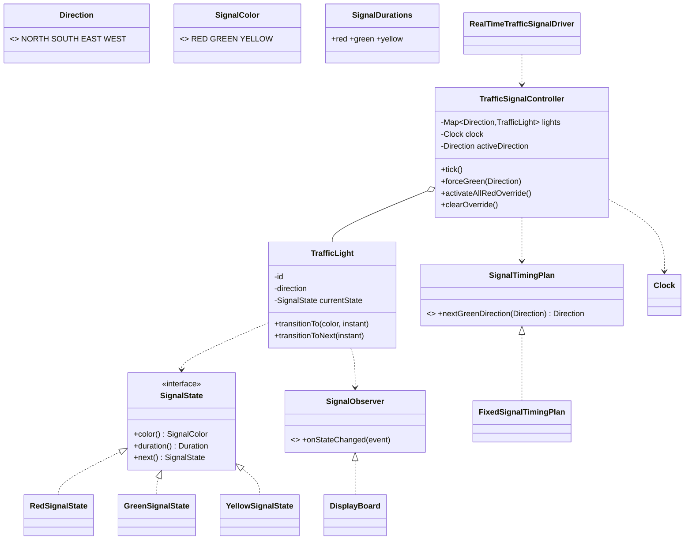

# Design a Traffic Signal Control System

> Structure mirrors the reference problems: *Clarify → Requirements → Core Entities → Class Diagram → Patterns → Concurrency → Testability → API walkthrough*.

---

## 1. How to attack this in an interview

Start with safety, not animation. A traffic signal is a small state machine whose correctness depends on the invariant: conflicting movements are never GREEN together. Then make time injectable so the design can be proven without waiting in real time.

### Clarifying questions to ask
| Question | Why it matters | Assumption we lock in |
| --- | --- | --- |
| One intersection or a network? | Network coordination adds routing/synchronization complexity | One intersection |
| Which directions are modelled? | Drives `Direction` and light map | NORTH, SOUTH, EAST, WEST |
| Can opposing directions be grouped? | Affects safety invariant | Simple model: one GREEN direction at a time |
| Are durations fixed or adaptive? | Strategy seam | Fixed timing now, adaptive later via `SignalTimingPlan` |
| Emergency behavior? | Must preempt normal state machine safely | all-RED or priority direction GREEN |
| Real time or simulated time? | Core testability issue | Inject `Clock`; tests advance `MutableClock` and call `tick()` |
| Concurrent access? | Scheduler, admin override and UI reads can race | Controller guards shared state with a lock |

### What earns points
- Name the **State pattern** first: RED/GREEN/YELLOW know `next()` and `duration()`.
- State the safety invariant before coding: at most one GREEN direction in this simplified model.
- Avoid `Thread.sleep` in core logic; inject `Clock` and expose deterministic `tick()`.
- Treat the scheduled executor as an adapter, not as the design's brain.

---

## 2. Requirements

**Functional**
1. An `Intersection`/controller has multiple `TrafficLight`s, one per configured `Direction`.
2. Each light cycles `GREEN -> YELLOW -> RED -> GREEN` with configurable durations.
3. The controller coordinates lights so at most one direction is GREEN at a time.
4. Emergency override can force all RED or force a priority direction GREEN.
5. Clearing an override resumes normal cycling.
6. Observers (display boards/loggers) are notified on every state change.

**Non-functional**
1. **Thread-safe**: scheduled ticks, manual ticks and overrides cannot corrupt the phase.
2. **Testable**: no real waiting; all transition decisions use injected `Clock`.
3. **Extensible**: timing plans and observers are pluggable.

---

## 3. Core entities

- **`TrafficLight`** — physical signal head; owns its current `SignalState` and notifies observers.
- **`SignalState`** — State interface with `color()`, `duration()`, `next()`.
- **`RedSignalState` / `GreenSignalState` / `YellowSignalState`** — concrete State pattern classes.
- **`SignalDurations`** — immutable per-light durations.
- **`SignalTimingPlan`** — Strategy for direction order and durations.
- **`FixedSignalTimingPlan`** — deterministic round-robin timing strategy.
- **`TrafficSignalController`** — facade/coordinator that enforces the safety invariant.
- **`SignalObserver`** and **`SignalChangeEvent`** — Observer pattern hook for display/logging.
- **`DisplayBoard`** — sample observer storing latest colors.
- **`RealTimeTrafficSignalDriver`** — optional scheduled adapter that calls `tick()` periodically.

---

## 4. Class diagram



---

## 5. Design patterns used

| Pattern | Where | Why |
| --- | --- | --- |
| **State** | `SignalState`, `RedSignalState`, `GreenSignalState`, `YellowSignalState` | Headline pattern: states own transition and duration instead of a fragile switch. |
| **Observer** | `SignalObserver`, `SignalChangeEvent`, `DisplayBoard` | Displays/loggers react to state changes without coupling to controller internals. |
| **Strategy** | `SignalTimingPlan`, `FixedSignalTimingPlan` | Swap fixed-time timing with adaptive/sensor-based timing later. |
| **Facade** | `TrafficSignalController` | One API for ticking, overrides, snapshots and safety checks. |

**Deliberately not a Singleton.** A controller Singleton is a common textbook answer, but it hurts tests and prevents multiple intersections in one JVM. This implementation prefers normal object construction with injected `Clock` and `SignalTimingPlan`.

---

## 6. Concurrency

The shared state is the phase: active direction, emergency mode, phase start time and the multi-light color snapshot. `TrafficSignalController` protects that state with one `ReentrantLock`, making `tick()`, `forceGreen()`, `activateAllRedOverride()` and `clearOverride()` atomic relative to one another.

`TrafficLight` synchronizes its own `SignalState` reads/writes. Observers are `CopyOnWriteArrayList`s and are notified outside the light lock to avoid callback deadlocks.

The optional `RealTimeTrafficSignalDriver` uses a single-threaded `ScheduledExecutorService`, and it is cleanly stoppable through `shutdown()`/`close()`.

---

## 7. Testability

- `Clock` is injected into the controller. Tests use `MutableClock.atEpoch()`, advance it, call `tick()`, and assert states instantly.
- No core transition uses `Thread.sleep` or `Instant.now()`.
- The scheduler is optional; deterministic tests exercise the same controller logic directly.
- Observers are plain interfaces, so tests can collect events in a `List`.
- Safety is easy to assert with `safetyInvariantHolds()` or by counting GREEN values in `snapshot()`.

---

## 8. API walkthrough

```java
SignalDurations durations = SignalDurations.ofSeconds(5, 30, 3);
TrafficSignalController controller = new TrafficSignalController(
        FixedSignalTimingPlan.fourWay(durations),
        Clock.systemUTC());

DisplayBoard board = new DisplayBoard();
controller.addObserver(board);

controller.tick();                    // production scheduler or tests can drive this
controller.forceGreen(Direction.NORTH); // ambulance preemption
controller.clearOverride();            // resumes normal cycle from NORTH

try (RealTimeTrafficSignalDriver driver = controller.startRealTimeDriver(Duration.ofMillis(250))) {
    // application keeps running
}
```
