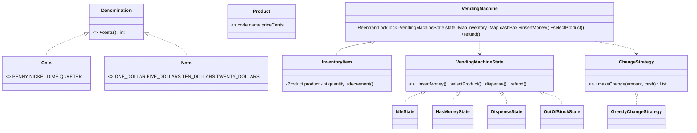

# Design a Vending Machine

## 1. How to attack this in an interview

Start with the transaction loop: *insert money → select product → dispense item + exact change → idle*. The trap is modelling payment with `double` or hiding state transitions in a pile of `if/else`. Make State the headline pattern and make change-making pluggable.

### Clarifying questions
| Question | Assumption we lock in |
| --- | --- |
| What money is accepted? | Discrete `Coin` and `Note` denominations with integer cent values. |
| Can one customer insert multiple denominations? | Yes, the machine accumulates an inserted balance. |
| What happens on cancel? | Return all inserted money and go back to idle. |
| What if exact change is impossible? | Reject the purchase; keep money inserted so the customer can add money, choose another item, or refund. |
| Is the machine multi-user? | Physically single-user, but API calls are thread-safe. |
| How is change computed? | Pluggable `ChangeStrategy`; default is greedy. |

### What earns points
- Naming **State** as the headline pattern and showing clean transitions.
- Keeping money in integer cents, never `double`/`float`.
- Calling out the last-item race and guarding state + inventory + cash as one atomic critical section.

## 2. Requirements

**Functional:** maintain products by code/name/price/quantity; accept coins/notes; support inserting multiple denominations; select and dispense when funded; return exact change; refund inserted money; reject insufficient funds, out-of-stock items and impossible change; track collected balance.

**Non-functional:** transaction commit is thread-safe; change logic is swappable; outcomes are deterministic and easy to assert; money uses integer cents.

## 3. Core entities

- **`Product`** — immutable code, name and price in cents.
- **`InventoryItem`** — product plus guarded quantity.
- **`Denomination`** → `Coin`, `Note` — accepted money values.
- **`VendingMachineState`** → `IdleState`, `HasMoneyState`, `DispenseState`, `OutOfStockState`.
- **`ChangeStrategy`** → `GreedyChangeStrategy`.
- **`DispenseResult`** / **`RefundResult`** — deterministic operation outcomes.
- **`VendingMachine`** — facade, state owner, inventory owner and transaction lock.

## 4. Class diagram



## 5. Design patterns

| Pattern | Where | Why |
| --- | --- | --- |
| **State** | `VendingMachineState` and concrete states | Keeps legal operations and transitions explicit: idle, has money, dispensing, out of stock. |
| **Strategy** | `ChangeStrategy` | Swap greedy change-making for DP/backtracking without editing the machine. |
| **Builder** | `VendingMachine.Builder` | Readable setup of inventory, starting cash float and strategy. |
| **Facade** | `VendingMachine` | One clean API over inventory, payment, state and change. |

## 6. Concurrency

The dangerous race is two threads selecting the same last product. Both could read quantity `1`, both compute change, and both decrement unless the whole commit is atomic.

This design uses one `ReentrantLock` in `VendingMachine`. The lock guards state transitions, inserted balance, inventory decrement, change computation, cash-box update and collected balance. Inventory quantity is a plain int because it is never accessed outside this lock; using an atomic counter alone would not protect the multi-field transaction invariant.

> `// INTERVIEW INSIGHT:` the linearization point is `completeDispense()` under the machine lock. Either the whole purchase commits once, or it does not commit at all.

## 7. Testability

- Money is integer cents, so assertions are exact.
- `ChangeStrategy` is injected, so tests can use default greedy or a fake strategy.
- `DispenseResult` lists the product and exact denominations returned as change.
- `RefundResult` lists the exact money returned.
- No sleeping or wall-clock time is needed.

## 8. API walkthrough

```java
VendingMachine machine = VendingMachine.builder()
        .addProduct("A1", "Cola", 65, 10)
        .addChange(Coin.QUARTER, 4)
        .addChange(Coin.DIME, 10)
        .build();

machine.insertNote(Note.ONE_DOLLAR);
DispenseResult result = machine.selectProduct("A1");
// result.product().name() == "Cola"; result.changeCents() == 35; machine is idle again.
```
