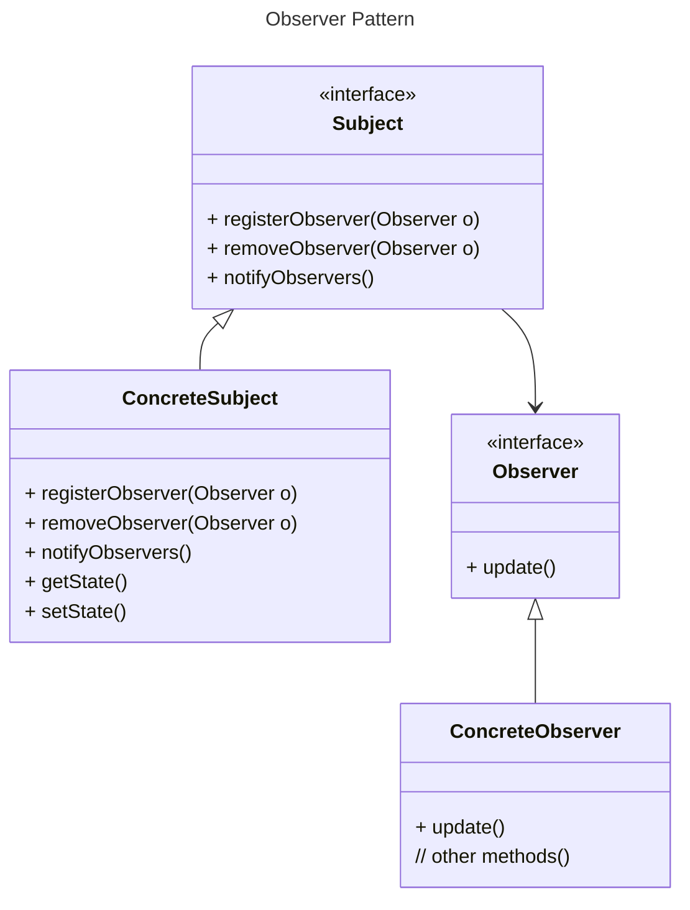
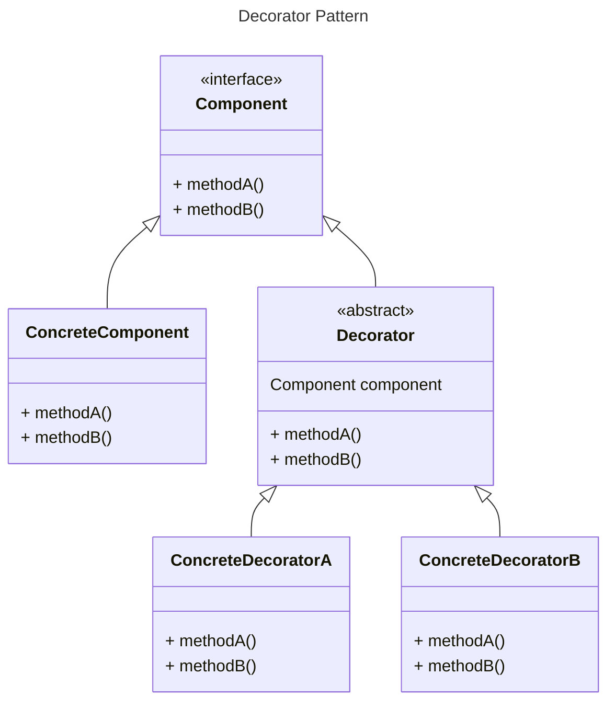
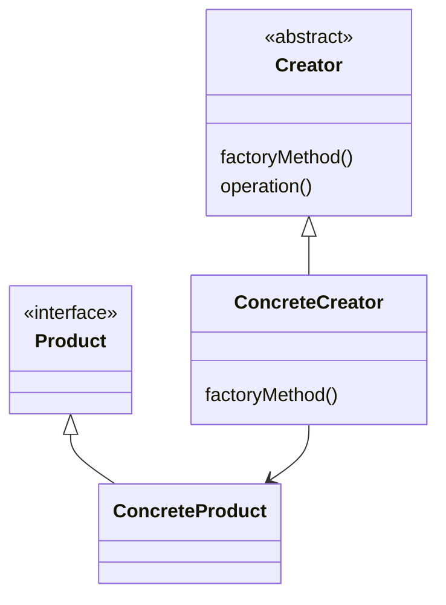
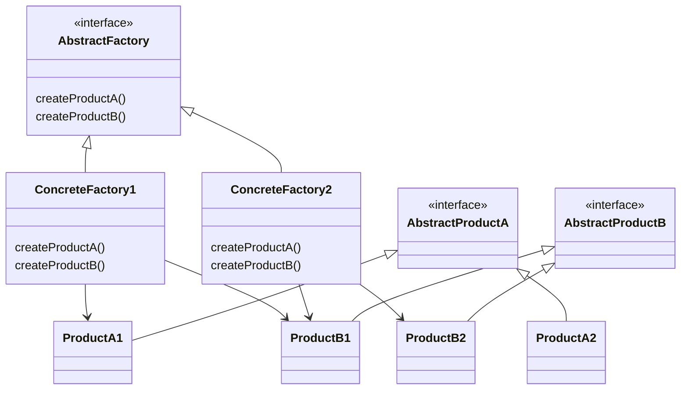
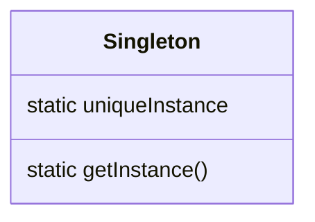

# Design Patterns Class Diagram

## Observer Pattern
- defines a one-to-many dependency between objects so that when the object changes state, all of its dependents are notified and updated automatically.

## Decorator Pattern
- attach additional responsibilities to an object dynamically. Decorators provide a flexible alternative to subclassing for extending functionalities.

## Factory Method
- defines an interface for creating an object, but let subclass decide which class to instantiate. Factory method lets a class defer instantiation to the subclasses.

## Factory Method
- provides an interface for creating families of related or dependent objects without specifying their concrete classes

## Singleton Pattern
- ensures that a class has only one instance, and provides a global point of access to it.

